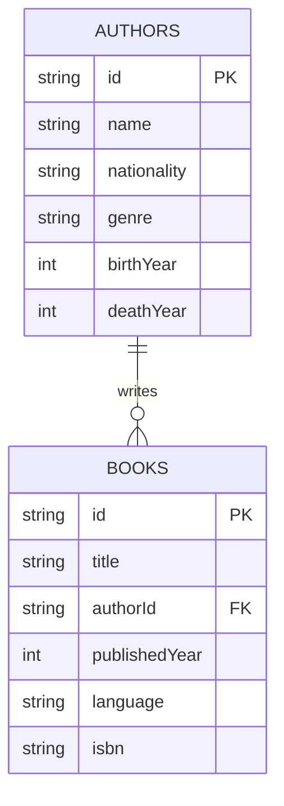

## The Importance of Data Transformation

In modern enterprise applications, **data transformation** is a critical process that enables systems to **communicate, integrate, and operate cohesively**. As organizations increasingly rely on diverse systems—ERP, CRM, databases, APIs, and third-party services—data often arrives in **inconsistent formats**. In large enterprises, it is critical that the data is accessible in a common format at one place. To make this data usable, it must be transformed into a **standardized, canonical format**.

In this artical, we will focus on understanding the foundational technology XML & .NET. These we are going to use to build our gateway engine in upcoming series of blog.

## Understanding the Core Technologies

Lets start with understanding these technologies in detail.

### What is XML?

**[XML (eXtensible Markup Language)](https://www.w3schools.com/xml/)** is a markup language designed to store and transport data. It is both human-readable and machine-readable, making it ideal for data exchange between systems.

**[XML (eXtensible Markup Language)](https://en.wikipedia.org/wiki/XML)** is a widely adopted standard for structured data representation.

#### Key Features

- **Self-descriptive**: Data is wrapped in tags that describe its meaning.
- **Platform-independent**: Works across different systems and technologies.
- **Hierarchical structure**: Data is organized in a tree-like format.
- **Extensible**: You can define your own tags and structure.

### What is XSLT?

**[XSLT (eXtensible Stylesheet Language Transformations)](https://en.wikipedia.org/wiki/XSLT)** is a declarative language designed specifically for transforming XML documents. It excels in:

- **Mapping one XML structure to another**.
- **Filtering, sorting, and restructuring data**.
- **Generating different output formats** (XML, HTML, plain text, JSON).

It is part of the **XSL (Extensible Stylesheet Language)** family and works by applying transformation rules defined in an XSLT stylesheet.

#### How XSLT Works

- XSLT uses **templates** to match elements in the source XML.
- It applies **XPath expressions** to navigate and select nodes.
- The transformation engine processes the XML and outputs a new document based on the rules.

## Demo Preparation

### Demo XML File

We will use the below XML file for all the below demo code. It contains list of authors and books.
Below table describes each attribute of these entities

#### Books Entity

| Column Name     | Data Type | Description                                      |
|-----------------|-----------|--------------------------------------------------|
| id              | String    | Unique identifier for the book (e.g., B001)      |
| title           | String    | Title of the book                                |
| authorId        | String    | Reference to the author's ID (foreign key)       |
| publishedYear   | Integer   | Year the book was published                      |
| language        | String    | Language in which the book was originally written|
| isbn            | String    | International Standard Book Number               |

#### Author Entity

| Column Name     | Data Type | Description                                      |
|-----------------|-----------|--------------------------------------------------|
| id              | String    | Unique identifier for the author (e.g., A001)    |
| name            | String    | Full name of the author                          |
| nationality     | String    | Country of origin                                |
| genre           | String    | Primary literary genre                           |
| birthYear       | Integer   | Year the author was born                         |
| deathYear       | Integer   | Year the author died (optional)                  |



```xml
<?xml version="1.0" encoding="UTF-8"?>
<library>
  <authors>
    <author id="A001" nationality="British" genre="Dystopian">
      <name>George Orwell</name>
      <birthYear>1903</birthYear>
      <deathYear>1950</deathYear>
    </author>
    <author id="A002" nationality="British" genre="Fantasy">
      <name>J.K. Rowling</name>
      <birthYear>1965</birthYear>
    </author>
    <author id="A003" nationality="Japanese" genre="Magical Realism">
      <name>Haruki Murakami</name>
      <birthYear>1949</birthYear>
    </author>
    <author id="A004" nationality="American" genre="Science Fiction">
      <name>Isaac Asimov</name>
      <birthYear>1920</birthYear>
      <deathYear>1992</deathYear>
    </author>
  </authors>

  <books>
    <book id="B001" authorId="A001" language="English">
      <title>1984</title>
      <publishedYear>1949</publishedYear>
      <isbn>9780451524935</isbn>
    </book>
    <book id="B002" authorId="A001" language="English">
      <title>Animal Farm</title>
      <publishedYear>1945</publishedYear>
      <isbn>9780451526342</isbn>
    </book>
    <book id="B003" authorId="A002" language="English">
      <title>Harry Potter and the Sorcerer's Stone</title>
      <publishedYear>1997</publishedYear>
      <isbn>9780439708180</isbn>
    </book>
    <book id="B004" authorId="A002" language="English">
      <title>Harry Potter and the Chamber of Secrets</title>
      <publishedYear>1998</publishedYear>
      <isbn>9780439064873</isbn>
    </book>
    <book id="B005" authorId="A002" language="English">
      <title>Harry Potter and the Prisoner of Azkaban</title>
      <publishedYear>1999</publishedYear>
      <isbn>9780439136365</isbn>
    </book>
    <book id="B006" authorId="A002" language="English">
      <title>Harry Potter and the Goblet of Fire</title>
      <publishedYear>2000</publishedYear>
      <isbn>9780439139601</isbn>
    </book>
    <book id="B007" authorId="A002" language="English">
      <title>Harry Potter and the Order of the Phoenix</title>
      <publishedYear>2003</publishedYear>
      <isbn>9780439358071</isbn>
    </book>
    <book id="B008" authorId="A002" language="English">
      <title>Harry Potter and the Half-Blood Prince</title>
      <publishedYear>2005</publishedYear>
      <isbn>9780439785969</isbn>
    </book>
    <book id="B009" authorId="A002" language="English">
      <title>Harry Potter and the Deathly Hallows</title>
      <publishedYear>2007</publishedYear>
      <isbn>9780545010221</isbn>
    </book>
    <book id="B010" authorId="A003" language="Japanese">
      <title>Kafka on the Shore</title>
      <publishedYear>2002</publishedYear>
      <isbn>9781400079278</isbn>
    </book>
    <book id="B011" authorId="A003" language="Japanese">
      <title>Norwegian Wood</title>
      <publishedYear>1987</publishedYear>
      <isbn>9780375704024</isbn>
    </book>
    <book id="B012" authorId="A003" language="Japanese">
      <title>1Q84</title>
      <publishedYear>2009</publishedYear>
      <isbn>9780307593313</isbn>
    </book>
    <book id="B013" authorId="A003" language="Japanese">
      <title>The Wind-Up Bird Chronicle</title>
      <publishedYear>1994</publishedYear>
      <isbn>9780679775430</isbn>
    </book>
    <book id="B014" authorId="A003" language="Japanese">
      <title>Hard-Boiled Wonderland and the End of the World</title>
      <publishedYear>1985</publishedYear>
      <isbn>9780679743460</isbn>
    </book>
    <book id="B015" authorId="A004" language="English">
      <title>Foundation</title>
      <publishedYear>1951</publishedYear>
      <isbn>9780553293357</isbn>
    </book>
    <book id="B016" authorId="A004" language="English">
      <title>Foundation and Empire</title>
      <publishedYear>1952</publishedYear>
      <isbn>9780553293371</isbn>
    </book>
    <book id="B017" authorId="A004" language="English">
      <title>Second Foundation</title>
      <publishedYear>1953</publishedYear>
      <isbn>9780553293364</isbn>
    </book>
    <book id="B018" authorId="A004" language="English">
      <title>Foundation's Edge</title>
      <publishedYear>1982</publishedYear>
      <isbn>9780553293388</isbn>
    </book>
    <book id="B019" authorId="A004" language="English">
      <title>Foundation and Earth</title>
      <publishedYear>1986</publishedYear>
      <isbn>9780553293425</isbn>
    </book>
    <book id="B020" authorId="A004" language="English">
      <title>Prelude to Foundation</title>
      <publishedYear>1988</publishedYear>
      <isbn>9780553278392</isbn>
    </book>
  </books>
</library>
```

### Demo XLST File

The belwo file shows a typical transformation logic that we can use to generate a HTML table from given XML file

```xml
<?xml version="1.0" encoding="UTF-8"?>
<xsl:stylesheet version="1.0"
  xmlns:xsl="http://www.w3.org/1999/XSL/Transform">
  <xsl:output method="html" indent="yes"/>
  <xsl:key name="booksByAuthor" match="book" use="@authorId"/>
  <xsl:template match="/">
    <html>
      <head>
        <title>Library Catalog</title>
        <style>
          table { border-collapse: collapse; width: 100%; margin-bottom: 20px; }
          th, td { border: 1px solid #ccc; padding: 8px; text-align: left; }
          th { background-color: #f2f2f2; }
          h2 { margin-top: 40px; }
        </style>
      </head>
      <body>
        <h1>Library Catalog</h1>
        <xsl:for-each select="library/authors/author">
          <xsl:variable name="authorId" select="@id"/>
          <xsl:if test="count(key('booksByAuthor', $authorId)) &gt; 0">
            <h2>
              <xsl:value-of select="name"/> 
              (<xsl:value-of select="@genre"/>, 
              <xsl:value-of select="@nationality"/>)
            </h2>
            <table>
              <tr>
                <th>Title</th>
                <th>Published Year</th>
                <th>Language</th>
                <th>ISBN</th>
              </tr>
              <xsl:for-each select="key('booksByAuthor', $authorId)">
                <tr>
                  <td><xsl:value-of select="title"/></td>
                  <td><xsl:value-of select="publishedYear"/></td>
                  <td><xsl:value-of select="@language"/></td>
                  <td><xsl:value-of select="isbn"/></td>
                </tr>
              </xsl:for-each>
            </table>
          </xsl:if>
        </xsl:for-each>
      </body>
    </html>
  </xsl:template>
</xsl:stylesheet>
```

## C# Support for XML and XSLT

### Overview

C# and the .NET Framework provide robust, high-performance support for working with XML and XSLT. These capabilities are essential for building transformation pipelines, especially in enterprise applications. We will explore some of the most important classes and thier usage. This will give you a solid foundaiton to work on advance XML scenarios.

### Key Namespaces and Classes

Below are some of the important namespaces in .NET. Depending upon your use case, these can be utilized in combination.

| Namespace | Purpose |
|-----------|---------|
| `System.Xml` | Core XML support (DOM, readers, writers) |
| `System.Xml.XPath` | XPath querying support |
| `System.Xml.Xsl` | XSLT transformation engine |
| `System.Xml.Schema` | XML Schema validation |

### Optimized Classes for Performance

- **`XmlReader` / `XmlWriter`**: Use this classes for forward-only, streaming access to XML documents. Ideal for large files.
- **`XslCompiledTransform`**: Compiles XSLT stylesheets for fast, reusable transformations.
- **`XPathNavigator`**: This provides a read-only cursor for efficient XPath queries execution.

### Sample: Transform XML Using XSLT with XPath

#### XPathDocument in C# & .NET

`XPathDocument` is a class in the `System.Xml.XPath` namespace that provides a fast, read-only, in-memory representation of an XML document. It is optimized for XPath queries and XSLT transformations, making it more efficient than `XmlDocument` for these purposes.

#### Combining XSLT + .NET for a middlwware developmemt

.NET provides **native support** for XML and XSLT manipulations through namespaces like `System.Xml`, `System.Xml.XPath`, and `System.Xml.Xsl`. It has rich support for reading, wirting, transforming and searching XML based documents. This enables:

- **Efficient transformation** using `XslCompiledTransform`, which compiles XSLT for performance.
- **XPath queries** for precise data extraction and manipulation.
- **Streaming support** for processing large XML files without loading them entirely into memory.

This makes the combination of XML, XSLT, and C# ideal for building **high-volume, high-performance transformation pipelines**.

## Conclusion

.NET and XML offers a very elegant solution to build transformation component. We will take this idea to next level to build a custom integration and transformation engine. Be with me on this journey.
