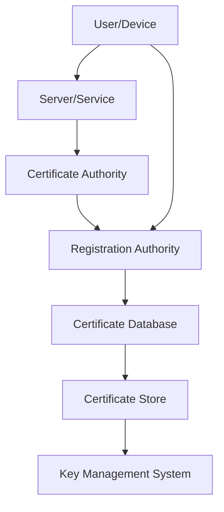
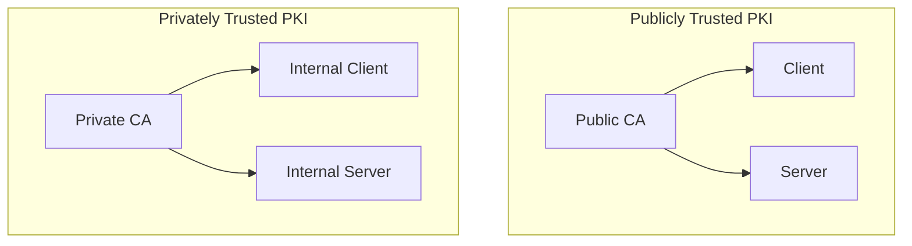

## Introduction

Public Key Infrastructure (PKI) is a comprehensive framework designed to manage digital certificates and public-key encryption. It facilitates secure communication and authentication over networks, ensuring data integrity, confidentiality, and authenticity.

### 1. Understanding PKI Architecture

#### 1.1 What is PKI?

PKI is a system of hardware, software, policies, and standards that manage the creation, distribution, and revocation of digital certificates. These certificates are used to verify the identity of users, devices, and services.

#### 1.2 Components of PKI

PKI is composed of several integral components that work together to provide a secure environment for digital communications:

- **Certificate Authority (CA**): The Certificate Authority (CA) is the cornerstone of PKI. It is a trusted entity responsible for issuing, revoking, and managing digital certificates. The CA verifies the identity of entities requesting certificates and signs them with its private key, ensuring their authenticity.

- **Registration Authority (RA)**: The Registration Authority (RA) acts as an intermediary between the CA and the entities requesting certificates. It handles the initial verification of the entities' identities before forwarding their requests to the CA for approval and issuance.

- **Certificate Database**: The Certificate Database is a centralized repository that stores all issued certificates and their associated metadata. This database is crucial for managing the lifecycle of certificates, including tracking their validity, renewal, and revocation status.

- **Certificate Store**: The Certificate Store is a secure repository where certificates and their private keys are stored. It ensures that certificates are readily accessible for applications and systems to use in secure communication and authentication processes.

- **Key Management System** : The Key Management System is responsible for the secure handling of cryptographic keys. It manages the creation, distribution, storage, and destruction of keys, ensuring that they are protected throughout their lifecycle. This system is vital for maintaining the security and integrity of the PKI infrastructure.

The diagram below shows the relation between these components

#### 1.3 Types of PKI Architectures

PKI architectures can be broadly categorized into two types:

- **Publicly Trusted PKI**: Publicly Trusted PKI is used for public-facing services and relies on certificates issued by trusted CAs. These certificates are recognized and trusted by clients and operating systems in public channels, such as the internet.

- **Privately Trusted PKI**: Privately Trusted PKI is used within organizations to secure internal assets and networks. It involves running a private CA that issues certificates for internal use, providing control over the PKI infrastructure.

### 2. The Need for PKI

Public Key Infrastructure (PKI) is essential for ensuring secure and trustworthy digital communications. In this section, we'll explore the various reasons why PKI is necessary, the challenges faced without it, and the critical role it plays in modern cybersecurity.

#### 2.1 Enhancing Security

In today's digital world, security is paramount. PKI enhances security by providing robust encryption and authentication mechanisms.

PKI provides robust security by encrypting data and ensuring that only authorized entities can access it.

##### 2.1.1 Encryption

PKI uses asymmetric encryption to protect data. This involves a pair of cryptographic keys: a public key and a private key. The public key encrypts data, while the private key decrypts it. This ensures that even if data is intercepted during transmission, it cannot be read without the corresponding private key.

##### 2.1.2 Authentication

Digital certificates issued by a trusted Certificate Authority (CA) authenticate the identity of users, devices, and services. This prevents unauthorized access and ensures that entities involved in communication are who they claim to be.

#### 2.2 Authentication and Trust

PKI establishes a chain of trust through digital certificates, which are used to verify identities and secure communications.

##### 2.2.1 Identity Verification

Digital certificates contain information about the entity they are issued to, such as their public key and identity details. When a certificate is presented, the recipient can verify its authenticity by checking the signature of the CA that issued it.

##### 2.2.2 Trust Hierarchy

PKI creates a hierarchical trust model, where trust is established from a root CA down to intermediate CAs and end-entity certificates. This hierarchy ensures that trust is propagated through the entire chain, making it difficult for malicious entities to forge identities.

#### 2.3 Regulatory Compliance

Many industries have stringent regulations and standards for data protection and privacy. PKI helps organizations comply with these requirements.

##### 2.3.1 Data Protection Regulations

Regulations such as the General Data Protection Regulation (GDPR) and the Health Insurance Portability and Accountability Act (HIPAA) mandate the protection of sensitive data. PKI provides the necessary encryption and authentication mechanisms to meet these requirements.

##### 2.3.2 Industry Standards

Standards such as the Payment Card Industry Data Security Standard (PCI DSS) require the use of encryption and secure authentication methods. PKI helps organizations adhere to these standards, ensuring the security of payment card data and other sensitive information.

#### 2.4 Challenges Without PKI

Without PKI, organizations face several significant challenges that can compromise their security and trustworthiness.

##### 2.4.1 Lack of Encryption

Without PKI, data transmitted over networks is vulnerable to interception and unauthorized access. This can lead to data breaches and the exposure of sensitive information.

##### 2.4.2 Identity Verification Issues

Without digital certificates, verifying the identity of users, devices, and services becomes challenging. This can result in unauthorized access and potential security breaches.

##### 2.4.3 Increased Risk of Data Breaches

The absence of PKI increases the risk of data breaches and cyber-attacks. Without robust encryption and authentication mechanisms, organizations are more susceptible to attacks such as man-in-the-middle (MitM) attacks and phishing.

#### 2.5 Benefits of PKI

Implementing PKI brings numerous benefits that enhance security, trust, and compliance.

##### 2.5.1 Enhanced Security

PKI provides strong encryption and authentication, protecting data from unauthorized access and tampering. This ensures the integrity and confidentiality of communications.

##### 2.5.2 Improved Trust and Compliance

PKI helps organizations comply with regulatory requirements and build trust with customers and partners. By using digital certificates, organizations can demonstrate their commitment to security and data protection.

##### 2.5.3 Scalability and Flexibility

PKI can be scaled to meet the needs of organizations of all sizes. It provides a flexible solution for various security requirements, from securing internal communications to protecting public-facing services.

### 3. Challenges Without PKI

#### 3.1 Lack of Encryption

Without PKI, data transmitted over networks is vulnerable to interception and unauthorized access.

#### 3.2 Identity Verification Issues

Without digital certificates, verifying the identity of users and devices becomes challenging, leading to potential security breaches.

#### 3.3 Increased Risk of Data Breaches

The absence of PKI increases the risk of data breaches and cyber-attacks, as there is no robust mechanism to protect data integrity and confidentiality.

### 4. Benefits of PKI

#### 4.1 Enhanced Security

PKI provides strong encryption and authentication, protecting data from unauthorized access and tampering.

#### 4.2 Improved Trust and Compliance

PKI helps organizations comply with regulatory requirements and build trust with customers and partners.

#### 4.3 Scalability and Flexibility

PKI can be scaled to meet the needs of organizations of all sizes, providing a flexible solution for various security requirements.

### 5. Implementing PKI in Organizations

#### 5.1 Planning and Design

Assess Security Needs: Identify the security requirements and use cases for PKI.
Choose the Right Architecture: Decide between publicly trusted and privately trusted PKI based on organizational needs.

#### 5.2 Setting Up the Infrastructure

- **Establish a Certificate Authority (CA)**: Set up a CA to issue and manage digital certificates.
- **Deploy Registration Authorities (RAs)**: Implement RAs to verify the identity of entities requesting certificates.

#### 5.3 Managing Certificates

Certificate Issuance: Issue digital certificates to users, devices, and services.
Certificate Revocation: Implement mechanisms to revoke certificates that are no longer valid or have been compromised.

#### 5.4 Ensuring Compliance and Security

Regular Audits: Conduct regular audits to ensure compliance with security policies and standards.
Update and Patch: Keep the PKI infrastructure updated with the latest security patches and updates 8.

## Conclusion

Implementing PKI is crucial for organizations to secure their digital communications and protect sensitive data. By understanding the architecture, benefits, and implementation steps, organizations can effectively deploy PKI to enhance their security posture.
