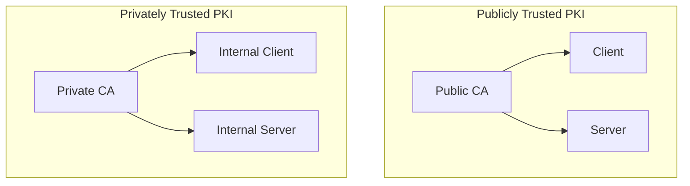

## Introduction

Public Key Infrastructure (PKI) is a comprehensive framework designed to manage digital certificates and public-key encryption. It facilitates secure communication and authentication over networks, ensuring data integrity, confidentiality, and authenticity.

### 1. Understanding PKI Architecture

#### 1.1 What is PKI?

PKI is a system of hardware, software, policies, and standards that manage the creation, distribution, and revocation of digital certificates. These certificates are used to verify the identity of users, devices, and services.

#### 1.2 Components of PKI

PKI is composed of several integral components that work together to provide a secure environment for digital communications:

- **Certificate Authority (CA**): The Certificate Authority (CA) is the cornerstone of PKI. It is a trusted entity responsible for issuing, revoking, and managing digital certificates. The CA verifies the identity of entities requesting certificates and signs them with its private key, ensuring their authenticity.

- **Registration Authority (RA)**: The Registration Authority (RA) acts as an intermediary between the CA and the entities requesting certificates. It handles the initial verification of the entities' identities before forwarding their requests to the CA for approval and issuance.

- **Certificate Database**: The Certificate Database is a centralized repository that stores all issued certificates and their associated metadata. This database is crucial for managing the lifecycle of certificates, including tracking their validity, renewal, and revocation status.

- **Certificate Store**: The Certificate Store is a secure repository where certificates and their private keys are stored. It ensures that certificates are readily accessible for applications and systems to use in secure communication and authentication processes.

- **Key Management System** : The Key Management System is responsible for the secure handling of cryptographic keys. It manages the creation, distribution, storage, and destruction of keys, ensuring that they are protected throughout their lifecycle. This system is vital for maintaining the security and integrity of the PKI infrastructure.

#### 1.3 Types of PKI Architectures

PKI architectures can be broadly categorized into two types:

- **Publicly Trusted PKI**: Publicly Trusted PKI is used for public-facing services and relies on certificates issued by trusted CAs. These certificates are recognized and trusted by clients and operating systems in public channels, such as the internet.

- **Privately Trusted PKI**: Privately Trusted PKI is used within organizations to secure internal assets and networks. It involves running a private CA that issues certificates for internal use, providing control over the PKI infrastructure.

### 2. The Need for PKI

#### 2.1 Enhancing Security

PKI provides robust security by encrypting data and ensuring that only authorized entities can access it.

#### 2.2 Authentication and Trust

Digital certificates authenticate the identity of users and devices, establishing trust in digital communications.

#### 2.3 Regulatory Compliance

Many industries require PKI to comply with regulations and standards for data protection and privacy.

### 3. Challenges Without PKI

#### 3.1 Lack of Encryption

Without PKI, data transmitted over networks is vulnerable to interception and unauthorized access.

#### 3.2 Identity Verification Issues

Without digital certificates, verifying the identity of users and devices becomes challenging, leading to potential security breaches.

#### 3.3 Increased Risk of Data Breaches

The absence of PKI increases the risk of data breaches and cyber-attacks, as there is no robust mechanism to protect data integrity and confidentiality.

### 4. Benefits of PKI

#### 4.1 Enhanced Security

PKI provides strong encryption and authentication, protecting data from unauthorized access and tampering.

#### 4.2 Improved Trust and Compliance

PKI helps organizations comply with regulatory requirements and build trust with customers and partners.

#### 4.3 Scalability and Flexibility

PKI can be scaled to meet the needs of organizations of all sizes, providing a flexible solution for various security requirements.

### 5. Implementing PKI in Organizations

#### 5.1 Planning and Design

Assess Security Needs: Identify the security requirements and use cases for PKI.
Choose the Right Architecture: Decide between publicly trusted and privately trusted PKI based on organizational needs.

#### 5.2 Setting Up the Infrastructure

- **Establish a Certificate Authority (CA)**: Set up a CA to issue and manage digital certificates.
- **Deploy Registration Authorities (RAs)**: Implement RAs to verify the identity of entities requesting certificates.

#### 5.3 Managing Certificates

Certificate Issuance: Issue digital certificates to users, devices, and services.
Certificate Revocation: Implement mechanisms to revoke certificates that are no longer valid or have been compromised.

#### 5.4 Ensuring Compliance and Security

Regular Audits: Conduct regular audits to ensure compliance with security policies and standards.
Update and Patch: Keep the PKI infrastructure updated with the latest security patches and updates 8.

## Conclusion

Implementing PKI is crucial for organizations to secure their digital communications and protect sensitive data. By understanding the architecture, benefits, and implementation steps, organizations can effectively deploy PKI to enhance their security posture.
