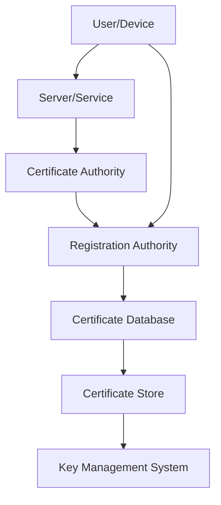
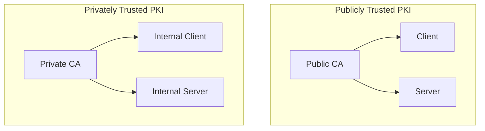

## Introduction

Public Key Infrastructure (PKI) is a comprehensive framework designed to manage digital certificates and public-key encryption. It facilitates secure communication and authentication over networks, ensuring data integrity, confidentiality, and authenticity.

### 1. Understanding PKI Architecture

#### 1.1 What is PKI?

PKI is a system of hardware, software, policies, and standards that manage the creation, distribution, and revocation of digital certificates. These certificates are used to verify the identity of users, devices, and services.

#### 1.2 Components of PKI

PKI is composed of several integral components that work together to provide a secure environment for digital communications:

- **Certificate Authority (CA**): The Certificate Authority (CA) is the cornerstone of PKI. It is a trusted entity responsible for issuing, revoking, and managing digital certificates. The CA verifies the identity of entities requesting certificates and signs them with its private key, ensuring their authenticity.

- **Registration Authority (RA)**: The Registration Authority (RA) acts as an intermediary between the CA and the entities requesting certificates. It handles the initial verification of the entities' identities before forwarding their requests to the CA for approval and issuance.

- **Certificate Database**: The Certificate Database is a centralized repository that stores all issued certificates and their associated metadata. This database is crucial for managing the lifecycle of certificates, including tracking their validity, renewal, and revocation status.

- **Certificate Store**: The Certificate Store is a secure repository where certificates and their private keys are stored. It ensures that certificates are readily accessible for applications and systems to use in secure communication and authentication processes.

- **Key Management System** : The Key Management System is responsible for the secure handling of cryptographic keys. It manages the creation, distribution, storage, and destruction of keys, ensuring that they are protected throughout their lifecycle. This system is vital for maintaining the security and integrity of the PKI infrastructure.

The diagram below shows the relation between these components

#### 1.3 Types of PKI Architectures

PKI architectures can be broadly categorized into two types:

- **Publicly Trusted PKI**: Publicly Trusted PKI is used for public-facing services and relies on certificates issued by trusted CAs. These certificates are recognized and trusted by clients and operating systems in public channels, such as the internet.

- **Privately Trusted PKI**: Privately Trusted PKI is used within organizations to secure internal assets and networks. It involves running a private CA that issues certificates for internal use, providing control over the PKI infrastructure.

### 2. The Need for PKI

Public Key Infrastructure (PKI) is essential for ensuring secure and trustworthy digital communications. In this section, we'll explore the various reasons why PKI is necessary, the challenges faced without it, and the critical role it plays in modern cybersecurity.

#### 2.1 Enhancing Security

In today's digital world, security is paramount. PKI enhances security by providing robust encryption and authentication mechanisms.

PKI provides robust security by encrypting data and ensuring that only authorized entities can access it.

##### 2.1.1 Encryption

PKI uses asymmetric encryption to protect data. This involves a pair of cryptographic keys: a public key and a private key. The public key encrypts data, while the private key decrypts it. This ensures that even if data is intercepted during transmission, it cannot be read without the corresponding private key.

##### 2.1.2 Authentication

Digital certificates issued by a trusted Certificate Authority (CA) authenticate the identity of users, devices, and services. This prevents unauthorized access and ensures that entities involved in communication are who they claim to be.

#### 2.2 Authentication and Trust

PKI establishes a chain of trust through digital certificates, which are used to verify identities and secure communications.

##### 2.2.1 Identity Verification

Digital certificates contain information about the entity they are issued to, such as their public key and identity details. When a certificate is presented, the recipient can verify its authenticity by checking the signature of the CA that issued it.

##### 2.2.2 Trust Hierarchy

PKI creates a hierarchical trust model, where trust is established from a root CA down to intermediate CAs and end-entity certificates. This hierarchy ensures that trust is propagated through the entire chain, making it difficult for malicious entities to forge identities.

#### 2.3 Regulatory Compliance

Many industries have stringent regulations and standards for data protection and privacy. PKI helps organizations comply with these requirements.

##### 2.3.1 Data Protection Regulations

Regulations such as the General Data Protection Regulation (GDPR) and the Health Insurance Portability and Accountability Act (HIPAA) mandate the protection of sensitive data. PKI provides the necessary encryption and authentication mechanisms to meet these requirements.

##### 2.3.2 Industry Standards

Standards such as the Payment Card Industry Data Security Standard (PCI DSS) require the use of encryption and secure authentication methods. PKI helps organizations adhere to these standards, ensuring the security of payment card data and other sensitive information.

#### 2.4 Challenges Without PKI

Without PKI, organizations face several significant challenges that can compromise their security and trustworthiness.

##### 2.4.1 Lack of Encryption

Without PKI, data transmitted over networks is vulnerable to interception and unauthorized access. This can lead to data breaches and the exposure of sensitive information.

##### 2.4.2 Identity Verification Issues

Without digital certificates, verifying the identity of users, devices, and services becomes challenging. This can result in unauthorized access and potential security breaches.

##### 2.4.3 Increased Risk of Data Breaches

The absence of PKI increases the risk of data breaches and cyber-attacks. Without robust encryption and authentication mechanisms, organizations are more susceptible to attacks such as man-in-the-middle (MitM) attacks and phishing.

#### 2.5 Benefits of PKI

Implementing PKI brings numerous benefits that enhance security, trust, and compliance.

##### 2.5.1 Enhanced Security

PKI provides strong encryption and authentication, protecting data from unauthorized access and tampering. This ensures the integrity and confidentiality of communications.

##### 2.5.2 Improved Trust and Compliance

PKI helps organizations comply with regulatory requirements and build trust with customers and partners. By using digital certificates, organizations can demonstrate their commitment to security and data protection.

##### 2.5.3 Scalability and Flexibility

PKI can be scaled to meet the needs of organizations of all sizes. It provides a flexible solution for various security requirements, from securing internal communications to protecting public-facing services.

### 3. Challenges Without PKI

Public Key Infrastructure (PKI) is a critical component of modern cybersecurity. Without PKI, organizations face numerous challenges that can compromise their security, trustworthiness, and operational efficiency. In this section, we'll explore the key challenges that arise in the absence of PKI.

#### 3.1 Lack of Encryption

Encryption is essential for protecting data in transit and at rest. Without PKI, organizations lack a robust mechanism for encrypting data, leading to several vulnerabilities:

#### 3.1.1 Data Interception

Without encryption, data transmitted over networks can be easily intercepted by malicious actors. This can lead to unauthorized access to sensitive information, such as personal data, financial details, and intellectual property.

#### 3.1.2 Data Integrity

Without PKI, there is no mechanism to ensure the integrity of data. This means that data can be altered or tampered with during transmission, leading to potential data corruption and loss of trust in the data's authenticity.

### 3.2 Identity Verification Issues

PKI provides a reliable method for verifying the identity of users, devices, and services. Without PKI, organizations face significant challenges in ensuring that entities are who they claim to be:

#### 3.2.1 Unauthorized Access

Without digital certificates, it becomes difficult to verify the identity of users and devices. This can lead to unauthorized access to systems and data, increasing the risk of security breaches.

#### 3.2.2 Phishing and Spoofing

In the absence of PKI, organizations are more vulnerable to phishing and spoofing attacks. Malicious actors can impersonate legitimate entities, tricking users into divulging sensitive information or performing harmful actions.

### 3.3 Increased Risk of Data Breaches

Data breaches are a significant threat to organizations, leading to financial losses, reputational damage, and regulatory penalties. Without PKI, the risk of data breaches increases due to several factors:

#### 3.3.1 Weak Authentication

Without PKI, organizations may rely on weaker authentication methods, such as passwords. These methods are more susceptible to attacks, such as brute force and credential stuffing, leading to unauthorized access and data breaches.

#### 3.3.2 Lack of Secure Communication

Without PKI, there is no guarantee that communications between users, devices, and services are secure. This can lead to man-in-the-middle (MitM) attacks, where malicious actors intercept and manipulate communications.

### 3.4 Compliance and Regulatory Challenges

Many industries have stringent regulations and standards for data protection and privacy. Without PKI, organizations may struggle to comply with these requirements:

#### 3.4.1 Regulatory Non-Compliance

Regulations such as GDPR, HIPAA, and PCI DSS mandate the use of encryption and secure authentication methods. Without PKI, organizations may fail to meet these requirements, leading to regulatory penalties and legal liabilities.

#### 3.4.2 Loss of Trust

Compliance with regulatory standards is essential for building trust with customers, partners, and stakeholders. Without PKI, organizations may struggle to demonstrate their commitment to security and data protection, leading to a loss of trust.

### 3.5 Operational Inefficiencies

PKI streamlines various security processes, improving operational efficiency. Without PKI, organizations may face several operational challenges:

#### 3.5.1 Manual Processes

Without PKI, organizations may rely on manual processes for managing security, such as manually issuing and revoking credentials. This can be time-consuming, error-prone, and inefficient.

#### 3.5.2 Scalability Issues

PKI provides a scalable solution for managing digital certificates and cryptographic keys. Without PKI, organizations may struggle to scale their security infrastructure to meet growing demands, leading to operational bottlenecks.

### 4. Benefits of PKI

Implementing Public Key Infrastructure (PKI) brings numerous advantages to organizations, enhancing security, trust, compliance, and operational efficiency. In this section, we'll explore the key benefits that PKI provides.

#### 4.1 Enhanced Security

PKI significantly improves the security of digital communications and data protection through robust encryption and authentication mechanisms.

##### 4.1.1 Strong Encryption

PKI uses asymmetric encryption, which involves a pair of cryptographic keys: a public key and a private key. The public key encrypts data, while the private key decrypts it. This ensures that even if data is intercepted during transmission, it cannot be read without the corresponding private key 1.

##### 4.1.2 Secure Authentication

Digital certificates issued by a trusted Certificate Authority (CA) authenticate the identity of users, devices, and services. This prevents unauthorized access and ensures that entities involved in communication are who they claim to be 2.

#### 4.2 Improved Trust and Compliance

PKI helps organizations build trust with customers, partners, and stakeholders by ensuring secure and authenticated communications. It also aids in meeting regulatory requirements.

##### 4.2.1 Establishing Trust

Digital certificates create a chain of trust, verifying the identities of entities involved in digital communications. This trust is essential for secure transactions, such as online banking, e-commerce, and secure email communications 1.

##### 4.2.2 Regulatory Compliance

Many industries have stringent regulations and standards for data protection and privacy, such as GDPR, HIPAA, and PCI DSS. PKI provides the necessary encryption and authentication mechanisms to comply with these regulations, helping organizations avoid legal liabilities and penalties 2.

#### 4.3 Scalability and Flexibility

PKI offers a scalable and flexible solution for managing digital certificates and cryptographic keys, making it suitable for organizations of all sizes.

##### 4.3.1 Scalability

PKI can be scaled to meet the needs of small businesses as well as large enterprises. It supports the issuance and management of a large number of digital certificates, ensuring that security measures can grow with the organization 3.

##### 4.3.2 Flexibility

PKI can be adapted to various use cases, from securing internal communications to protecting public-facing services. It supports a wide range of applications, including secure email, VPN access, digital signatures, and IoT device authentication 3.

#### 4.4 Operational Efficiency

Implementing PKI streamlines various security processes, improving operational efficiency and reducing the risk of human error.

##### 4.4.1 Automated Certificate Management

PKI systems often include tools for automating the issuance, renewal, and revocation of digital certificates. This reduces the administrative burden on IT staff and ensures that certificates are managed efficiently 3.

##### 4.4.2 Reduced Risk of Human Error

By automating key management processes, PKI minimizes the risk of human error, such as misconfigurations or forgotten renewals. This enhances the overall security posture of the organization 3.

#### 4.5 Cost Savings

While implementing PKI requires an initial investment, it can lead to significant cost savings in the long run by reducing the risk of data breaches and improving operational efficiency.

##### 4.5.1 Preventing Data Breaches

Data breaches can be extremely costly, both in terms of financial losses and reputational damage. By providing robust encryption and authentication, PKI helps prevent data breaches, saving organizations from the associated costs 3.

##### 4.5.2 Streamlined Operations

Automating certificate management and reducing the risk of human error can lead to more efficient operations, reducing the need for manual intervention and lowering operational costs 3.

### 5. Implementing PKI in Organizations

#### 5.1 Planning and Design

Assess Security Needs: Identify the security requirements and use cases for PKI.
Choose the Right Architecture: Decide between publicly trusted and privately trusted PKI based on organizational needs.

#### 5.2 Setting Up the Infrastructure

- **Establish a Certificate Authority (CA)**: Set up a CA to issue and manage digital certificates.
- **Deploy Registration Authorities (RAs)**: Implement RAs to verify the identity of entities requesting certificates.

#### 5.3 Managing Certificates

Certificate Issuance: Issue digital certificates to users, devices, and services.
Certificate Revocation: Implement mechanisms to revoke certificates that are no longer valid or have been compromised.

#### 5.4 Ensuring Compliance and Security

Regular Audits: Conduct regular audits to ensure compliance with security policies and standards.
Update and Patch: Keep the PKI infrastructure updated with the latest security patches and updates 8.

## Conclusion

Implementing PKI is crucial for organizations to secure their digital communications and protect sensitive data. By understanding the architecture, benefits, and implementation steps, organizations can effectively deploy PKI to enhance their security posture.
