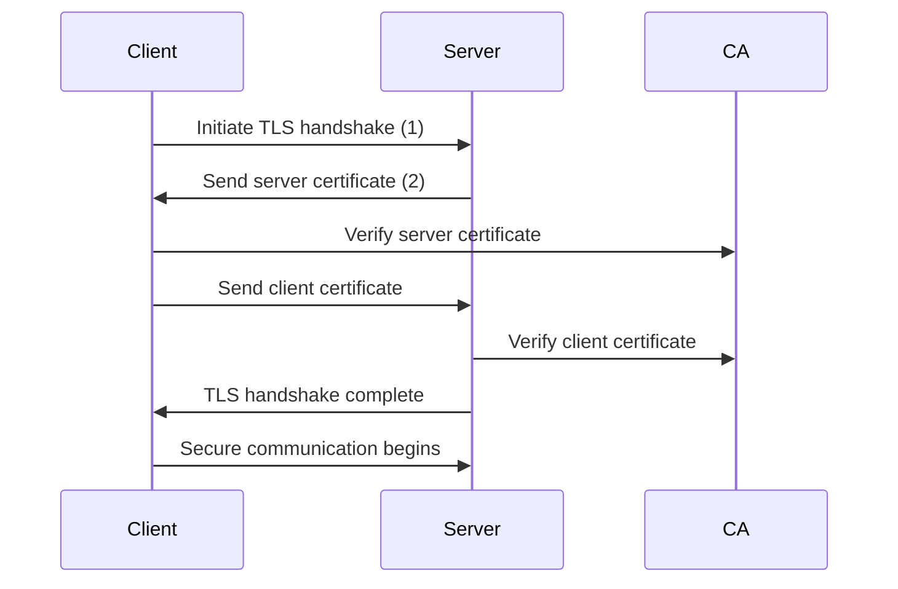

## Introduction

In today's digital world, security is a important concern. Ensuring the security of the IT systems is very important. This means that enterprise should employ robust security measurs across the board. One of the area where security needs to implemented is the client to server authentication. Mutual TLS (mTLS), also known as Mutual Authentication or Two-Way SSL/TLS, is a security protocol that ensures both the client and the server authenticate each other using digital certificates during a secure connection. In this blog post I will delve into what mTLS is, how it works, and other aspects of mTLS.

## What is Mutual TLS (mTLS)?

Mutual TLS (mTLS) is a security protocol that provides mutual authentication between the client and the server using digital certificates. Unlike one-way SSL/TLS, where only the server is authenticated, mTLS ensures that both parties verify each other's identity before establishing a secure connection.

### How mTLS Works

#### Step-by-Step Process

1. **Certificate Setup**: The server and each client have their own SSL/TLS certificates issued by a trusted Certificate Authority (CA).
2. **Client Sends Request**: The client initiates a connection to the server over HTTPS. During the TLS handshake, the server sends its certificate to the client.
3. **Client Certificate Sent**: The server requests the client's certificate. The client sends its certificate to the server.
4. **Server Verifies Client**: The server checks the validity of the client's certificate. If all checks pass, the server accepts the connection.
5. **Secure Communication Begins**: Once mutual authentication is successful, the client and server exchange encrypted data over the secure channel.

Below diagram shows a typical sequence of operations that takes place during a mutual TLS authentication.



### Benefits

- **Stronger Security**: In this setup both cleitn & server authenticates the other.
- **Prevents Impersonation**: Ensures that only trusted clients can access the server.
- **Common in Enterprise Environments**: This is used in APIs, B2B communications, and internal systems.

### Challenges

- **Certificate Management**: Since all clients needs certificates, managing certificates for all devices can be complex.
- **Latency**: Validating the certificates both ways during handshaking add an extra processing, this results in increased latency to the connection.
- **Server Configuration**: Requires proper server support and configuration.

## Implementation Methods

There are many ways in which the mutual TLS can be implemented. we will see how to implement mTLS in .NET based applications. We will have a ASP.NET Core API and an .NET Console client setup using mTLS.

### Certificate Generation for Testing

We will utlize the Powershell command to generate a self-signed certificate for local testing. You can use OpenSSL or any other tool, but for simplicity, we will use the built-in command in Windows.

Generating certificates for local testing involve 3 steps:

1. Generate a self-signed certificate root certificate
2. Generate a self-signed certificate for the server
3. Generate a self-signed certificate for the client

### Step 1: Generate a self-signed root certificate

Run the below command in Powershell window

```powershell
$rootCert = New-SelfSignedCertificate -Type Custom -KeyUsageProperty Sign -KeyUsage CertSign `
    -Subject "CN=MyRootCA" -KeyAlgorithm RSA -KeyLength 2048 -CertStoreLocation "Cert:\CurrentUser\My" `
    -NotAfter (Get-Date).AddYears(5) -FriendlyName "MyRootCA"
Export-Certificate -Cert $rootCert -FilePath .\rootCA.cer
```

### Step 2: Generate a self-signed server certificate

Run the below command in Powershell window

```powershell
$serverCert = New-SelfSignedCertificate -Type Custom -DnsName "localhost" `
    -KeyAlgorithm RSA -KeyLength 2048 -CertStoreLocation "Cert:\CurrentUser\My" `
    -Signer $rootCert -NotAfter (Get-Date).AddYears(2) -FriendlyName "BankingServiceServer"
Export-PfxCertificate -Cert $serverCert -FilePath .\server.pfx -Password (ConvertTo-SecureString -String "YourPassword123" -Force -AsPlainText)
```

### Step 3: Generate a self-signed client certificate

Run the below command in Powershell window

```powershell
$clientCert = New-SelfSignedCertificate -Type Custom -DnsName "client" `
    -KeyAlgorithm RSA -KeyLength 2048 -CertStoreLocation "Cert:\CurrentUser\My" `
    -Signer $rootCert -NotAfter (Get-Date).AddYears(2) -FriendlyName "BankingServiceClient"
Export-PfxCertificate -Cert $clientCert -FilePath .\client.pfx -Password (ConvertTo-SecureString -String "ClientPassword123" -Force -AsPlainText)
```

All these commands will generate the certificates in the current directory. You can change the path to save them in a different location. The `-Password` parameter is used to protect the PFX files with a password. Make sure to use a strong password and keep it secure.

### Step 4: Install the root certificate

To install the root certificate, you can double-click on the `rootCA.cer` file and follow the prompts to install it in the Trusted Root Certification Authorities store. This step is important to ensure that the server and client certificates are trusted by your system.

## Configure the server to use the certificates

You will need to configure your server to use the generated certificates. This typically involves specifying the paths to the PFX files and the passwords you used when exporting them. The exact steps will depend on the programming language and framework you are using.
I will show how to do this for a ASP.NET Core Web API project.

### Configure ASP.NET Core Web API to use the certificates

As part of the bootstrapping process, you will need to configure the Kestrel server to use the certificates. This is typically done in the `Program.cs` file of your ASP.NET Core Web API project. Refer the below code snippet to configure the Kestrel server to use the certificates.

```csharp
// Configure Kestrel for mTLS
builder.WebHost.ConfigureKestrel(options =>
{
    options.ConfigureHttpsDefaults(httpsOptions =>
    {
        httpsOptions.ServerCertificate = new X509Certificate2("server.pfx", "YourPassword123");
        
        // Require client certificates
        httpsOptions.ClientCertificateMode = ClientCertificateMode.RequireCertificate;

        // (Optional) Add custom certificate validation
        httpsOptions.ClientCertificateValidation = (certificate, chain, errors) =>
        {
            // Example: accept all valid certificates
            return errors == System.Net.Security.SslPolicyErrors.None;
            // For production, implement proper validation here
        };
    });
});
```

Adding a custom validation step is optional, the above code shows the hook to add a custom validation step. You can implement your own logic to validate the client certificate. For production, you should implement proper validation logic to ensure the client certificate is valid and trusted.

You can refer full code [here](https://github.com/pravinchandankhede/codesamples/blob/main/src/MTLSDemo/BankingService/Program.cs)

## Configure the client to use the certificates

You will need to configure your client to use the generated client certificate. This typically involves specifying the path to the PFX file and the password you used when exporting it. The exact steps will depend on the programming language and framework you are using.
We will see how to do this for a .NET Console application.

### Configure .NET Console application to use the client certificate

You will need to configure your HttpClient to use the client certificate. This is typically done in the `Program.cs` file of your .NET Console application. Refer the below code snippet to configure the HttpClient to use the client certificate.

```csharp
// Specify your client certificate file and password.
string clientCertPath = "client.pfx";
string clientCertPassword = "ClientPassword123";

// Load the client certificate.
var clientCertificate = new X509Certificate2(clientCertPath, clientCertPassword);

// Configure HttpClientHandler to use the client certificate.
var handler = new HttpClientHandler();
handler.ClientCertificates.Add(clientCertificate);

// In production, validate the server certificate properly.
// Here the callback is configured to accept any certificate for demo purposes.
handler.ServerCertificateCustomValidationCallback =
    (httpRequestMessage, cert, cetChain, policyErrors) => true;

using var httpClient = new HttpClient(handler);

// Make a request to the server.
```

Here, we are loading the client certificate from the PFX file and adding it to the `HttpClientHandler`. The `ServerCertificateCustomValidationCallback` is set to accept any server certificate for demo purposes. In production, you should implement proper validation logic to ensure the server certificate is valid and trusted.
The handler is then used to create a instance of `HttpClient` which can be used to make requests to the server.

You can refer full code [here](https://github.com/pravinchandankhede/codesamples/blob/main/src/MTLSDemo/MTLSClient/Program.cs)

## How its works?

The server and client certificates are used to establish a secure connection between the client and server. The server presents its certificate to the client, and the client verifies it against the trusted root certificate. If the server certificate is valid, the client sends its own certificate to the server for verification. The server then verifies the client's certificate against its trusted root certificate. If both certificates are valid, a secure connection is established, allowing encrypted communication between the client and server.

1. Client connects to server over HTTPS.
2. Server presents its certificate (server.pfx) to the client.
3. Client validates the server certificate using the Root CA (rootCA.cer). If trusted, the handshake continues.
4. Server requests a client certificate (because of ClientCertificateMode.RequireCertificate).
5. Client presents its certificate (client.pfx) to the server.
6. Server validates the client certificate using the Root CA.
7. If both validations succeed, a secure, mutually authenticated connection is established.

## Certificate Revocation Methods

Just as generating and using certificate is important so is the revocation of these certificates. Below are the some of the techniques that can be leveraged to revoke certificates.

1. **Certificate Revocation List (CRL)**: A list of revoked certificates published by a CA. Clients download the CRL and check if a certificate is on the list.
2. **Online Certificate Status Protocol (OCSP)**: Clients query the CA in real-time to check if a certificate is revoked.
3. **OCSP Stapling**: The server fetches the OCSP response from the CA and “staples” it to the TLS handshake.
4. **Short-Lived Certificates**: Certificates that expire quickly, avoiding the need for revocation.

## Comparison with Other Authentication Methods

| Method           | Real-Time | Client Load | Server Load | Reliability | Latency |
|------------------|-----------|-------------|--------------|-------------|---------|
| CRL              | ❌        | High        | Low          | Low         | Medium  |
| OCSP             | ✅        | Medium      | Medium       | Medium      | High    |
| OCSP Stapling    | ✅        | Low         | Medium       | High        | Low     |
| Short-Lived Certs| ❌        | Low         | High         | High        | Low     |

## Conclusion

Mutual TLS (mTLS) is a powerful security protocol that ensures both client and server authentication using digital certificates. While it offers stronger security and prevents impersonation, it also comes with challenges such as certificate management and latency. With support from key technology vendors and Azure cloud services, implementing mTLS can be streamlined and effective for enterprise environments.
