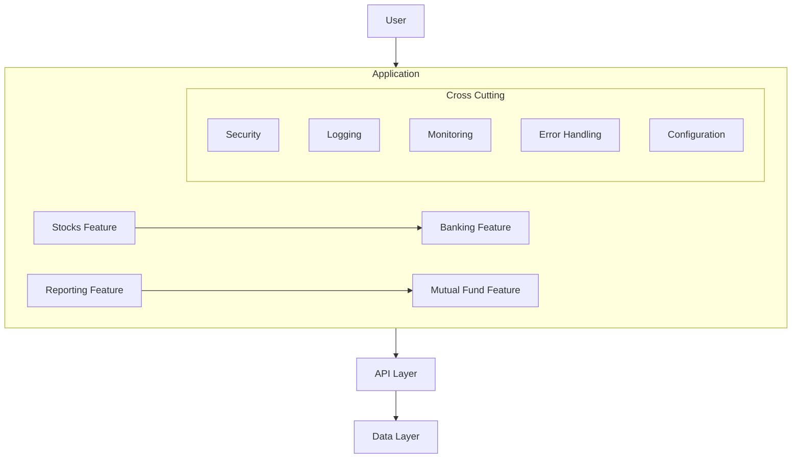
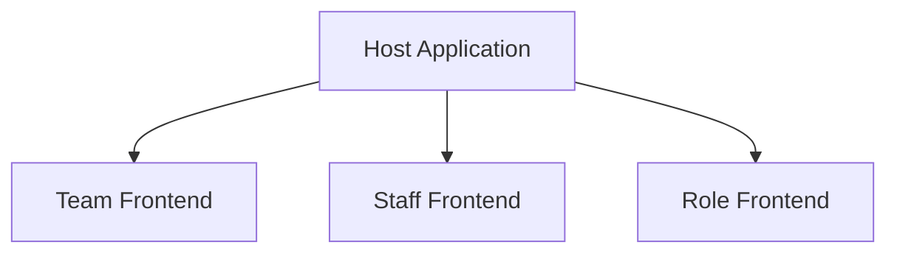
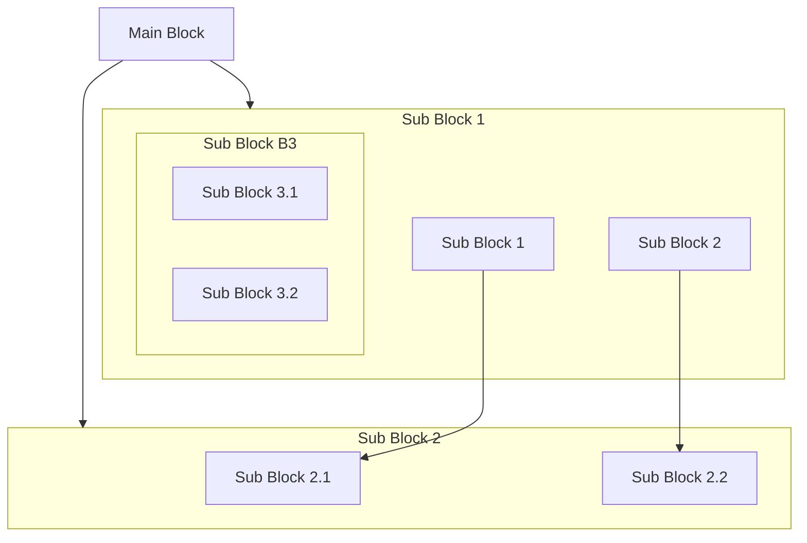

 >Micro Frontend is a new architectural style for building web applications. It is an extension of the microservices architecture to the frontend world. It allows you to break down your large frontend application into smaller, more manageable pieces, which can be developed, deployed, and maintained independently.
 {: .prompt-info }

## Need for Micro Frontend Architecture
Currently the traditional monolithic architecture that is very much prevelant has several limitations. This makes it difficult to scale and maintain the frontend application. Some of the key limitations are:
 - **Monolithic Codebase**: The traditional monolithic architecture has a single codebase that contains all the frontend logic. This makes it difficult to scale and maintain the application as the codebase grows.
 - **Tight Coupling**: The traditional monolithic architecture has tight coupling between the frontend components. This makes it difficult to change or replace a component without affecting the other components.
 - **Single Technology Stack**: The traditional monolithic architecture has a single technology stack that is used to develop the frontend application. This makes it difficult to upgrade to the latest technologies and frameworks without rewriting the entire application. This means the upgrade needs to be planned for entire application and doesn't support incremental upgrades.
 - **Single Deployment**: The traditional monolithic architecture has a single deployment process that is used to deploy the frontend application. This makes it difficult to deploy the application in a continuous delivery environment. Even if one single funcionality is changed, the entire application needs to be deployed increasng downtime and risk.
 - **Large Team Size**: The traditional monolithic architecture has a single large team that is responsible for developing the frontend application. This makes it difficult to scale the development team as the application grows.
 - **Single Release Cycle**: The traditional monolithic architecture has a single release cycle that is used to release the frontend application. This makes it difficult to release new features and bug fixes quickly.
 - **Single User Experience**: The traditional monolithic architecture has a single user experience that is provided to all the users. This makes it difficult to provide a personalized user experience.
 - **Single Performance**: The traditional monolithic architecture has a single performance that is provided to all the users. This makes it difficult to optimize the performance for different users. The grain of deployment unit is much bigger and hence the performance optimization is difficult.
 - **Single Scalability**: The traditional monolithic architecture has a single scalability that is provided to all the users. This makes it difficult to scale the application horizontally. This also means that scaling a individual functionality is difficult or rather not possible.
 - **Single Security**: The traditional monolithic architecture has a single security that is provided to all the users. This makes it difficult to secure the application from different types of attacks.

### A Typical Monolith Architecture
Diagram below shows a typical monolithic architecture where the entire frontend application is developed as a single unit. This makes it difficult to scale and maintain the application as the codebase grows.

# Micro Frontend
Micro Frontend is a new architectural style for building web applications. It is an extension of the microservices architecture to the frontend world. It allows you to break down your large frontend application into smaller, more manageable pieces, which can be developed, deployed, and maintained independently.
This allows us to break a big monilith UI into smaller pieces of modules/screens that can be clubbed together to form a single UI. This helps in better maintainability, scalability and reusability of the code.

## Micro Frontend Architecture
As discussed above, Micro Frontend focuses on breaking down the monolith application into smaller pieces. Each small piece is called a Micro Frontend and loaded inside a shell called Host application.
Each micro frontend can be developed using a different technology, framework, and language. They can be developed by different teams and can be deployed independently. The host utlizies a configuration approach to load these micro frontends at runtime to form a uniform single UI experience for users.

### Ways to implement Micro Frontend

### Benefits of using Micro Frontend
Micro Frontend architecture has several benefits over the traditional monolithic architecture. Some of the key benefits are:
 - **Modular Structure**: Micro Frontend allows you to break down your large frontend application into smaller, more manageable modules. This modules can be developed by different teams in parallel.
 - **Independent Development**: Each of the module can be developed by diffeent teams using thier own tech stack. This means more autonomy and control over internal designs.
 - **Independent Deployment**: Each team can decide on thier own deployment plans. This gives more control to each team and enables the release cycles that are not dependent on other teams.
 - **Performance**: Micro Frontend architecture allows you to load only the required modules on demand. This helps in reducing the initial load time of the application.
 - **Reusability**: Micro Frontend architecture allows you to reuse the modules across different applications. This helps in reducing the development time and effort.
 - **Scalability**: Micro Frontend architecture allows you to scale your application horizontally by adding more instances of the modules. This helps in handling the increased load on the application.
 - **Maintainability**: Micro Frontend architecture allows you to maintain each module independently. This helps in reducing the complexity of the codebase and makes it easier to debug and fix issues.
 - **Flexibility**: Micro Frontend architecture allows you to change the technology stack of a module without affecting the other modules. This helps in keeping the application up-to-date with the latest technologies.
 - **Improved User Experience**: Micro Frontend architecture allows you to provide a seamless user experience by loading the modules on demand. This helps in reducing the initial load time of the application and providing a better user experience. your users don't need to wait to load the entire application before they can start using it.
 - **Security**: Micro Frontend architecture allows you to secure each module independently. This helps in reducing the attack surface of the application and makes it more secure.
 - **Shared Services**: Micro Frontend architecture allows you to share services across different modules. This helps in reducing the duplication of code and makes it easier to maintain and update the services.

### Challenges of using Micro Frontend
Micro Frontend architecture has several challenges that you need to consider before adopting it. Some of the key challenges are:
 - **Integration**: Micro Frontend architecture requires you to integrate the modules at runtime. This can be challenging as you need to ensure that the modules are loaded in the correct order and communicate with each other properly.
 - **Communication**: Micro Frontend architecture requires you to establish a communication mechanism between the modules. This can be challenging as you need to ensure that the modules can communicate with each other without any issues.
 - **State Management**: Micro Frontend architecture requires you to manage the state of the application across different modules. This can be challenging as you need to ensure that the state is consistent across the modules.
 - **Performance**: Micro Frontend architecture requires you to load the modules on demand. This can be challenging as you need to ensure that the modules are loaded quickly and provide a seamless user experience.
 - **Security**: Micro Frontend architecture requires you to secure each module independently. This can be challenging as you need to ensure that the modules are secure and don't expose any vulnerabilities.
 - **Testing**: Micro Frontend architecture requires you to test each module independently. This can be challenging as you need to ensure that the modules work correctly and don't break the application.
 - **Deployment**: Micro Frontend architecture requires you to deploy each module independently. This can be challenging as you need to ensure that the modules are deployed correctly and don't affect the other modules.
 - **Versioning**: Micro Frontend architecture requires you to version each module independently. This can be challenging as you need to ensure that the modules are compatible with each other and don't break the application.
 - **Monitoring**: Micro Frontend architecture requires you to monitor each module independently. This can be challenging as you need to ensure that the modules are performing correctly and don't affect the other modules.

## Micro Frontend with Angular

