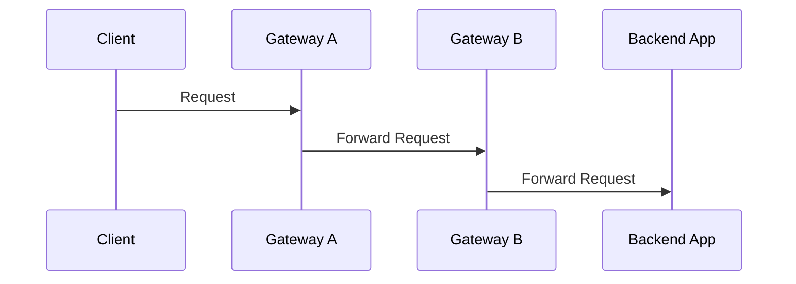
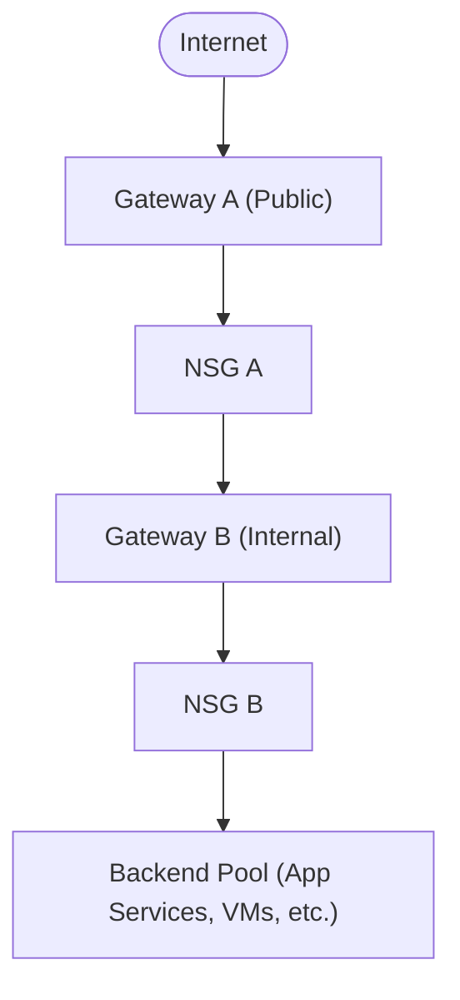

## What is Azure Application Gateway?

[Azure Application Gateway](https://learn.microsoft.com/en-us/azure/application-gateway/overview) is a web traffic load balancer that operates at the application layer ([OSI Layer 7](https://en.wikipedia.org/wiki/OSI_model)). Unlike traditional load balancers that work at the transport layer (Layer 4), Application Gateway can make routing decisions based on HTTP attributes such as:

- URL path
- Host headers
- Query strings
- HTTP methods

This enables advanced routing scenarios, such as:

- URL-based routing (e.g., /images to one backend, /videos to another)
- Multi-site hosting
- SSL termination
- Web Application Firewall (WAF) integration

### Key Feature of Application Gateway

- **Layer 7 Load Balancing**: Intelligent routing based on HTTP/S attributes
- **Web Application Firewall (WAF)**: Protects against common threats like SQL injection and XSS
- **SSL Termination**: Offloads SSL processing from backend servers
- **Autoscaling**: Automatically adjusts capacity based on traffic
- **Zone Redundancy**: High availability across availability zones
- **Custom Probes**: Health monitoring of backend services
- **Private Link Support**: Secure backend connectivity

### Benefits

Application Gateway provides a lot of benefits, some of them I have highlgihted in below table

|Benefit|Description|
|-------|---------|
|Security|Built-in WAF, SSL termination, and integration with Azure DDoS Protection|
|Performance|Autoscaling and caching improve response times|
|Flexibility|Supports multiple site hosting and path-based routing|
|Cost Efficiency|Reduces backend load by offloading SSL and routing logic|
|Zero Trust Ready|Works with Private Link and NSGs for secure internal access|

## What is App Gateway Chaining?

App Gateway refers to the architectural practice of connecting multiple Application Gateways in a sequence to manage and route traffic across complex application environments. This is often used in enterprise or hybrid cloud scenarios where traffic needs to pass through multiple layers of inspection, transformation, or routing before reaching the final destination.

In this pattern, more than one gateways are used to route the traffic before it reaches the destination backend. There are different topologies that can be used to arrange these App Gateway. These are often used as a design for network segmentation like DMZ and multiregion setup.

### Scenario

In this post, I will show how to use App Gateway in a chain fashion performing different roles in the overall setup.

Imagine a setup, in which the client calls an backend system to get the data. However, instead of diretly calling the backend we will put a gateway in between that will route the traffic to backend. In our case, the client is internet facing hence we will use 2 gateways to structure in the form of DMZ located in 2 subnets.



Each gateway in the chain will perform specific functions:

- **Gateway A**: Handles SSL termination, Web Application Firewall (WAF), and basic routing. This is exposed to internet.
- **Gateway B**: Performs advanced routing, authentication, or forwards traffic to internal services. This will be internal to setup.

## Connectivity Options

Below are some of the connectivity options that can be used

|Method|Description|Use Case|
|--------|---------|--------|
|VNet Peering| Use this to connects two virtual networks in Azure|Same region or global VNet communication|
|Private Link|This provides private connectivity to Azure services|Secure, private access to Gateway B|
|ExpressRoute|Dedicated private connection from on-prem to Azure|Hybrid cloud or high-throughput needs|

## Benefits of using Gateway Chaining for DMZ

|Benefit|Description|
|--------|-----------|
|Layered Security|Isolates public and internal traffic handling|
|Granular Control|Each gateway can enforce different policies|
|Scalability|Each layer can scale independently|
|Compliance|Easier to meet regulatory requirements with network segmentation|
|Zero Trust Ready|Supports identity-aware routing and inspection at multiple layers|

## Using NSG to implement routing




## Introduction

In modern software architecture, especially with the rise of **microservices**, the **API Gateway** pattern has become a cornerstone. It acts as a single entry point for clients, handling requests by routing them to the appropriate microservices, aggregating results, and performing cross-cutting concerns like authentication, logging, and rate limiting.

In this  article I will explore the API Gateway pattern in depth, with practical **C# code samples**, and discuss its implementation across different architectural paradigms.

## What is an API Gateway?

An **API Gateway** is a server that sits between clients and backend services. It abstracts the internal system architecture and provides a unified API to the clients.

### Responsibilities of an API Gateway:

- Request routing
- Load balancing
- Authentication and authorization
- Rate limiting and throttling
- Response transformation
- Caching
- Logging and monitoring

## Why Use an API Gateway?

Without an API Gateway, clients must interact with each microservice individually. This leads to:

- Increased complexity on the client side
- Tight coupling between client and services
- Duplication of cross-cutting concerns

### Benefits of Using an API Gateway

- **Simplified Client Communication**: Clients interact with a single endpoint.
- **Centralized Security**: Authentication and authorization are managed in one place.
- **Rate Limiting and Throttling**: Prevent abuse and ensure fair usage.
- **Load Balancing**: Distribute requests evenly across services.
- **Response Aggregation**: Combine responses from multiple services.
- **Protocol Translation**: Convert between different protocols (e.g., HTTP to gRPC).

### Challenges of Using an API Gateway

- **Single Point of Failure**: If the gateway goes down, all services become inaccessible.
- **Performance Overhead**: Additional processing can introduce latency.
- **Complex Configuration**: Managing routing, security, and policies can be complex.
- **Scalability**: The gateway itself must be scalable to handle traffic.

## Ways to implement API Gateway

1. **Monolithic API Gateway**  
   A single, centralized API Gateway that handles all incoming requests and routes them to the appropriate backend services. This approach is simple to implement but can become a bottleneck as the system scales.

2. **Microservices API Gateway**  
   Each microservice has its own dedicated API Gateway. This approach provides better scalability and isolation but increases the complexity of managing multiple gateways.

3. **Serverless API Gateway**  
   Using serverless platforms like AWS API Gateway or Azure API Management to handle API requests. This approach reduces infrastructure management and scales automatically based on demand.

4. **Custom Middleware**  
   Implementing a custom middleware layer in your backend application to act as an API Gateway. This provides flexibility but requires more development effort and maintenance.

5. **BFF (Backend for Frontend)**  
   Creating a dedicated API Gateway for each frontend application (e.g., web, mobile). This ensures that each frontend gets tailored APIs optimized for its needs.

6. **GraphQL Gateway**  
   Using GraphQL as an API Gateway to aggregate and fetch data from multiple backend services. This approach provides flexibility in querying data but requires a GraphQL server setup.

7. **Service Mesh Integration**  
   Leveraging service mesh tools like Istio or Linkerd to implement API Gateway functionality as part of the service mesh. This approach is suitable for Kubernetes-based environments.

## Implementing an API Gateway in C#

Let’s start with a **basic custom API Gateway** using **ASP.NET Core**.

### Sample Setup

Assume we have two microservices:

- `OrderService` at `http://localhost:5000`
- `ProductService` at `http://localhost:5001`

The services are created using API controller for Order and Products as shown below

```csharp
	// GET: api/Order
	[HttpGet]
	public IActionResult GetOrders()
	{
		if (!System.IO.File.Exists(DataFilePath))
		{
			return NotFound("Data file not found.");
		}

		var jsonData = System.IO.File.ReadAllText(DataFilePath);
		var orders = JsonSerializer.Deserialize<List<Order>>(jsonData);

		return Ok(orders);
	}
```

```csharp
	// GET: api/Product
	[HttpGet]
	public IActionResult GetProducts()
	{
		if (!System.IO.File.Exists(DataFilePath))
		{
			return NotFound("Data file not found.");
		}

		var jsonData = System.IO.File.ReadAllText(DataFilePath);
		var products = JsonSerializer.Deserialize<List<Product>>(jsonData);

		return Ok(products);
	}
```

### Create the API Gateway Project

```bash
dotnet new webapi -n ApiGateway
cd ApiGateway
```

### Create a GatewayController

Next we will create a GatewayController which exposes endpoints for Products and Order. These endpoints internally calls the underlying products and order services.

- This way the caller client is sheilded from the lower level details of smaller services.
- Also it helps to implement the aggregation and other features in gateway.
- This way the heavy lifting logic is done by the gateway.

#### Exposing the intermediate methods

Here we will expose expose gateway method for Products and Orders

```csharp
	// GET: api/Gateway/products
	[HttpGet("products")]
	public async Task<IActionResult> GetProducts()
	{
		var productServiceUrl = _productServiceUrl + "Product";
		var response = await _httpClient.GetAsync(productServiceUrl);

		if (!response.IsSuccessStatusCode)
		{
			return StatusCode((int)response.StatusCode, "Failed to fetch products.");
		}

		var products = await response.Content.ReadAsStringAsync();
		return Content(products, "application/json");
	}

	// GET: api/Gateway/orders
	[HttpGet("orders")]
	public async Task<IActionResult> GetOrders()
	{
		var orderServiceUrl = _orderServiceUrl + "Order";
		var response = await _httpClient.GetAsync(orderServiceUrl);

		if (!response.IsSuccessStatusCode)
		{
			return StatusCode((int)response.StatusCode, "Failed to fetch orders.");
		}

		var orders = await response.Content.ReadAsStringAsync();
		return Content(orders, "application/json");
	}

```

#### Exposing an aggregate method

This method exposes an endpoint that calls the orders and products services and then return only the orders that matches with products. This way, you can implement any filter or aggregation logic

```csharp
	[HttpGet("orders-with-products")]
	public async Task<IActionResult> GetOrdersWithProducts()
	{
		var orderServiceUrl = _orderServiceUrl + "Order";
		var productServiceUrl = _productServiceUrl + "Product";

		var options = new JsonSerializerOptions
		{
			PropertyNameCaseInsensitive = true
		};

		// Fetch orders
		var orderResponse = await _httpClient.GetAsync(orderServiceUrl);
		if (!orderResponse.IsSuccessStatusCode)
		{
			return StatusCode((int)orderResponse.StatusCode, "Failed to fetch orders.");
		}
		var orderData = await orderResponse.Content.ReadAsStringAsync();
		var orders = JsonSerializer.Deserialize<List<Order>>(orderData, options);

		// Fetch products
		var productResponse = await _httpClient.GetAsync(productServiceUrl);
		if (!productResponse.IsSuccessStatusCode)
		{
			return StatusCode((int)productResponse.StatusCode, "Failed to fetch products.");
		}
		var productData = await productResponse.Content.ReadAsStringAsync();
		var products = JsonSerializer.Deserialize<List<Product>>(productData, options);

		// Aggregate orders with product details
		var ordersWithProducts = orders.Select(order =>
		{
			var enrichedItems = order.Items.Select(item =>
			{
				var product = products.FirstOrDefault(p => p.Id == item.ProductId);
				return new
				{
					item.ProductId,
					ProductName = product?.Name,
					item.Quantity,
					item.Price,
					ProductCategory = product?.Category
				};
			}).ToList();

			return new
			{
				order.Id,
				order.CustomerName,
				order.OrderDate,
				Items = enrichedItems,
				order.TotalAmount
			};
		});

		return Ok(ordersWithProducts);
	}
```

### Create a client console app to call the gateway

Though this can be any type of client, we will use a .NET Console application to call our Gateway methods.

```csharp
	client = new ShoppingCartClient("http://localhost:5002");

	//Fetch products
	products = await client.GetProductsAsync();
	Console.WriteLine("Products: " + products);

	// Fetch orders
	var orders = await client.GetOrdersAsync();
	Console.WriteLine("Orders: " + orders);
```

Here `ShoppingCartClient` is a utility class created to abstract the `HttpClient` calls for gateway service.

The code for this sample can be found [here](https://github.com/pravinchandankhede/designpatterns/tree/main/src/microservices/APIGateway)

This is a basic reverse proxy. Let’s now explore more advanced patterns.

## Cloud-Native API Gateways

In this method we will use the API gateway that are provided by all major cloud providers. In this method, we deploy an instance of API Gateway which acts as an reverse proxy and handle all the heavu lifting work like aggregation etc.

### Azure API Management (APIM)

Microsoft Azure provides a cloud service [Azure API Management](https://azure.microsoft.com/en-us/products/api-management). It supports following features at a high level

- **API Gateway**: Lets you manage API securely with declarative pplicies for request authentication, validation, routing, throttling, caching, transformation, load balancing and circuit breaking.
- **Monitoring**: Provides native support for monitoring and log analytics. Helps you get insights into usage, latency, error rates with pre define dashboards.
- **Seemless Integration**: It is capable of native integration with services like App Services, Azure Functions, Logic Apps, Kubernetes etc. This help to unify traffic across all these workloads.
- **API Developer Portal**: Proivdes self service developer portal for interactive documentation, test and access management.
- **Hybrid Cloud Support**: Capable of exposing not only Azure but services from other cloud providers as well.

#### Example Policy (XML)

Here is an sample Azure API Management (APIM) policy example for a shopping cart service that shows request authentication, response caching, response transformation, and circuit breaking. This assumes the service aggregates two granular services: Orders and Products.

 ```xml
<policies>
    <inbound>
        <!-- Base policy -->
        <base />

        <!-- Request Authentication -->
        <validate-jwt header-name="Authorization" failed-validation-httpcode="401" failed-validation-error-message="Unauthorized">
            <openid-config url="https://login.microsoftonline.com/{tenant-id}/.well-known/openid-configuration" />
            <required-claims>
                <claim name="aud">
                    <value>api://shopping-cart-service</value>
                </claim>
            </required-claims>
        </validate-jwt>

        <!-- Caching Response -->
        <cache-lookup vary-by-developer="false" vary-by-developer-groups="false" vary-by-query-parameters="*" />
    </inbound>

    <backend>
        <!-- Circuit Breaker -->
        <circuit-breaker errors-count="5" interval="30" />
    </backend>

    <outbound>
        <!-- Caching Response -->
        <cache-store duration="300" />

        <!-- Response Transformation -->
        <set-body>
            @{
                var response = context.Response.Body.As<JObject>();
                return new JObject(
                    new JProperty("status", "success"),
                    new JProperty("data", response)
                ).ToString();
            }
        </set-body>
    </outbound>

    <on-error>
        <!-- Handle errors gracefully -->
        <set-status code="500" reason="Internal Server Error" />
        <set-body>
            {
                "status": "error",
                "message": "An unexpected error occurred. Please try again later."
            }
        </set-body>
    </on-error>
</policies>
```

**Request Authentication**: Uses validate-jwt to authenticate requests using a JWT token issued by Azure AD.
Replace {tenant-id} with your Azure AD tenant ID and api://shopping-cart-service with your API's audience.

**Caching**: cache-lookup checks if the response is already cached.
cache-store stores the response for 300 seconds (5 minutes).

**Circuit Breaker**: Limits backend calls if there are 5 errors within a 30-second interval.

**Response Transformation**: Wraps the backend response in a custom JSON structure with a status field.

**Error Handling**: Returns a user-friendly error message in case of failures.

### AWS API Gateway

AWS also offers a similar service however we won't be going thorugh that in detail. You can refer it [here](https://aws.amazon.com/api-gateway/)

## Custom API Gateway with Ocelot (C#)

[Ocelot](https://www.nuget.org/packages/Ocelot) is a popular .NET API Gateway library.

Install Ocelot

```bash
dotnet add package Ocelot
```

ocelot.json

```json
{
  "Routes": [
    {
      "DownstreamPathTemplate": "/products",
      "DownstreamScheme": "http",
      "DownstreamHostAndPorts": [
        { "Host": "localhost", "Port": 5001 }
      ],
      "UpstreamPathTemplate": "/products",
      "UpstreamHttpMethod": [ "GET" ]
    }
  ],
  "GlobalConfiguration": {
    "BaseUrl": "http://localhost:5000"
  }
}
```

Program.cs

```csharp
builder.Services.AddOcelot();
var app = builder.Build();
await app.UseOcelot();
app.Run();
```

## API Gateway in Microservices Architecture

In a microservices setup, the API Gateway:

- Acts as a facade for internal services
- Helps with service discovery
- Enables centralized security

### Aggregation Example

 ```csharp
 app.MapGet("/dashboard", async (HttpClient http) =>
{
    var products = await http.GetStringAsync("http://localhost:5001/products");
    var orders = await http.GetStringAsync("http://localhost:5002/orders");

    return Results.Json(new { products = JsonSerializer.Deserialize<object>(products), orders = JsonSerializer.Deserialize<object>(orders) });
});
```

## BFF (Backend for Frontend)

A BFF is a specialized API Gateway tailored to a specific frontend (e.g., mobile, web).

Why BFF?

- Different frontends have different needs
- Avoid over-fetching or under-fetching
- Encapsulate frontend-specific logic

Example

```csharp
app.MapGet("/mobile/dashboard", async (HttpClient http) =>
{
    var summary = await http.GetStringAsync("http://localhost:5001/mobile-summary");
    return Results.Json(new { summary });
});
```

You can have separate BFFs for:

- Web
- Mobile
- IoT

## API Gateway vs Service Mesh

| Feature | API Gateway | Service Mesh |
|---------|-------------|--------------|
| Scope | North-South (client to service) | East-West (service to service)
| Focus | Entry point, auth, rate limiting | Traffic control, observability
| Examples |  Ocelot, Azure APIM | Istio, Linkerd
| Language | App-level (C#) | Sidecar proxies (Envoy)esh

Can They Coexist?
Yes! Use API Gateway for external traffic and Service Mesh for internal communication.

## Best Practices

Secure your gateway with OAuth2/JWT
Rate limit to prevent abuse
Use caching for performance
Log and monitor all requests
Keep the gateway stateless
Avoid putting business logic in the gateway

## Testing and Monitoring

Use tools like:

- Postman for API testing
- Serilog or Application Insights for logging
- Prometheus + Grafana for metrics

## Sample code

Please refer the below project for the sample implementation code
[Link](https://github.com/pravinchandankhede/designpatterns/tree/main/src/microservices/APIGateway)

## Conclusion

The API Gateway pattern is essential in modern distributed systems. Whether you're building a custom gateway in C#, using cloud-native solutions like Azure APIM, or implementing BFFs for frontend optimization, the pattern provides a powerful abstraction layer that simplifies client interactions and centralizes cross-cutting concerns.
