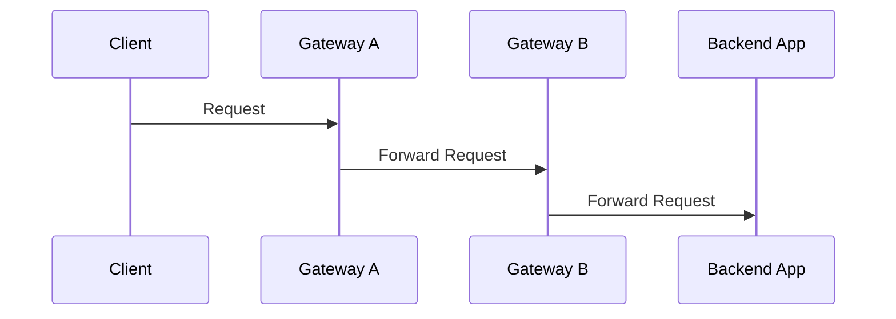
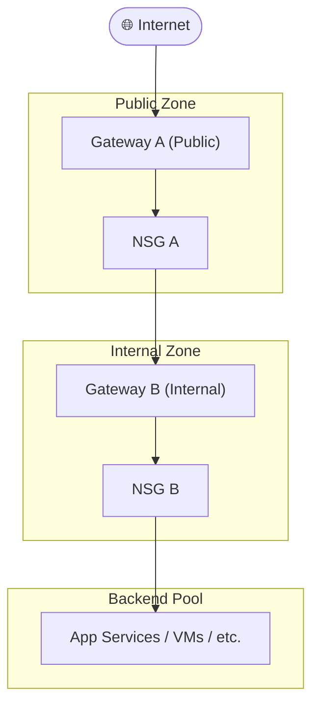

## What is Azure Application Gateway?

[Azure Application Gateway](https://learn.microsoft.com/en-us/azure/application-gateway/overview) is a web traffic load balancer that operates at the application layer ([OSI Layer 7](https://en.wikipedia.org/wiki/OSI_model)). Unlike traditional load balancers that work at the transport layer (Layer 4), Application Gateway can make routing decisions based on HTTP attributes such as:

- URL path
- Host headers
- Query strings
- HTTP methods

This enables advanced routing scenarios, such as:

- URL-based routing (e.g., /images to one backend, /videos to another)
- Multi-site hosting
- SSL termination
- Web Application Firewall (WAF) integration

### Key Feature of Application Gateway

- **Layer 7 Load Balancing**: Intelligent routing based on HTTP/S attributes
- **Web Application Firewall (WAF)**: Protects against common threats like SQL injection and XSS
- **SSL Termination**: Offloads SSL processing from backend servers
- **Autoscaling**: Automatically adjusts capacity based on traffic
- **Zone Redundancy**: High availability across availability zones
- **Custom Probes**: Health monitoring of backend services
- **Private Link Support**: Secure backend connectivity

### Benefits

Application Gateway provides a lot of benefits, some of them I have highlgihted in below table

|Benefit|Description|
|-------|---------|
|Security|Built-in WAF, SSL termination, and integration with Azure DDoS Protection|
|Performance|Autoscaling and caching improve response times|
|Flexibility|Supports multiple site hosting and path-based routing|
|Cost Efficiency|Reduces backend load by offloading SSL and routing logic|
|Zero Trust Ready|Works with Private Link and NSGs for secure internal access|

## What is App Gateway Chaining?

App Gateway refers to the architectural practice of connecting multiple Application Gateways in a sequence to manage and route traffic across complex application environments. This is often used in enterprise or hybrid cloud scenarios where traffic needs to pass through multiple layers of inspection, transformation, or routing before reaching the final destination.

In this pattern, more than one gateways are used to route the traffic before it reaches the destination backend. There are different topologies that can be used to arrange these App Gateway. These are often used as a design for network segmentation like DMZ and multiregion setup.

### Scenario

In this post, I will show how to use App Gateway in a chain fashion performing different roles in the overall setup.

Imagine a setup, in which the client calls an backend system to get the data. However, instead of diretly calling the backend we will put a gateway in between that will route the traffic to backend. In our case, the client is internet facing hence we will use 2 gateways to structure in the form of DMZ located in 2 subnets.

Each gateway in the chain will perform specific functions:

- **Gateway A**: Handles SSL termination, Web Application Firewall (WAF), and basic routing. This is exposed to internet.
- **Gateway B**: Performs advanced routing, authentication, or forwards traffic to internal services. This will be internal to setup.

## Connectivity Options

Below are some of the connectivity options that can be used

|Method|Description|Use Case|
|--------|---------|--------|
|VNet Peering| Use this to connects two virtual networks in Azure|Same region or global VNet communication|
|Private Link|This provides private connectivity to Azure services|Secure, private access to Gateway B|
|ExpressRoute|Dedicated private connection from on-prem to Azure|Hybrid cloud or high-throughput needs|

## Benefits of using Gateway Chaining for DMZ

|Benefit|Description|
|--------|-----------|
|Layered Security|Isolates public and internal traffic handling|
|Granular Control|Each gateway can enforce different policies|
|Scalability|Each layer can scale independently|
|Compliance|Easier to meet regulatory requirements with network segmentation|
|Zero Trust Ready|Supports identity-aware routing and inspection at multiple layers|

## Using NSG to implement routing

In this setup, we will use 2 NSG that will be associated to subnet of 2 App Gateways

- **NSG 1**: This NSG will be attached to subnet of gateway 1, it will allow all traffic from internet to flow to gateway 1. It will also allow traffic to flow from Gateway 1 to 2.
Below rule table show the details

|Priority|Direction|Protocol|Source|Destination|Port|Action|Description|
|--------|---------|--------|------|------------|----|-----|-----------|
|100|Inbound|TCP|Internet|Gateway A|443|Allow|AllowHTTPS from internet|
|200|Inbound|TCP|Gateway A|Gateway B|443|Allow|Allow HTTPS to Gateway B|
|400|Inbound|*|*|*|*|Deny|Deny all else|

- **NSG 2**: This NSG routes the traffic from Gateway 2 to Backend services.

|Priority|Direction|Protocol|Source|Destination|Port|Action|Description|
|--------|---------|--------|------|------------|----|-----|-----------|
|100|Inbound|TCP|Gateway A|Gateway B|443|Allow|Allow HTTPS from Gateway A|
|200|Inbound|TCP|Gateway B|Backend Pool|443|Allow|Allow HTTPS to backend|
|400|Inbound|*|*|*|*|Deny|Deny all else|

## Why to use 2 NSGs?

In the above setup, we have used 2 NSGs. However this is not needed in every case. Please consider the below before you decide on the number of NSGs

### When One NSG Is Enough

If both Gateway A and Gateway B are in the same subnet or you only need to control traffic in one direction, then:

You can attach one NSG to the subnet (or NIC) and define inbound and outbound rules to control traffic between the gateways and the backend. This simplifies management and reduces overhead.

Example: Single NSG on Gateway A Subnet

| Priority | Direction | Protocol | Source     | Destination | Port | Action | Description                  |
|----------|-----------|----------|------------|-------------|------|--------|------------------------------|
| 100      | Inbound   | TCP      | Internet   | Gateway A   | 443  | Allow  | Allow HTTPS from internet   |
| 200      | Outbound  | TCP      | Gateway A  | Gateway B   | 443  | Allow  | Allow HTTPS to Gateway B    |
| 300      | Outbound  | TCP      | Gateway B  | Backend     | 443  | Allow  | Allow HTTPS to backend      |
| 400      | *         | *        | *          | *           | *    | Deny   | Default deny                |

### When Two NSGs Are Better

Use two NSGs when:

- Gateways are in different subnets (which is common in layered architectures).
- You want independent control over each layer (e.g., DMZ vs internal).
- You need more granular logging, auditing, or policy enforcement.
- This aligns with Zero Trust and defense-in-depth principles.

## Conclusion

The API Gateway is essential in modern distributed systems. Effectively using Application Gateway involves thoughtful planning of your network and segmentation. You should also think about implementing various policies and how application gateway can be effectively leverage for your requirements.
