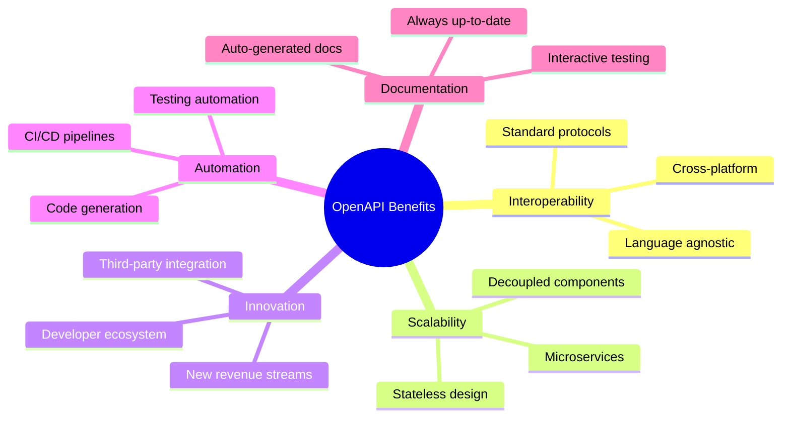
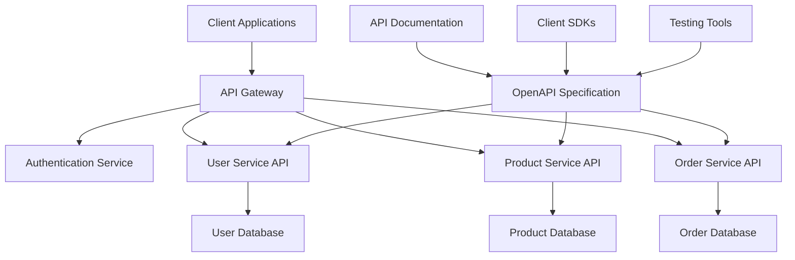
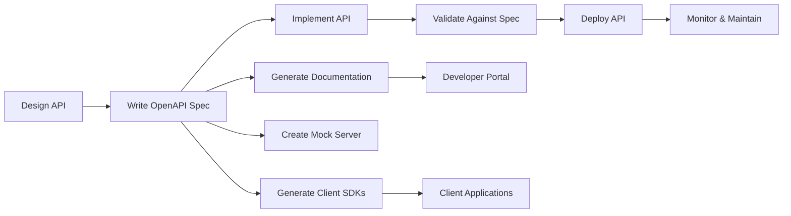
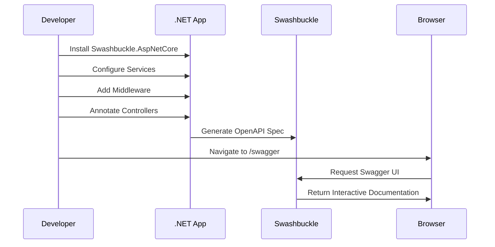

## What is API

API stands for Application Programming Interface. It is a set of rules and protocols that allows different software applications to communicate with each other. APIs define the methods and data formats that applications can use to request and exchange information.

## Why should we go for APIs?

APIs helps to build a robust ecosystem around applications by enabling seamless integration and interaction between different services and components. Here are some key benefits:

1. **Interoperability**: APIs enable different systems and applications to work together, regardless of their underlying technologies. This is especially important in today's diverse IT landscape, where organizations use a mix of on-premises and cloud-based solutions. These APIs are based on open standards and uses well known protocols like [HTTP](https://httpwg.org/) and [REST](https://restfulapi.net/).

2. **Scalability**: APIs allow organizations to scale their applications more easily by decoupling the front-end and back-end components. This means that developers can update or replace individual components without affecting the entire system. One of the pattern for APIs is to be stateless, which means that each request from a client contains all the information needed to process that request. This helps in achieving better performance and resource utilization.

3. **Innovation**: By exposing their functionality through APIs, organizations can encourage third-party developers to build new applications and services on top of their platforms. This can lead to innovative solutions and new revenue streams. Since APIs are designed to be easily consumable, they can attract a larger developer community, fostering collaboration and creativity.

4. **Automation**: APIs can be used to automate repetitive tasks and streamline workflows. This can help organizations improve efficiency and reduce the risk of human error.



## API Based ecosystems

In todays collaborative environment, APIs play a crucial role in enabling different applications and services to work together seamlessly. By providing a standardized way for systems to communicate, APIs help organizations build a more integrated and efficient ecosystem.

These ecosystems are based on open standards and protocols, which promote interoperability and reduce vendor lock-in. By leveraging APIs, organizations can create a more flexible and adaptable architecture that can evolve with changing business needs. This essentially plays an important role during business expansion, acquisition and integration efforts.

Below diagram shows an example of ecosystem for ecommerce



## Discovering APIs

APIs can be discovered through various means, including:

1. **API Documentation**: Most APIs come with documentation that describes the available endpoints, request/response formats, and authentication methods. This is often the best place to start.

2. **API Marketplaces**: Platforms like RapidAPI or Postman offer a collection of APIs that you can browse and test.

3. **OpenAPI Specification**: Many modern APIs use the OpenAPI Specification (formerly known as Swagger) to define their endpoints in a machine-readable format. This allows for easier discovery and integration.

4. **Community and Forums**: Engaging with developer communities, forums, and social media can help you discover lesser-known APIs or get recommendations based on your needs.

5. **Code Repositories**: Exploring public code repositories (e.g., GitHub) can reveal APIs used in various projects, along with example implementations.

By leveraging these resources, developers can efficiently discover and integrate APIs into their applications.

In this article, we will explore about Open API Specification and how it helps to create discoverable APIs. We will also see how to implement it in a .NET application.

## What is OpenAPI Specification?

The OpenAPI Specification (OAS) is a standard for defining RESTful APIs in a machine-readable format. It allows developers to describe the structure and behavior of their APIs using a JSON or YAML document. This specification serves as a contract between the API provider and consumers, enabling better collaboration and understanding.

Key features of OpenAPI Specification include:

1. **Standardization**: OAS provides a consistent way to describe APIs, making it easier for developers to understand and use them.

2. **Documentation Generation**: Tools can automatically generate documentation from the OpenAPI definition, ensuring that it is always up-to-date with the API implementation.

3. **Client SDK Generation**: OpenAPI definitions can be used to generate client SDKs in various programming languages, simplifying the integration process for developers.

4. **API Testing**: The specification can be used to create automated tests for APIs, ensuring that they behave as expected.

5. **Ecosystem Support**: Many tools and frameworks support OpenAPI, making it easier to integrate into existing workflows.

6. **Discoverability**: APIs defined with OpenAPI can be easily discovered and understood by developers, as the specification provides a clear and structured way to present API capabilities.



## OpenAPI Structure and Schema

The OpenAPI Specification defines a standard structure for describing RESTful APIs. The main components of the OpenAPI structure include:

1. **Info Object**: Contains metadata about the API, such as the title, version, and description.

2. **Paths Object**: Defines the available endpoints (paths) and their operations (e.g., GET, POST) along with parameters, request bodies, and responses.

3. **Components Object**: Allows for the definition of reusable components, such as schemas (data models), parameters, and responses.

4. **Security Requirements**: Specifies the security mechanisms (e.g., API keys, OAuth) that protect the API.

5. **Tags**: Provides a way to group related endpoints for better organization and discoverability.

```json
{
  "openapi": "3.0.0",
  "info": {
    "title": "My API",
    "version": "v1"
  },
  "paths": {
    "/api/my": {
      "get": {
        "summary": "Get My Data",
        "responses": {
          "200": {
            "description": "Successful response",
            "content": {
              "application/json": {
                "schema": {
                  "type": "object",
                  "properties": {
                    "message": {
                      "type": "string"
                    }
                  }
                }
              }
            }
          }
        }
      }
    }
  }
}
```

## How to Implement OpenAPI in .NET

In .NET, you can implement OpenAPI Specification using various libraries and tools. One of the most popular libraries is **Swashbuckle.AspNetCore**, which seamlessly integrates with ASP.NET Core applications to generate OpenAPI documentation.

Below is high level implementation flow



### Steps to Implement OpenAPI in .NET

1. **Install Swashbuckle.AspNetCore**: Add the NuGet package to your project.

   ```bash
   dotnet add package Swashbuckle.AspNetCore
   ```

2. **Configure Services**: In your `Startup.cs` or `Program.cs`, add Swagger services to the DI container.

   ```csharp
   public void ConfigureServices(IServiceCollection services)
   {
       services.AddControllers();
       services.AddSwaggerGen(c =>
       {
           c.SwaggerDoc("v1", new OpenApiInfo { Title = "My API", Version = "v1" });
       });
   }
   ```

3. **Enable Middleware**: In the `Configure` method, enable the Swagger middleware.

   ```csharp
   public void Configure(IApplicationBuilder app, IWebHostEnvironment env)
   {
       if (env.IsDevelopment())
       {
           app.UseDeveloperExceptionPage();
       }

       app.UseRouting();

       app.UseAuthorization();

       app.UseEndpoints(endpoints =>
       {
           endpoints.MapControllers();
       });

       app.UseSwagger();
       app.UseSwaggerUI(c =>
       {
           c.SwaggerEndpoint("/swagger/v1/swagger.json", "My API V1");
       });
   }
   ```

4. **Annotate Your API**: Use attributes to provide additional metadata for your API endpoints.

   ```csharp
   [ApiController]
   [Route("api/[controller]")]
   public class MyController : ControllerBase
   {
       [HttpGet]
       public IActionResult Get()
       {
           return Ok(new { Message = "Hello World" });
       }
   }
   ```

5. **Access the Swagger UI**: Run your application and navigate to `/swagger` to see the generated API documentation.

In summary, the OpenAPI Specification is a powerful tool for designing, documenting, and consuming APIs, promoting best practices and improving the overall developer experience.
