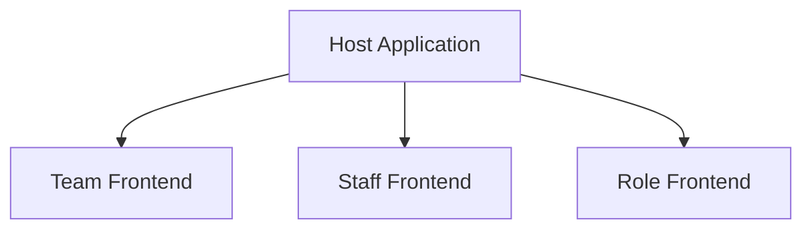

# Micro Frontend
Micro Frontend is a new architectural style for building web applications. It is an extension of the microservices architecture to the frontend world. It allows you to break down your large frontend application into smaller, more manageable pieces, which can be developed, deployed, and maintained independently.
This allows us to break a big monilith UI into smaller pieces of modules/screens that can be clubbed together to form a single UI. This helps in better maintainability, scalability and reusability of the code.

## Micro Frontend Architecture
As discussed above, Micro Frontend focuses on breaking down the monolith application into smaller pieces. Each small piece is called a Micro Frontend and loaded inside a shell called Host application.
Each micro frontend can be developed using a different technology, framework, and language. They can be developed by different teams and can be deployed independently. The host utlizies a configuration approach to load these micro frontends at runtime to form a uniform single UI experience for users.

### Ways to implement Micro Frontend

### Benefits of using Micro Frontend
Micro Frontend architecture has several benefits over the traditional monolithic architecture. Some of the key benefits are:
 - Modular Structure: Micro Frontend allows you to break down your large frontend application into smaller, more manageable modules. This modules can be developed by different teams in parallel.
 - Independent Development: Each of the module can be developed by diffeent teams using thier own tech stack. This means more autonomy and control over internal designs.
 - Independent Deployment: Each team can decide on thier own deployment plans. This gives more control to each team and enables the release cycles that are not dependent on other teams.

### Challenges of using Micro Frontend

## Micro Frontend with Angular
