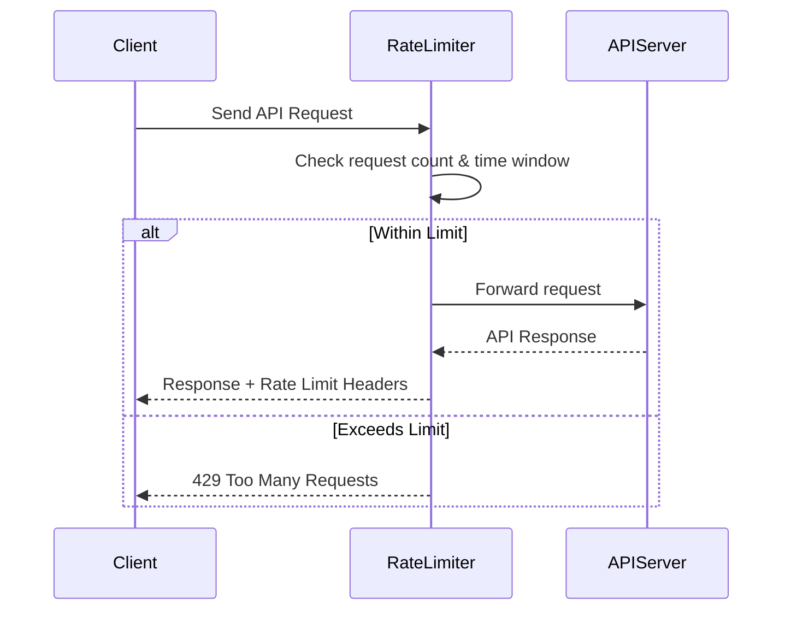

## Introduction

APIs (Application Programming Interfaces) are the backbone of modern software systems, enabling communication between different services and applications. They are now the defacto standards for system integration and extension.

The APIs are easily accessible over HTTP and a wide variety of devices, which makes them the first choice for developers. Many software vendors are exposing thier products through APIs. This makes their product

APIs are the backbone of API based economy and often subject to high traffic, and without proper controls, they can become overwhelmed, leading to performance issues or even downtime. As APIs become more widely used, managing how they are accessed becomes critical — and that's where **API rate limiting** comes in. Rate limiting is a key strategy to ensure that APIs remain stable, secure, and performant.

### What is API Rate Limiting?

**API rate limiting** is a technique used to control the number of requests a client can make to an API within a specified time frame. It acts as a gatekeeper, ensuring that no single user or application can overwhelm the system with too many requests.

For example, an API might allow:

- 100 requests per minute per user
- 1,000 requests per day per IP address

There are various strategies and algorithms for implementing rate limiting, each with its own advantages and trade-offs. The goal is to balance resource usage while providing a fair and consistent experience for all users. These balances help maintain the stability, security, and performance of the API.

### Why is Rate Limiting Important?

Rate limiting serves several key purposes:

- **Prevents Abuse**: Stops malicious users from spamming or launching [denial-of-service (DoS) attacks](https://en.wikipedia.org/wiki/Denial-of-service_attack).
- **Ensures Fair Usage**: Distributes resources evenly among users, preventing a few clients from monopolizing the API.
- **Improves Performance**: Reduces server load and helps maintain consistent response times.
- **Enhances Security**: Helps detect and block suspicious behavior patterns.
- **Controls Costs**: Especially important for APIs with usage-based billing models.

Rate limiting is often used by **cloud providers, API gateways, and application developers** for building **scalable, secure, and reliable APIs**.

## How Rate Limiting Works

API rate limiting is all about controlling access to resources by defining how many requests a client can make in a given time window. To implement this, systems use various algorithms that track and enforce these limits.
Below are some of the key concepts that we need to understand for rate limiting.

### Key Concepts

- **Request**: A call made by a client to an API endpoint.
- **Limit**: The maximum number of requests allowed.
- **Window**: The time period over which the limit is applied (e.g., 60 seconds).
- **Quota**: The total number of requests allowed over a longer period (e.g., 10,000 requests per month).
- **Headers**: APIs often return rate limit info in response headers like:
  - `X-RateLimit-Limit`
  - `X-RateLimit-Remaining`
  - `X-RateLimit-Reset`
- **HTTP Status Codes**:
  - `429 Too Many Requests`: Indicates the client has hit the rate limit.

### Rate Limiting Flow at High Level

1. **Client Sends Request**: A client (user, app, or service) sends a request to an API endpoint.

2. **Rate Limiter Intercepts Request**: Before the request reaches the actual API logic, it passes through a rate limiter — this could be middleware, an API gateway, or a proxy. We will subsequently see how this is implemented.

3. **Rate Limiter Checks Usage**: The rate limiter checks:

   - Who is making the request (IP, user ID, API key). There can be other parameters as well depending on the use case.
   - How many requests they’ve made in the current time window.
   - Whether they’ve exceeded their allowed limit

4. **Decision Point**: Depending on the outcome of the checks:

   - ✅ If under the limit: The request is forwarded to the API server.
   - ❌ If over the limit: The request is blocked, and a 429 Too Many Requests response is returned.

5. **API Server Processes Request**: If allowed, the API server processes the request and returns a response.

6. **Rate Limit Headers Returned**: The response includes headers like:

   - `X-RateLimit-Limit`: Total allowed requests
   - `X-RateLimit-Remaining`: Requests left in the window
   - `X-RateLimit-Reset`: Time when the limit resets

   These can be utilized by clients to manage their request rates effectively and avoid hitting the limits including implementing exponential backoff strategies. Clients can also use these headers for managing the user experience like showing error messages etc.

Below diagram the pictorial view of this entire process. The rate limited can be implemented using variety of techniques. The core concept however remains the same.



### Common Rate Limiting Algorithms

Different algorithms offer different trade-offs in terms of accuracy, complexity, and performance. Here's a breakdown of the most widely used ones:

#### 1. Fixed Window

- **How it works**: Counts requests in fixed time intervals (e.g., per minute).
- **Pros**: Simple to implement.
- **Cons**: Can lead to burst traffic at window edges.

**Example**:  
If the limit is 100 requests per minute, a client could send 100 requests at 11:59:59 and another 100 at 12:00:01 — effectively 200 requests in 2 seconds.

#### 2. Sliding Window

- **How it works**: Uses a rolling time window to calculate the request count.
- **Pros**: Smoother and fairer than fixed window.
- **Cons**: Slightly more complex to implement.

**Example**:  
If the limit is 100 requests per minute, the system checks how many requests were made in the last 60 seconds from the current time.

#### 3. Token Bucket

- **How it works**: Tokens are added to a bucket at a fixed rate. Each request consumes a token.
- **Pros**: Allows short bursts while enforcing a steady rate over time.
- **Cons**: Requires token management logic.

**Example**:  
A bucket holds 10 tokens and refills at 1 token per second. A client can make 10 quick requests, then must wait for tokens to refill.

#### 4. Leaky Bucket

- **How it works**: Requests enter a queue (bucket) and are processed at a fixed rate.
- **Pros**: Smooths out bursts and enforces a consistent flow.
- **Cons**: Requests beyond the queue capacity are dropped or delayed.

**Example**:  
If the leak rate is 1 request per second, and 10 requests arrive at once, they’ll be processed one per second. Excess requests may be dropped if the bucket overflows.

### Algorithm Comparison Table

| Algorithm      | Burst Handling | Fairness | Complexity | Use Case Example         |
|----------------|----------------|----------|------------|---------------------------|
| Fixed Window   | ❌ Poor         | ❌ Low    | ✅ Simple   | Basic APIs, internal tools |
| Sliding Window | ✅ Good         | ✅ High   | ⚠️ Medium  | Public APIs, SaaS platforms |
| Token Bucket   | ✅ Excellent    | ✅ High   | ⚠️ Medium  | Rate-limited user actions |
| Leaky Bucket   | ✅ Good         | ✅ High   | ⚠️ Medium  | Streaming, messaging APIs  |

## Implementing Rate Limiting

Rate limiting is a component that intercepts the request to your API and controls the rate at which requests are processed. It can be implemented using code, configuration, or infrastructure components. Implementing API rate limiting can be done at various layers of your infrastructure, depending on your architecture, scale, and performance needs. Below are the most common approaches:

### 1. At the API Gateway Level

API gateways are often the first line of defense and are ideal for enforcing rate limits globally or per client.

#### Pros

- Centralized control
- Scales well
- Easy to configure

#### Examples

- **[Azure API Management](https://learn.microsoft.com/en-us/azure/api-management/api-management-howto-product-with-rates-limits)**: Supports usage plans and throttling per API key. Almost all major cloud providers offer similar services.
- **[Kong Gateway Rate Limiting Plugin](https://docs.konghq.com/hub/kong-inc/rate-limiting/)**: Offers plugins for rate limiting based on IP, consumer, or credential.
- **[NGINX Rate Limiting](https://nginx.org/en/docs/http/ngx_http_limit_req_module.html)**: Can be configured with `limit_req_zone` and `limit_req`.

#### Sample Azure API Management Config

```xml
<inbound>
    <base />
    <!-- Limit to 10 calls per 60 seconds per subscription key -->
    <rate-limit-by-key calls="10" renewal-period="60" counter-key="@(context.Subscription.Key)" />
</inbound>
<backend>
    <base />
</backend>
<outbound>
    <base />
</outbound>
<on-error>
    <base />
</on-error>
```

This policy enforces a limit of 10 requests per minute for each subscription key. You can adjust `calls` and `renewal-period` as needed. Place this in your API's policy definition in Azure API Management.

### 2. In Application Code

You can implement rate limiting directly in your backend code using libraries or custom logic. This gives you fine-grained control.

#### Pros

- Highly customizable
- Can be user-aware (e.g., based on roles or plans)

#### Libraries

- Node.js: express-rate-limit, rate-limiter-flexible
- Python: ratelimit, limits, Flask-Limiter
- Go: golang.org/x/time/rate

#### Example (Node.js with Express)

```javascript
const rateLimit = require('express-rate-limit');

const limiter = rateLimit({
  windowMs: 60 * 1000, // 1 minute
  max: 10, // Limit each IP to 10 requests per windowMs
  message: 'Too many requests, please try again later.',
});

app.use('/api/', limiter);
```

### 3. Using Third-Party Services

Cloud-based services and API management platforms often provide built-in rate limiting features.

#### Pros

- No infrastructure overhead
- Built-in analytics and dashboards

#### Examples

- **[Cloudflare Rate Limiting](https://developers.cloudflare.com/rate-limits/):** Create rate limiting rules based on URL patterns, IP addresses, and more.
- **[Apigee API Management](https://cloud.google.com/apigee/docs/api-platform/security/rate-limiting):** Comprehensive API management with built-in rate limiting policies.
- **[Google Cloud Endpoints Quotas](https://cloud.google.com/endpoints/docs/openapi/quotas):** Supports quota enforcement and monitoring for APIs.

### Choosing the Right Approach

| Approach            | Best For                                   | Customization | Scalability |
|---------------------|--------------------------------------------|---------------|-------------|
| API Gateway         | Centralized control, microservices         | ⚠️ Medium     | ✅ High     |
| Application Code    | Custom logic, user-specific limits         | ✅ High       | ⚠️ Medium   |
| Third-Party Services| Quick setup, managed infrastructure        | ⚠️ Medium     | ✅ High     |

## Best Practices for API Rate Limiting

Implementing rate limiting is not just about setting numbers — it’s about creating a fair, scalable, and user-friendly experience. Here are some best practices to follow:

### 1. Choose the Right Limits

- Base limits on **user roles**, **subscription plans**, or **IP addresses**.
- Use analytics to understand typical usage patterns before setting thresholds.
- Avoid overly strict limits that frustrate users or overly lenient ones that risk abuse.

### 2. Communicate Limits Clearly

- Include rate limit headers in every response:
  - `X-RateLimit-Limit`: Max requests allowed
  - `X-RateLimit-Remaining`: Requests left in the window
  - `X-RateLimit-Reset`: Time when the limit resets
- Document rate limits in your API docs with examples.

### 3. Handle 429 Errors Gracefully

- Return a clear error message with retry instructions.
- Include a `Retry-After` header to tell clients when to try again.
- Encourage exponential backoff in client SDKs.

### 4. Monitor and Log Usage

- Track rate-limited requests to identify abuse or misconfigured clients.
- Use dashboards to visualize usage trends and adjust limits dynamically.

### 5. Use Tiered Limits

- Offer different limits for free vs. paid users.
- Allow higher limits for trusted partners or internal services.

### 6. Support Burst Traffic

- Use algorithms like **Token Bucket** to allow short bursts while maintaining average limits.
- Combine burst and sustained rate limits for flexibility.

## Challenges, Pitfalls and Mitigation

There is nothing like perfect design. Even with the best intentions, rate limiting can introduce complexity and edge cases. Here are common challenges and how to avoid them:

| **Category**             | **Challenge / Pitfall**                                                                 | **Description**                                                                                   | **Mitigation Strategy**                                                                 |
|--------------------------|------------------------------------------------------------------------------------------|---------------------------------------------------------------------------------------------------|------------------------------------------------------------------------------------------|
| **Scalability**          | Handling high traffic                                                                   | Rate limiting mechanisms must scale with increasing API usage without degrading performance.     | Use distributed caching (e.g., Redis), load balancing, and efficient algorithms like token bucket. |
|                          | Distributed rate limiting                                                               | Ensuring consistent limits across multiple servers or instances can be complex.                  | Use centralized or shared data stores (e.g., Redis, Memcached) for rate limit counters. |
| **Accuracy**             | Clock synchronization                                                                   | In distributed systems, unsynchronized clocks can lead to inaccurate rate limit enforcement.     | Use NTP (Network Time Protocol) and prefer algorithms that are less time-sensitive.     |
|                          | Token bucket drift                                                                      | In token bucket algorithms, drift over time can cause inconsistencies in rate enforcement.       | Regularly sync state and use monotonic clocks where possible.                          |
| **User Experience**      | Harsh throttling                                                                         | Overly strict limits can frustrate users or degrade service usability.                           | Implement soft limits, exponential backoff, or grace periods.                          |
|                          | Lack of feedback                                                                         | Not informing users of remaining quota or reset time can lead to confusion.                      | Include rate limit headers (e.g., `X-RateLimit-Remaining`, `Retry-After`) in responses. |
| **Security**             | Abuse detection                                                                          | Rate limiting alone may not prevent abuse like bot attacks or credential stuffing.               | Combine with CAPTCHA, IP reputation, and anomaly detection systems.                     |
|                          | Bypass via multiple IPs                                                                  | Attackers may circumvent limits using proxies or rotating IPs.                                   | Use user-based or API key-based limits in addition to IP-based limits.                 |
| **Implementation**       | Complex logic                                                                            | Implementing dynamic or tiered rate limits can introduce bugs or performance issues.             | Use well-tested libraries or middleware; document and test thoroughly.                 |
|                          | Storage overhead                                                                         | Tracking usage per user/IP can require significant memory or database resources.                 | Use efficient data structures and TTLs; aggregate data where possible.                 |
| **Monitoring & Alerts**  | Lack of visibility                                                                       | Without proper logging and alerting, it's hard to detect when limits are misconfigured or failing.| Implement dashboards, logging, and alerting for rate limit metrics.                    |
|                          | False positives                                                                          | Legitimate users may be incorrectly throttled due to misconfigured rules or shared IPs.          | Use adaptive rate limits and monitor for patterns before enforcing strict rules.        |

By following best practices and being aware of common pitfalls, you can build a rate limiting system that protects your API without frustrating your users.

## Monitoring & Analytics

Monitoring and analytics are important aspects of software development. They allow for close observation of different components in a system. In the context of API rate limiting, monitoring and analytics involve collecting, analyzing, and visualizing data related to:

- API usage patterns
- Throttling and quota breaches
- User/IP/API key behavior
- System performance under load
- Anomalies or abuse attempts

### Why It’s Important

| **Reason**                         | **Explanation**                                                                                      |
|-----------------------------------|------------------------------------------------------------------------------------------------------|
| **Operational Visibility**        | Understand how APIs are used, which users are hitting limits, and when.                             |
| **Troubleshooting & Debugging**   | Quickly identify misconfigurations, bugs, or abuse patterns.                                        |
| **Capacity Planning**             | Analyze trends to forecast traffic and scale infrastructure accordingly.                            |
| **Security & Abuse Detection**    | Spot suspicious activity like scraping, brute-force attacks, or DDoS attempts.                      |
| **User Experience Optimization**  | Identify legitimate users frequently throttled and adjust limits or tiers.                          |
| **Compliance & Auditing**         | Maintain logs and metrics for regulatory or internal compliance.                                    |

### Value It Adds to Rate Limiting

| **Value**                          | **How It Helps**                                                                                     |
|-----------------------------------|-------------------------------------------------------------------------------------------------------|
| **Proactive Management**          | Adjust limits dynamically before they impact users.                                                  |
| **Data-Driven Decisions**         | Inform pricing tiers, quota policies, and product strategy.                                          |
| **Improved Reliability**          | Ensure rate limiting is functioning correctly and not over-throttling.                              |
| **Enhanced Security Posture**     | Correlate rate limit data with security logs to detect threats.                                     |
| **Better Developer Support**      | Provide clear answers to “Why was I throttled?” with supporting data.                               |

### Best Practices

Efforts should be made to align the monitoring and analytics with the rate limiting strategy across the organization. Every organization has a set of defined practices for observability and rate limiting is no different. Here are some best practices to follow:

- **Dashboards**: Use tools like Grafana, Kibana, or Datadog to visualize metrics.
- **Alerts**: Set up alerts for high throttle rates, traffic spikes, or anomalies.
- **Efficient Logging**: Log only necessary data to avoid performance and storage issues.
- **Correlation**: Combine rate limit data with latency, error rates, and system health.
- **Anomaly Detection**: Use statistical models or ML to detect unusual usage patterns.

## Advanced Topics in API Rate Limiting

Below are some of the things that you would like to consider while designing your API rate limiting.

| **Topic**                        | **Description**                                                                                                                                     | **Best Practices / Mitigation**                                                                 |
|----------------------------------|-----------------------------------------------------------------------------------------------------------------------------------------------------|--------------------------------------------------------------------------------------------------|
| **Dynamic Rate Limiting**        | Adjusts limits based on user behavior, subscription tier, or system load.                                                                           | Use machine learning or heuristics to adapt limits in real-time. Allow overrides for premium users. |
| **Leaky Bucket vs Token Bucket** | Two common algorithms: Leaky Bucket enforces a steady rate; Token Bucket allows bursts.                                                             | Choose based on use case: Token Bucket for flexibility, Leaky Bucket for strict control.         |
| **Sliding Window Counters**      | More accurate than fixed windows by tracking requests over a rolling time frame.                                                                    | Implement using Redis sorted sets or time-bucketed counters.                                     |
| **Global vs Local Limits**       | Global limits apply across all endpoints; local limits apply per endpoint or method.                                                                | Combine both for fine-grained control. Use local limits for expensive operations.                |
| **Multi-Tenant Rate Limiting**   | Different tenants (e.g., customers or apps) may have different quotas.                                                                               | Store tenant metadata and apply tiered or custom limits.                                         |
| **Rate Limit Sharing**           | Shared limits across multiple API keys or services (e.g., a team or app).                                                                            | Track usage at the group level and enforce shared quotas.                                        |
| **Quota Buckets**                | Pre-allocated request quotas that refill periodically (e.g., daily/monthly).                                                                         | Use for long-term usage control. Combine with short-term rate limits for burst protection.       |
| **Rate Limit Headers**           | Communicating limits to clients via HTTP headers like `X-RateLimit-Limit`, `X-RateLimit-Remaining`, `Retry-After`.                                  | Standardize headers and document them clearly in API docs.                                       |
| **Rate Limit Exemptions**        | Allowing certain users, IPs, or internal services to bypass limits.                                                                                  | Use whitelisting carefully; monitor exempted traffic for abuse.                                  |
| **Backoff Strategies**           | Clients should back off when throttled (e.g., exponential backoff, jitter).                                                                          | Document expected client behavior. Provide clear error messages and retry-after headers.         |
| **Rate Limiting as a Service**   | Using third-party tools or platforms (e.g., Kong, Envoy, AWS API Gateway) to manage rate limits.                                                    | Evaluate based on latency, flexibility, and integration needs.                                   |
| **Analytics & Anomaly Detection**| Monitoring usage patterns to detect abuse, misconfiguration, or unusual spikes.                                                                     | Use dashboards, alerts, and anomaly detection tools.                                             |

## Conclusion

Rate limiting is a crucial aspect of API design that helps maintain stability, security, and performance. By controlling how many requests clients can make, you can prevent abuse, ensure fair usage, and improve the overall user experience. While designing your API rate limiting strategy, consider the specific needs of your application, the expected traffic patterns, and the user experience you want to provide. Follow the best practices outlined in this post to implement effective rate limiting that scales with your API's growth.
As APIs continue to evolve and become more integral to software ecosystems, mastering rate limiting will be essential for developers and architects alike. I hope this article has provided you with a solid understanding of API rate limiting, its importance, and how to implement it effectively. If you have any questions or would like to share your experiences with rate limiting, feel free to leave a comment below.
