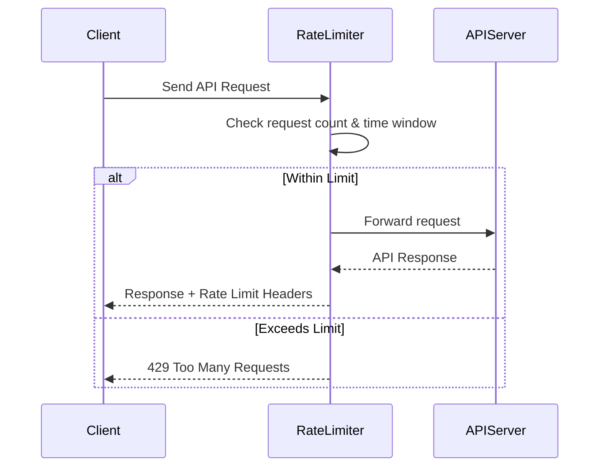

# 📘 Table of Contents: Understanding API Rate Limiting

5. [Implementing Rate Limiting]
   - At the API Gateway level
   - In application code (Node.js, Python, etc.)
   - Using third-party services (e.g., Cloudflare, AWS API Gateway)

6. [Best Practices]
   - Choosing the right limits
   - Communicating limits to clients
   - Handling rate limit errors gracefully

7. [Rate Limiting in Popular APIs]
   - Twitter API
   - GitHub API
   - OpenAI API
   - Google APIs

8. Monitoring and Analytics
   - Logging rate-limited requests
   - Visualizing usage patterns

9. Challenges and Pitfalls
   - Dealing with spikes
   - Rate limiting in distributed systems
   - Bypassing and abuse

10. Advanced Topics
    - Dynamic rate limiting
    - User-based vs IP-based limits
    - Rate limiting for GraphQL APIs

11. Conclusion
    - Summary
    - Final thoughts and recommendations

12. Further Reading & Resources
    - Documentation links
    - Tools and libraries
    - Community discussions

## Introduction

APIs (Application Programming Interfaces) are the backbone of modern software systems, enabling communication between different services and applications. They are now the defacto standards for system integration and extension.

The APIs are easily accessible over HTTP and a wide variety of devices, which makes them the first choice for developers. Many software vendors are exposing thier products through APIs. This makes their product

APIs are the backbone of API based economy and often subject to high traffic, and without proper controls, they can become overwhelmed, leading to performance issues or even downtime. As APIs become more widely used, managing how they are accessed becomes critical — and that's where **API rate limiting** comes in. Rate limiting is a key strategy to ensure that APIs remain stable, secure, and performant.

### What is API Rate Limiting?

**API rate limiting** is a technique used to control the number of requests a client can make to an API within a specified time frame. It acts as a gatekeeper, ensuring that no single user or application can overwhelm the system with too many requests.

For example, an API might allow:

- 100 requests per minute per user
- 1,000 requests per day per IP address

There are various strategies and algorithms for implementing rate limiting, each with its own advantages and trade-offs. The goal is to balance resource usage while providing a fair and consistent experience for all users. These balances help maintain the stability, security, and performance of the API.

### Why is Rate Limiting Important?

Rate limiting serves several key purposes:

- **Prevents Abuse**: Stops malicious users from spamming or launching [denial-of-service (DoS) attacks](https://en.wikipedia.org/wiki/Denial-of-service_attack).
- **Ensures Fair Usage**: Distributes resources evenly among users, preventing a few clients from monopolizing the API.
- **Improves Performance**: Reduces server load and helps maintain consistent response times.
- **Enhances Security**: Helps detect and block suspicious behavior patterns.
- **Controls Costs**: Especially important for APIs with usage-based billing models.

Rate limiting is often used by **cloud providers, API gateways, and application developers** for building **scalable, secure, and reliable APIs**.

## How Rate Limiting Works

API rate limiting is all about controlling access to resources by defining how many requests a client can make in a given time window. To implement this, systems use various algorithms that track and enforce these limits.
Below are some of the key concepts that we need to understand for rate limiting.

### Key Concepts

- **Request**: A call made by a client to an API endpoint.
- **Limit**: The maximum number of requests allowed.
- **Window**: The time period over which the limit is applied (e.g., 60 seconds).
- **Quota**: The total number of requests allowed over a longer period (e.g., 10,000 requests per month).
- **Headers**: APIs often return rate limit info in response headers like:
  - `X-RateLimit-Limit`
  - `X-RateLimit-Remaining`
  - `X-RateLimit-Reset`
- **HTTP Status Codes**:
  - `429 Too Many Requests`: Indicates the client has hit the rate limit.

### Rate Limiting Flow at High Level

1. **Client Sends Request**: A client (user, app, or service) sends a request to an API endpoint.

2. **Rate Limiter Intercepts Request**: Before the request reaches the actual API logic, it passes through a rate limiter — this could be middleware, an API gateway, or a proxy. We will subsequently see how this is implemented.

3. **Rate Limiter Checks Usage**: The rate limiter checks:

   - Who is making the request (IP, user ID, API key). There can be other parameters as well depending on the use case.
   - How many requests they’ve made in the current time window.
   - Whether they’ve exceeded their allowed limit

4. **Decision Point**: Depending on the outcome of the checks:

   - ✅ If under the limit: The request is forwarded to the API server.
   - ❌ If over the limit: The request is blocked, and a 429 Too Many Requests response is returned.

5. **API Server Processes Request**: If allowed, the API server processes the request and returns a response.

6. **Rate Limit Headers Returned**: The response includes headers like:

   - `X-RateLimit-Limit`: Total allowed requests
   - `X-RateLimit-Remaining`: Requests left in the window
   - `X-RateLimit-Reset`: Time when the limit resets

   These can be utilized by clients to manage their request rates effectively and avoid hitting the limits including implementing exponential backoff strategies. Clients can also use these headers for managing the user experience like showing error messages etc.

Below diagram the pictorial view of this entire process. The rate limited can be implemented using variety of techniques. The core concept however remains the same.



### Common Rate Limiting Algorithms

Different algorithms offer different trade-offs in terms of accuracy, complexity, and performance. Here's a breakdown of the most widely used ones:

#### 1. Fixed Window

- **How it works**: Counts requests in fixed time intervals (e.g., per minute).
- **Pros**: Simple to implement.
- **Cons**: Can lead to burst traffic at window edges.

**Example**:  
If the limit is 100 requests per minute, a client could send 100 requests at 11:59:59 and another 100 at 12:00:01 — effectively 200 requests in 2 seconds.

#### 2. Sliding Window

- **How it works**: Uses a rolling time window to calculate the request count.
- **Pros**: Smoother and fairer than fixed window.
- **Cons**: Slightly more complex to implement.

**Example**:  
If the limit is 100 requests per minute, the system checks how many requests were made in the last 60 seconds from the current time.

#### 3. Token Bucket

- **How it works**: Tokens are added to a bucket at a fixed rate. Each request consumes a token.
- **Pros**: Allows short bursts while enforcing a steady rate over time.
- **Cons**: Requires token management logic.

**Example**:  
A bucket holds 10 tokens and refills at 1 token per second. A client can make 10 quick requests, then must wait for tokens to refill.

#### 4. Leaky Bucket

- **How it works**: Requests enter a queue (bucket) and are processed at a fixed rate.
- **Pros**: Smooths out bursts and enforces a consistent flow.
- **Cons**: Requests beyond the queue capacity are dropped or delayed.

**Example**:  
If the leak rate is 1 request per second, and 10 requests arrive at once, they’ll be processed one per second. Excess requests may be dropped if the bucket overflows.

### Algorithm Comparison Table

| Algorithm      | Burst Handling | Fairness | Complexity | Use Case Example         |
|----------------|----------------|----------|------------|---------------------------|
| Fixed Window   | ❌ Poor         | ❌ Low    | ✅ Simple   | Basic APIs, internal tools |
| Sliding Window | ✅ Good         | ✅ High   | ⚠️ Medium  | Public APIs, SaaS platforms |
| Token Bucket   | ✅ Excellent    | ✅ High   | ⚠️ Medium  | Rate-limited user actions |
| Leaky Bucket   | ✅ Good         | ✅ High   | ⚠️ Medium  | Streaming, messaging APIs  |

## Implementing Rate Limiting

Rate limiting is a component that intercepts the request to your API and controls the rate at which requests are processed. It can be implemented using code, configuration, or infrastructure components. Implementing API rate limiting can be done at various layers of your infrastructure, depending on your architecture, scale, and performance needs. Below are the most common approaches:

### 1. At the API Gateway Level

API gateways are often the first line of defense and are ideal for enforcing rate limits globally or per client.

#### ✅ Pros

- Centralized control
- Scales well
- Easy to configure

#### 🔧 Examples

- **[Azure API Management](https://learn.microsoft.com/en-us/azure/api-management/api-management-howto-product-with-rates-limits)**: Supports usage plans and throttling per API key. Almost all major cloud providers offer similar services.
- **[Kong Gateway Rate Limiting Plugin](https://docs.konghq.com/hub/kong-inc/rate-limiting/)**: Offers plugins for rate limiting based on IP, consumer, or credential.
- **[NGINX Rate Limiting](https://nginx.org/en/docs/http/ngx_http_limit_req_module.html)**: Can be configured with `limit_req_zone` and `limit_req`.

#### 🧪 Sample Azure API Management Config

```yaml
<inbound>
    <base />
    <!-- Limit to 10 calls per 60 seconds per subscription key -->
    <rate-limit-by-key calls="10" renewal-period="60" counter-key="@(context.Subscription.Key)" />
</inbound>
<backend>
    <base />
</backend>
<outbound>
    <base />
</outbound>
<on-error>
    <base />
</on-error>
```

This policy enforces a limit of 10 requests per minute for each subscription key. You can adjust `calls` and `renewal-period` as needed. Place this in your API's policy definition in Azure API Management.

### 2. In Application Code

You can implement rate limiting directly in your backend code using libraries or custom logic. This gives you fine-grained control.

#### ✅ Pros

- Highly customizable
- Can be user-aware (e.g., based on roles or plans)

#### 🔧 Libraries

- Node.js: express-rate-limit, rate-limiter-flexible
- Python: ratelimit, limits, Flask-Limiter
- Go: golang.org/x/time/rate

#### 🧪 Example (Node.js with Express)

```javascript
const rateLimit = require('express-rate-limit');

const limiter = rateLimit({
  windowMs: 60 * 1000, // 1 minute
  max: 10, // Limit each IP to 10 requests per windowMs
  message: 'Too many requests, please try again later.',
});

app.use('/api/', limiter);
```

### 3. Using Third-Party Services

Cloud-based services and API management platforms often provide built-in rate limiting features.

#### ✅ Pros

- No infrastructure overhead
- Built-in analytics and dashboards

#### 🔧 Examples

- Cloudflare: Rate limiting rules based on URL patterns, IPs, etc.
- APIGee: Comprehensive API management with built-in rate limiting
- Google Cloud Endpoints: Supports quota enforcement and monitoring

### Choosing the Right Approach

| Approach            | Best For                                   | Customization | Scalability |
|---------------------|--------------------------------------------|---------------|-------------|
| API Gateway         | Centralized control, microservices         | ⚠️ Medium     | ✅ High     |
| Application Code    | Custom logic, user-specific limits         | ✅ High       | ⚠️ Medium   |
| Third-Party Services| Quick setup, managed infrastructure        | ⚠️ Medium     | ✅ High     |
