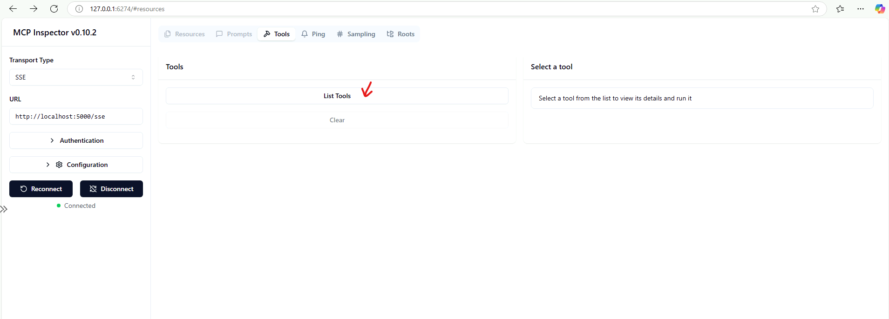
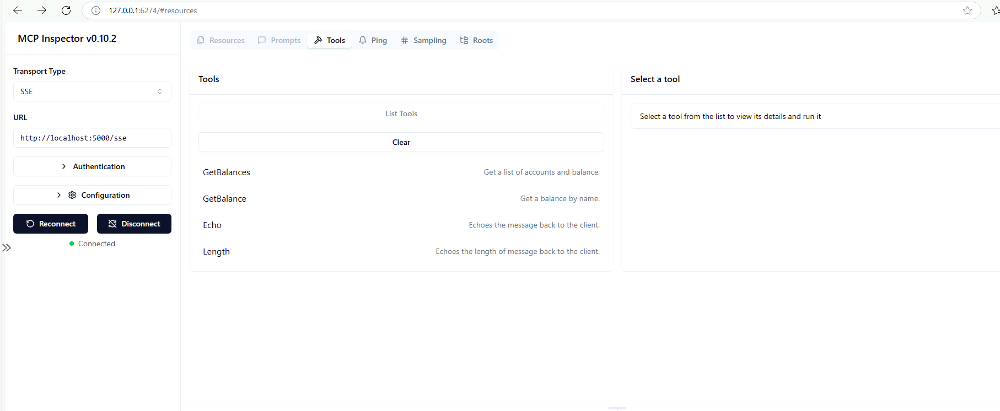
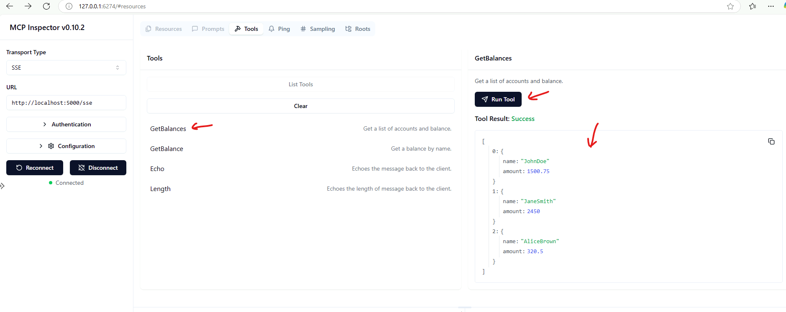

# Model Context Protocol
This is a demo project that demonstrate the concept of using [model context protocol](https://modelcontextprotocol.io/introduction) with C#. It uses the core Nuget packages [ModelContextProtocol](https://packages.nuget.org/packages/ModelContextProtocol/0.1.0-preview.10)
MCP helps you connect with variety of sources and expose them in a way which is similar to other MCP servers. This way the client code is simplified, and it can focus on implementing the core lgoic rather than trying to integrate the Agent with all varied data sources.

**In this demo, I will show how to expose your organizations APIs as Tools using MCP server technique.**

## Banking Service
This is  simple banking service which provides 2 operations
 - **Get Balances**: This returns a list of balances for various accounts.
	```csharp	   
	[HttpGet("balance")]
	public IActionResult GetBalances()
	{
		return Ok(AccountBalances);
	}
	```
	
 - **Get Balance**: This returns balance for a given customer.
	```csharp
	[HttpGet("balance/{accountName}")]
	public IActionResult GetBalance(string accountName)
	{
		var balance = AccountBalances.FirstOrDefault(b => b.Name?.Equals(accountName, StringComparison.OrdinalIgnoreCase) == true);

		if(balance != null)
		{
			return Ok(balance);
		}

		return NotFound(new { Message = $"Account '{accountName}' not found." });
	}
	```

*Note*: For simplicity the banking service implements a in memory list of names and amount.

We will see in next section how these service methods are exposed as MCP tools.

## Banking MCP Server
This is a MCP server exposed for the banking service. It demonstrates how to implement a MCP server for your organizations APIs. This project how you can build a MCP server around your APIs and then expose them using a ASP.NET Core runtime making it available over a endpoint. This endpoint can then be utilized by a client to list down all the tools available with MCP server.

### MCP Server Setup
We are using an WebApplication class to create a ASP.NET Core based host for the MCP server. We then enable error logging for it.

```csharp
var builder = WebApplication.CreateBuilder(args);
builder.Logging.AddConsole(consoleLogOptions =>
{			
	consoleLogOptions.LogToStandardErrorThreshold = LogLevel.Error;
});
```

We then add the MCP server to the ASP.NET Core pipeline. 
 - The MCP server is added as a service to the DI container. 
 - We also add the support Http transport protocol as the MCP endpoint woudl be exposed over HTTP. This will enable any HTTP client to integrate with the MCP server.
 - Next, we also add the tools support. This will use reflection to go thorugh all classes marked with `McpServerToolType` attribute and add the methods marked with  `McpServerTool` to the MCP server tool list.
 - We also add a `HttpClient` to the DI container. This will be used by the MCP server to make calls to the banking service.

```csharp
builder.Services
	.AddMcpServer()
	.WithHttpTransport()
	.WithToolsFromAssembly();
builder.Services.AddHttpClient();
builder.Services.AddSingleton<BankingServiceClient>();
```

### Tool Setup
We will see how to define a tool for MCP server. These tools will be invoked by the client to perform operations. The tools are defined using the `McpServerTool` attribute. This attribute is used to mark a method as a tool. The method can then be invoked by the client using the tool name.
Below is the implementation of the tool for `GetBalances` method under `BalanceTools` class.

```csharp
	[McpServerTool, Description("Get a list of accounts and balance.")]
	public static async Task<List<Balance>> GetBalances(BankingServiceClient bankingServiceClient)
	{
		var balances = await bankingServiceClient.GetBalances();
		return balances;
	}

	[McpServerTool, Description("Get a balance by name.")]
	public static async Task<Balance> GetBalance(BankingServiceClient bankingServiceClient, [Description("The name of the account holder to get details for")] string name)
	{
		var balance = await bankingServiceClient.GetBalance(name);
		return balance!;
	}
```

As you can see from above implementation, defining tool is mostly around wrapping up the service method and adding the `McpServerTool` attribute to it. As a good practice we should use `Description` attribute to provide a description of the tool. This will be used by the client to display the tool name and description. We will see the client implementation in the next section.
The `BankingServiceClient` is injected into the tool method. This is done using the DI container. The MCP server will resolve the dependencies for the tool method and inject them into the method.

## MCP Client
Out MCP client is a simple console application which uses the MCP server to list down all the tools available with the MCP server. It then invokes the tools to perform operations. The client uses the `McpClient` class to connect to the MCP server and list down all the tools available with it.

In real world scenario, the client can be a web application or a mobile application which can use the MCP server to perform operations. The client can be any application which can make HTTP calls to the MCP server. The MCP server will expose the tools as HTTP endpoints and the client can invoke them using the tool name.

### MCP Client Setup
Similar to server, the client will be using the `ModelContextProtocol` nuget package to connect to the MCP server. The client will use the `McpClient` class to connect to the MCP server and list down all the tools available with it. 

We follow the below steps to setup the MCP client -
- Create a `SseClientTransport` instance. This is used to connect to the MCP server using the Http transport protocol. There are other transport protocols available as well like Stdio, WebSocket, etc.
- Now use `McpClientFactory` to create a `McpClient` instance. This will be used to create an instance of actual McpClient configured to use `SseClientTransport` to the MCP server.

```csharp
var endpoint = "http://localhost:5000/sse";

var sseClientTransport = new SseClientTransport(new SseClientTransportOptions { Endpoint = new Uri(endpoint) });
var client = await McpClientFactory.CreateAsync(clientTransport: sseClientTransport);
```

*Note*: The MCP server exposes the metadata over `sse` endpoint.

### Tool Discovery
Once the client connection is established, we can use the `McpClient` instance to list down all the tools available with the MCP server. The `McpClient` class has a method called `ListToolsAsync` which returns a list of all the tools available with the MCP server. The tools are returned as a list of `McpClientTool` objects. Each `McpClientTool` object contains the name and description of the tool.
We can use a simple loop to iterate and print a list of all tools available with MCP server.

```csharp
foreach (var tool in await client.ListToolsAsync())
{
	Console.WriteLine($"Tool: {tool.Name}");
	Console.WriteLine($"Description: {tool.Description}");
	Console.WriteLine();
}
```

### Tool Invocation
Once we have the list of tools, we can invoke the tools to perform operations. The `McpClient` class has a method called `CallToolAsync` which can be used to invoke the tool. The method takes the tool name and the parameters required by the tool as input. The parameters are passed as a dictionary of key value pairs.

```csharp
await client.CallToolAsync("GetBalances")
	.ContinueWith(t =>
	{
		if (t.IsCompletedSuccessfully)
		{
			Console.WriteLine($"Tool result: {t.Result.Content.First().Text}");
		}
		else
		{
			Console.WriteLine($"Error: {t.Exception?.Message}");
		}
	});
```
## Standalone Testing of the MCP server 
In this section I will talk about a open source npm package that can we used to test an mcp server without needing a mcp client. This allows you to quickly go through the capabilities exposed by the server and also invoke them from the same interface.

Open a command prompt and run the below command. This command will install and run tool on your machine. Make sure you have Node runtime on your machine.

```bash
>npx @modelcontextprotocol/inspector
```

The tool will output somehting like below
```bash
Starting MCP inspector...
⚙️ Proxy server listening on port 6277
🔍 MCP Inspector is up and running at http://127.0.0.1:6274
```

Now open this URL in browser and you should see a screen like this - 


Select SSE for Transport type, provide the sse URL and then click connect. The connection would be done and you can see a "List Tools" button enabled


Once you click "List Tools@, it would show you all the tools available with this server


Select one of the tool and a testing pane will open. You can run it and test


## Run
To run the demo - 
- You can first start the BankingService project, this will start the APIs on `http://localhost:7001`
- Then you can start the MCP server project, this will start the MCP server on `http://localhost:5000/sse`
- Finally you can start the MCP client project, this will connect to the MCP server and list down all the tools available with it. You can then invoke the tools to perform operations.

You can see a sample output below -
```bash
Tool: GetBalances
Description: Get a list of accounts and balance.

Tool: GetBalance
Description: Get a balance by name.

Tool: Echo
Description: Echoes the message back to the client.

Tool: Length
Description: Echoes the length of message back to the client.

Tool result: [{"name":"JohnDoe","amount":1500.75},{"name":"JaneSmith","amount":2450.00},{"name":"AliceBrown","amount":320.50}]
```

## Source Code
You can find the source code for this project at below location

[Code](https://github.com/pravinchandankhede/agenticai/tree/main/src/model-context-protocol-demo)

## Conclusion
My objective was to demonstrate the model context protocol at a very basic level without considering the complexity of LLMs and other tools. In later post, I will demonstrate how to integrate with LLM and AI Agents.