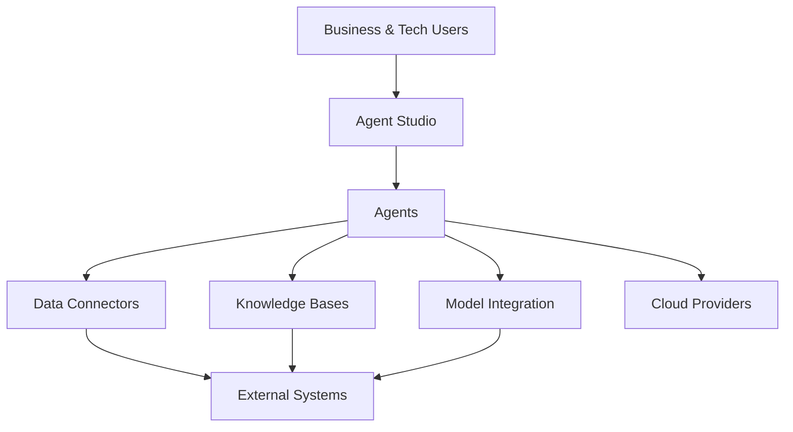
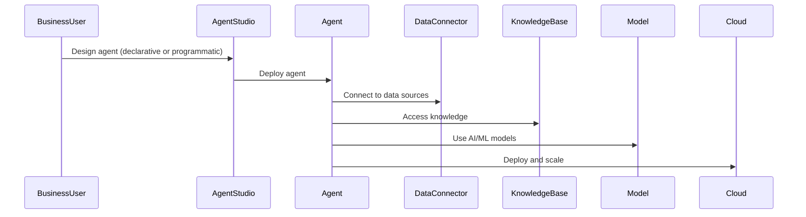

> **Repository:** [https://github.com/pravinchandankhede/matrix](https://github.com/pravinchandankhede/matrix)

## Introduction

Matrix is a next-generation agentic development platform designed to empower business leaders, technology teams, and organizations to rapidly deliver intelligent agents and solutions. Whether you prefer programmatic or declarative development, code or low-code approaches, Matrix provides a unified, cloud-agnostic foundation for building, deploying, and managing agents that connect to any data source, leverage multiple knowledge bases, and utilize any AI model.

---

## The Vision: Empowering Business and Technology

Matrix bridges the gap between business strategy and technology execution. It enables organizations to:

- **Accelerate Innovation:** Rapidly prototype, deploy, and iterate on intelligent agents.
- **Democratize Development:** Empower both developers and non-developers to build solutions.
- **Future-Proof Investments:** Remain cloud-agnostic and model-agnostic, adapting to evolving tech landscapes.
- **Unlock Data Value:** Seamlessly connect to diverse data sources and knowledge bases.

---

## Platform Benefits

### For Business Leaders

- **Agility:** Launch new digital initiatives and automate processes without long development cycles.
- **Cost Efficiency:** Reduce dependency on specialized development resources with low-code and declarative options.
- **Strategic Alignment:** Ensure technology solutions align with business goals and can be adapted as strategies evolve.

### For Technology Leaders

- **Cloud Agnosticism:** Deploy agents across any cloud provider, avoiding vendor lock-in.
- **Model Flexibility:** Integrate any AI/ML model, from open-source to proprietary, ensuring best-fit solutions.
- **Governance & Security:** Centralized management of agents, data sources, and access controls.

### For Tech Teams

- **Unified Development Experience:** Build agents programmatically or declaratively, with code or low-code.
- **Extensibility:** Connect to any data source, integrate with existing systems, and expand capabilities as needed.
- **Collaboration:** Enable cross-functional teams to contribute, from business analysts to engineers.

---

## Conceptual Overview

Matrix is built around the concept of “agents”—autonomous, intelligent entities that perform tasks, interact with data, and deliver business value. The platform provides:

- **Agent Studio:** Tools for designing, developing, and managing agents.
- **Data Connectors:** Plug-and-play integration with databases, APIs, files, and more.
- **Knowledge Bases:** Support for multiple, dynamic knowledge repositories.
- **Model Integration:** Use any AI/ML model, switch or combine models as needed.
- **Declarative & Programmatic Development:** Build agents visually or with code.

---

## High-Level Platform Architecture

**Explanation:**

- Users interact with Agent Studio to design and manage agents.
- Agents connect to data sources, knowledge bases, and models.
- Agents can be deployed to any cloud and integrate with external systems.

---

## Key Capabilities

### 1. Agent Development

- **Programmatic:** Full-code development for custom logic and integrations.
- **Declarative:** Visual and low-code tools for rapid agent creation.
- **Reusable Templates:** Accelerate development with pre-built agent templates.
- **Lifecycle Management:** Versioning, monitoring, and updating agents in production.

### 2. Data Connectivity

- **Universal Connectors:** Integrate with SQL/NoSQL databases, APIs, files, cloud storage, and more.
- **Real-Time & Batch:** Support for both real-time data streams and batch processing.
- **Data Transformation:** Built-in tools for mapping, cleaning, and transforming data.

### 3. Knowledge Management

- **Multiple Knowledge Bases:** Agents can access, update, and reason over diverse knowledge repositories.
- **Dynamic Updates:** Knowledge bases can be updated on-the-fly, supporting continuous learning.
- **Semantic Search:** Advanced search and retrieval across knowledge bases.

### 4. Model Integration

- **Model-Agnostic:** Use any AI/ML model, including LLMs, custom models, or third-party APIs.
- **Hybrid Intelligence:** Combine models for advanced reasoning and decision-making.
- **Model Orchestration:** Route tasks to the best-fit model based on context and requirements.

### 5. Cloud Agnosticism

- **Flexible Deployment:** Agents can run on any cloud provider or on-premises.
- **Scalability:** Scale agents horizontally and vertically as needed.
- **Multi-Cloud Support:** Deploy agents across multiple clouds for redundancy and reach.

### 6. Security & Governance

- **Centralized Management:** Unified dashboard for agent lifecycle, access controls, and audit trails.
- **Role-Based Access:** Fine-grained permissions for business, tech, and admin users.
- **Compliance:** Tools for ensuring data privacy, regulatory compliance, and secure operations.

---

## Strategic Advantages

### Business Impact

- **Faster Time-to-Market:** Launch new agents and solutions in days, not months.
- **Competitive Edge:** Rapidly respond to market changes and customer needs.
- **Data-Driven Decisions:** Leverage all available data for smarter automation and insights.
- **Empowered Teams:** Enable business analysts, product owners, and engineers to collaborate seamlessly.

### Technology Impact

- **Reduced Complexity:** Unified platform for all agentic development needs.
- **Interoperability:** Seamless integration with existing IT infrastructure.
- **Continuous Innovation:** Easily adopt new models, data sources, and technologies.
- **Resilience:** Multi-cloud and hybrid deployment options for business continuity.

---

## Example Use Cases

### 1. Customer Support Automation

Deploy agents that handle queries across channels, using multiple knowledge bases and models. Integrate with CRM, ticketing, and communication platforms for end-to-end automation.

### 2. Business Process Automation

Automate workflows by connecting agents to internal systems and data sources. Streamline approvals, reporting, and compliance tasks.

### 3. Intelligent Data Analysis

Agents aggregate and analyze data from disparate sources, providing actionable insights for business leaders and teams.

### 4. Cross-Cloud Orchestration

Deploy agents across multiple cloud providers, ensuring high availability and geographic reach.

### 5. Knowledge Management & Discovery

Enable agents to search, retrieve, and update information across multiple knowledge bases, supporting research, onboarding, and training.

---

## Platform Workflow Example

---

## Conclusion

Matrix is redefining how organizations build, deploy, and manage intelligent agents. By combining programmatic and declarative development, cloud and model agnosticism, and universal data connectivity, Matrix empowers business and technology leaders to drive innovation and deliver value—faster and smarter.

Whether you’re a business leader seeking agility, a technology leader demanding flexibility, or a tech team looking for a unified development experience, Matrix is your platform for the future of agentic solutions.

---
