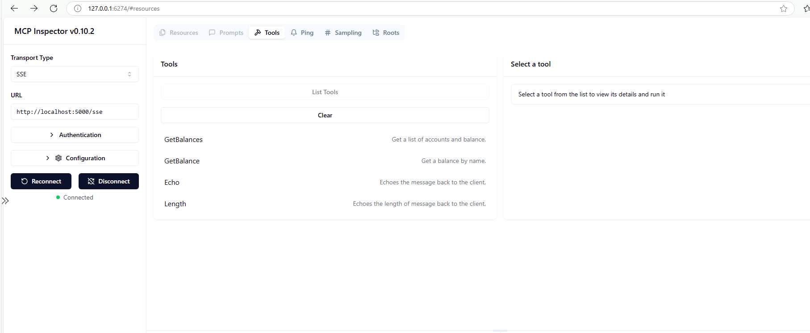

## Context Engineering

With the rise of Generative AI, the community has been building AI systems that revolve around the idea of prompt. Often the input is given in the form of a prompt and the AI system returns a response. Depending upon the context provided in the prompt, the AI's response can vary significantly. This has led to the realization that the context in which a prompt is given is just as important as the prompt itself. Thus, the shift from prompt engineering to context engineering. With the latest development in Agentic AI space, the idea of context has taken main stream place in system design.

With the development of distributed AI & Agentic systems, an agent has to often interact with multiple background systems and collaborate among variety of agents. Managing a context for such a ecosystem is even more important, as context passed between agents can greatly influence their behavior and the overall system performance.

## What is Context Engineering?

Context Engineering is an emerging discipline that focuses on designing and managing the information an AI system or agent sees before generating a response or performing a task. It goes beyond simple prompt engineering by creating a structured, dynamic environment of relevant data, rules, and signals. In a nutshell context is like a "mental workspace" for an AI agent. This workspace provides:

- Static context: System instructions, role definitions, compliance rules.
- Dynamic context: Conversation history, user preferences, real-time data.
- External context: Knowledge bases, APIs, documents, and tools.

## How is Context Engineering different than Prompt Engineering?

Context Engineering focuses on the broader environment and information that influences an AI agent's behavior, while Prompt Engineering is primarily concerned with the specific input given to the AI. In other words, Context Engineering is about creating the "mental workspace" for the AI, whereas Prompt Engineering is about crafting the specific prompts that the AI will respond to.

## Context Engineering in an Enterprise Architecture Strategy

As an Enterprise Architect, I think Context Engineering will play a crucial role in the future of AI system design. By effectively managing & engineering the context, we can create more intelligent, responsive, and adaptable AI agents that can better understand and serve user needs. From a reference AI architecture perspective, context engineering should be considered an integral part of the architecture that touches all the layers like Orchestration layer, RAG, Memory, Integration & security.

I believe enterprise should think about a centralized context management system that can provide a unified view of context across all AI agents and systems. This system should be able to capture, store, and share context information in real-time, enabling agents to access the most relevant context when needed.

>How is your organization approaching Context Engineering? Is it taking central stage in your AI strategy?

