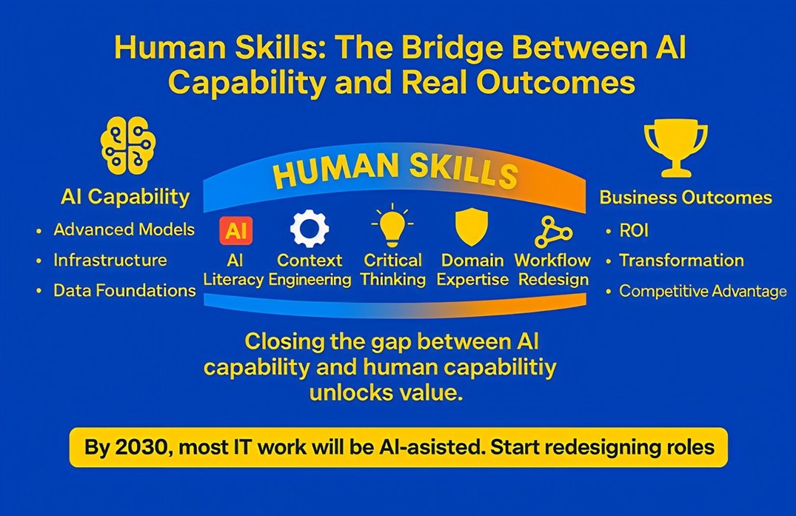

## AI Is Advancing Faster Than Organisations Can Absorb — But Are Humans Ready?

Over the past few years, almost every organisation has launched AI initiatives.
New copilots. New pilots. New proofs of concept.
Yet only a minority are seeing meaningful ROI or real transformation.
Why?
Because in my view, the real barrier isn’t technology anymore —
it’s human readiness, operating-model readiness, and behavioural readiness.
While AI capability is accelerating exponentially, I believe human capability and trust are still moving linearly. And to me, this is the #1 reason why AI value fails to materialise.

## Mantras for Tech Leaders

### AI Readiness ≠ Human Readiness

I see most organisations investing heavily in:
• Models
• Infrastructure
• Data foundations
• Vendor platforms
However, not enough are investing in adoption design, workflow redesign, or manager & workforce enablement.
I personally believe every AI use case must be assessed using two checks:
✔ Is the technology ready? (accuracy, guardrails, integration)
✔ Are the humans ready? (trust, skills, habits, role clarity)
Without this dual evaluation, even the best AI tools underdeliver.

### Accuracy & Reliability Are Now Enterprise-Grade Requirements

From what I’ve observed, AI doesn’t need to be perfect —
but it absolutely needs to be predictable, measurable, and governed.
Yet many organisations still don’t:
• Track error rates
• Validate outputs systematically
• Implement two-step verification loops
And still expect AI to make decisions or automate workflows.
In my view, leaders who treat accuracy as a KPI, not an assumption, will scale successfully.
And I believe the real value will come from decision-making agents, not just conversational assistants — agents that can negotiate, plan, orchestrate, and act autonomously.

### Human Skills Are the Bridge Between AI and Real Outcomes

In my view, organisations that win won’t be the ones with the most sophisticated AI models —
they’ll be the ones with the most prepared people.
Skills that, in my opinion, form this bridge include:
• AI literacy
• Context engineering
• Critical thinking
• Domain expertise
• Workflow redesign

By 2030, I believe a large portion of IT work will be AI-assisted or AI-augmented, which means leaders must start redesigning roles and responsibilities today.

I don’t think AI is the differentiator anymore — everyone can buy models and platforms.
I believe the real differentiator is how ready your people, processes, and leadership are to capture value from AI.
In my view, organisations that reduce the gap between AI capability and human capability will unlock the biggest competitive advantage over the next decade.
