## Introduction

MCP server have become a popular choice for hosting AI agents due to their ability to provide seamless integration with various tools and services. However, as the number of agents and tools increases, managing connections and ensuring efficient communication can become challenging. This is where the concept of an MCP Gateway comes into play.

> For a starter on MCP, refer my post [here](https://pravinchandankhede.github.io/posts/ModelContextProtocolSimple/).
{: .prompt-info }

### What is MCP Gateway?

An MCP Gateway is a centralized routing and management layer that sits between AI agents and multiple MCP servers. It acts as an intermediary that handles incoming requests from agents, routes them to the appropriate MCP server based on predefined rules, and manages the communication protocols used for interaction.
It helps you in streamlining the connections, improving scalability, and enhancing the overall performance of your AI agent ecosystem.

### Key Features of MCP Gateway

- **Centralized Routing**: The gateway routes requests from AI agents to the appropriate MCP server based on factors such as server load, agent requirements, and tool availability.
- **Protocol Management**: It supports multiple communication protocols (e.g., SSE, Streamable HTTP) to ensure compatibility with various agents and servers.
- **Scalability**: The gateway can handle a large number of agents and MCP servers, making it easier to scale your AI ecosystem as needed.
- **Load Balancing**: It can distribute requests evenly across multiple MCP servers to prevent overload and ensure optimal performance.

### Architecture Overview

an MCP gateway consists of a reverse proxy component that act as an bridge between the AI systems like agent & apps and the MCP servers. These MCP servers may inturn talk to various data sources like databases, external APIs etc.
The communiction between the agents and gateway can be done using protocols like MCP protocol over SSE or Streamable HTTP. The gateway then forwards these requests to the appropriate MCP server using SSE for real-time data streaming.

#### Reverse Proxy / Core Router

The traffic brain. It terminates connections, normalizes MCP requests (SSE/HTTP/WS), balances load across servers, and translates errors—so agents see a single, reliable entry point.

**Responsibilities**:

- Routes MCP requests from agents → servers
- Multiplexes connections (SSE, WebSockets, HTTP streaming)
- Manages load balancing across MCP servers
- Handles retries and error translation
- Applies HTTP/MCP protocol normalization

#### MCP Registry (Discovery & Metadata)

The source of truth for tools. Stores which MCP servers exist, their capabilities, versions, health status, and policies—so agents can discover tools dynamically without hardcoding endpoints.

**Capabilities**:

- Maintains metadata about servers (endpoints, capabilities, tool lists)
- Versioning and compatibility checks
- Dynamic registration/deregistration
- Health and heartbeat monitoring
- Provides discovery API for agents

#### Protocol Adapters

Compatibility layer for different transports (SSE, streamable HTTP, WebSockets). Ensures token/partial‑result streaming, back‑pressure, and graceful fallbacks across diverse agent runtimes.

**Typical adapters**:

- SSE Adapter (Server‑Sent Events)
- Streamable HTTP Adapter
- WebSocket Adapter (if used)
- Async/streaming management (token streaming, partial results)

#### Authentication & Authorization

Enterprise guardrails. Supports API keys, OAuth2/OIDC, JWT, and mTLS; scopes access per agent/team/tool; integrates with corporate identity to enforce least‑privilege access.

**Includes**:

- API key verification
- OAuth2 / OIDC integration
- JWT validation
- Mutual TLS (mTLS) for secure server ↔ gateway comms
- Scoped permissions per tool, per agent
- Least‑privilege control: which agent can access which MCP tool

Often combined with policy engine (OPA/Rego).

##### Policy Enforcement (PEP/PDP)

Where governance meets runtime. Applies allow/deny rules, data redaction (PII), egress controls, quotas, and time‑of‑day constraints—often backed by OPA/Rego or equivalent.

**Typical controls**:

- Tool whitelisting
- Data guardrails (PII suppression, safe output checks)
- Rate limits / quotas
- Resource boundaries per team
- Governance audit hooks

#### Connection Manager

Keeps sessions healthy. Manages persistent MCP connections, timeouts, retries, keepalives, and state for streaming responses—key for horizontal scalability and resilience.

**Responsibilities**:

- Maintains persistent MCP sessions
- Manages timeouts & keepalive
- State tracking for partial requests
- Load‑aware routing

#### Observability & Telemetry

Operational visibility. Emits structured logs, metrics (latency, error rates), traces (OpenTelemetry), and auditable records (who used which tool, when) to support SRE, FinOps, and compliance.

**Includes**:

- Request logs (structured, JSON)
- Trace IDs / correlation IDs
- Metrics (latency, throughput, errors)
- Distributed tracing (OpenTelemetry)
- Audit logs (who accessed which tool, when)

#### MCP Server Integrations

The execution surface. Mix of local servers (close to agents), remote servers (cloud/VM/K8s), and pooled clusters—with consistent access via the same gateway contract.

Multiple categories of servers communicate via the gateway:

- **Local MCP servers**: Running near the agents (same host, same network).
- **Remote MCP servers**: Running on-cloud (EKS, ECS, VMs).
- **Server pools / clusters**: Auto-scaled and load balanced.

The gateway ensures unified access regardless of server placement.

##### External Tool Connectors

Bridges to value. Wraps databases, SaaS, internal APIs, and business systems behind MCP servers—standardizing how agents call heterogeneous tools with typed schemas.

#### Security Sandbox / Isolation

Safety by design. Runs tool logic in isolated runtimes (containers, Firecracker, gVisor), limits CPU/memory, pins network egress, and scopes credentials to mitigate blast radius.

#### Admin Console / Control Plane

Day‑2 operations. UI/CLI/APIs for onboarding tools, rolling updates, kill‑switches, RBAC, policy edits, health dashboards, and blue/green or canary rollouts.

#### Caching Layer (Selective)

Performance booster. Caches tool metadata and idempotent responses; pools connections; reduces cold‑start latencies—without compromising freshness or auditability.

#### Plugin/Extension Framework

Future‑proofing. Lets teams add new adapters, policies, format transformers, and routing logic—so the gateway evolves with your toolchain and governance models.

#### API Gateway Extension (Optional)

Hybrid interop. Uses cloud API gateways (e.g., AWS API Gateway/Azure APIM) to expose non‑MCP services, with REST→MCP adapters for consistent policy, auth, and observability.

### Example Architecture Diagram

The following diagram illustrates the architecture of a typical MCP Gateway setup:

```mermaid

flowchart TB

%% ======================================================
%% LAYER 1: AI Agents
%% ======================================================
subgraph L1[AI Agents]
  direction TB
  A1[AI Agent 1]
  A2[AI Agent 2]
  A3[AI Agent 3]
  AN[AI Agent N]
end

%% ======================================================
%% LAYERS 2–4 WRAPPED: MCP Gateway (Boundary)
%% ======================================================
subgraph GWBOUND["MCP Gateway (Boundary)"]
  direction TB

  %% -------- LAYER 2: Ingress & Protocol Adapters --------
  subgraph L2[Ingress]
    direction TB
    PAD1[SSE Adapter]
    PAD2[Streamable HTTP Adapter]
    PAD3[WebSocket Adapter]
  end

  %% -------- LAYER 3: MCP Gateway Core --------
  subgraph L3[Gateway Core]
    direction TB
    RP[Reverse Proxy Router]
    REG[MCP Registry / Discovery]
    CM[Connection Manager]
  end

  %% -------- LAYER 4: Security & Policy --------
  subgraph L4[Security & Policy]
    direction TB
    AUTH["AuthN/AuthZ (OIDC/JWT/mTLS)"]
    POL["Policy Engine (OPA/Rego)"]
    RATELIM[Rate Limits / Quotas]
    AUDIT[Audit & Access Logs]
  end

  %% Ingress -> Gateway Core
  PAD1 --> RP
  PAD2 --> RP
  PAD3 --> RP
  RP --> REG
  RP --> CM

  %% Gateway Core <-> Security/Policy
  RP --- AUTH
  RP --- POL
  RP --- RATELIM
  RP --- AUDIT
  REG --- AUDIT
end

%% ======================================================
%% LAYER 5A: Local MCP Servers
%% ======================================================
subgraph L5a[Local MCP Servers]
  direction TB
  LSV1[MCP Server 1]
  LSV2[MCP Server 2]
end

%% ======================================================
%% LAYER 5B: Clustered MCP Servers
%% ======================================================
subgraph L5b["Clustered MCP Servers (AKS/VMSS)"]
  direction TB
  CSV3[MCP Server 3]
  CSV4[MCP Server 4]
  HPA[Autoscale / Pooling]
end

%% ======================================================
%% LAYER 6: Cloud API Gateway + Functions
%% ======================================================
subgraph L6[Cloud API Gateway + Functions]
  direction TB
  APIM[Azure API Mgmt]
  AF1[Azure Function 1]
  AF2[Azure Function 2]
end

%% ======================================================
%% LAYER 7A: Databases
%% ======================================================
subgraph L7a[Databases]
  direction TB
  DB1["(Database 1)"]
  DB2["(Database 2)"]
end

%% ======================================================
%% LAYER 7B: External Data Sources / APIs
%% ======================================================
subgraph L7b[External Data Sources / APIs]
  direction TB
  API1[External API 1]
  API2[External API 2]
  API3[External API 3]
end

%% ======================================================
%% FLOWS (Top -> Bottom)
%% ======================================================
%% Agents -> Ingress (inside GWBOUND)
A1 -->|MCP / SSE| PAD1
A2 -->|MCP / SSE| PAD1
A3 -->|MCP / Streamable HTTP| PAD2
AN -->|MCP / WS or HTTP| PAD3

%% Gateway Core -> MCP servers
RP -->|SSE| LSV1
RP -->|SSE| LSV2
RP -->|SSE| CSV3
RP -->|SSE| CSV4
CM --> HPA

%% Gateway Core -> Cloud API Gateway
RP -->|Streamable HTTP| APIM
APIM --> AF1
APIM --> AF2

%% Tool Connections to Data Sources (bottom)
LSV1 -->|Tool Conn.| DB1
LSV2 -->|Tool Conn.| DB2
CSV3 -->|Tool Conn.| API1
CSV4 -->|Tool Conn.| API2
AF2 -->|Tool Conn.| API3

%% ======================================================
%% THEMING (classDef first, then assignments)
%% ======================================================
classDef agent        fill:#E6F2FF,stroke:#4A90E2,color:#0A2540,stroke-width:1px;
classDef ingress      fill:#E8FBFF,stroke:#00ACC1,color:#003944,stroke-width:1px;
classDef gatewayCore  fill:#F3E8FF,stroke:#7E57C2,color:#2C115B,stroke-width:1px;
classDef security     fill:#FFF3F3,stroke:#E57373,color:#4A1010,stroke-width:1px;
classDef mcpLocal     fill:#FFF4E5,stroke:#FB8C00,color:#4A2A00,stroke-width:1px;
classDef mcpCluster   fill:#EFE7FB,stroke:#8E7CC3,color:#231942,stroke-width:1px;
classDef apiGateway   fill:#FFEDE7,stroke:#FF7043,color:#4A1D12,stroke-width:1px;
classDef function       fill:#FFE2EA,stroke:#EC407A,color:#4A0F27,stroke-width:1px;
classDef database     fill:#E9F7FF,stroke:#00ACC1,color:#003944,stroke-width:1px;
classDef extApi       fill:#F1FFF5,stroke:#2ECC71,color:#0B3A1F,stroke-width:1px;

%% Assign classes (after all nodes are declared)
class A1,A2,A3,AN agent
class PAD1,PAD2,PAD3 ingress
class RP,REG,CM gatewayCore
class AUTH,POL,RATELIM,AUDIT security
class LSV1,LSV2 mcpLocal
class CSV3,CSV4,HPA mcpCluster
class APIM apiGateway
class AF1,AF2 function
class DB1,DB2 database
class API1,API2,API3 extApi

%% ======================================================
%% SUBGRAPH STYLES (after all subgraphs exist)
%% ======================================================
style L1       fill:#F7FBFF,stroke:#4A90E2,stroke-width:1.2px;
style GWBOUND  fill:#F9FBFF,stroke:#5C6BC0,stroke-width:2px;
style L2       fill:#F5FDFF,stroke:#00ACC1,stroke-width:1.2px;
style L3       fill:#F6F2FF,stroke:#7E57C2,stroke-width:1.2px;
style L4       fill:#FFF7F7,stroke:#E57373,stroke-width:1.2px;
style L5a      fill:#FFF8EE,stroke:#FB8C00,stroke-width:1.2px;
style L5b      fill:#F4F0FF,stroke:#8E7CC3,stroke-width:1.2px;
style L6       fill:#FFF5F0,stroke:#FF7043,stroke-width:1.2px;
style L7a      fill:#F5FBFF,stroke:#00ACC1,stroke-width:1.2px;
style L7b      fill:#F5FFF8,stroke:#2ECC71,stroke-width:1.2px;
```

## Conclusion

Implementing an MCP Gateway can significantly enhance the management and scalability of AI agent ecosystems. By centralizing routing, protocol management, security, and observability, the gateway simplifies interactions between agents and MCP servers, allowing for more efficient tool integration and improved performance. As AI applications continue to grow in complexity, adopting an MCP Gateway architecture will be crucial for maintaining a robust and flexible infrastructure.

```mermaid

flowchart TB

%% ============================================
%% LAYER 1: AI Agents (Top)
%% ============================================
subgraph L1[AI Agents]
  direction TB
  A1[AI Agent 1]
  A2[AI Agent 2]
  A3[AI Agent 3]
  AN[AI Agent N]
end

%% ============================================
%% LAYERS 2–4: MCP Gateway (Boundary)
%% ============================================
subgraph GWBOUND["MCP Gateway (Boundary)"]
  direction TB

  %% Ingress & Protocol Adapters
  subgraph L2[Ingress & Protocol Adapters]
    direction TB
    PAD1[SSE Adapter]
    PAD2[Streamable HTTP Adapter]
    PAD3[WebSocket Adapter]
  end

  %% Gateway Core
  subgraph L3[MCP Gateway Core]
    direction TB
    RP[Reverse Proxy Router]
    REG[MCP Registry / Discovery]
    CM[Connection Manager]
  end

  %% Security & Policy
  subgraph L4[Security & Policy]
    direction TB
    AUTH["AuthN/AuthZ (OIDC/JWT/mTLS)"]
    POL["Policy Engine (OPA/Rego)"]
    RATELIM[Rate Limits / Quotas]
    AUDIT[Audit & Access Logs]
  end

  %% Ingress -> Core
  PAD1 --> RP
  PAD2 --> RP
  PAD3 --> RP
  RP --> REG
  RP --> CM

  %% Core <-> Security
  RP --- AUTH
  RP --- POL
  RP --- RATELIM
  RP --- AUDIT
  REG --- AUDIT
end

%% ============================================
%% LAYER 5: MCP Servers (immediately below Gateway)
%% ============================================
subgraph L5["A) Local & B) Clustered MCP Servers"]
  direction LR

  %% 5A: Local MCP Servers
  subgraph L5a[Local MCP Servers]
    direction TB
    LSV1[MCP Server 1]
    LSV2[MCP Server 2]
  end

  %% 5B: Clustered MCP Servers
  subgraph L5b["Clustered MCP Servers (EKS/EC2)"]
    direction TB
    CSV3[MCP Server 3]
    CSV4[MCP Server 4]
    HPA[Autoscale / Pooling]
  end
end

%% ============================================
%% LAYER 6: Cloud API Gateway + Functions
%% ============================================
subgraph L6[Cloud API Gateway + Functions]
  direction TB
  AGW[Amazon API Gateway]
  LMB1[AWS Lambda Function 1]
  LMB2[AWS Lambda Function 2]
end

%% ============================================
%% LAYER 7: Data Sources (Bottom)
%% ============================================
subgraph L7
  direction LR

  subgraph L7a[Databases]
    direction TB
    DB1["(Database 1)"]
    DB2["(Database 2)"]
  end

  subgraph L7b[External Data Sources / APIs]
    direction TB
    API1[External API 1]
    API2[External API 2]
    API3[External API 3]
  end
end

%% ============================================
%% FLOWS (Top -> Bottom)
%% ============================================
%% Agents -> Ingress (inside Gateway boundary)
A1 -->|MCP / SSE| PAD1
A2 -->|MCP / SSE| PAD1
A3 -->|MCP / Streamable HTTP| PAD2
AN -->|MCP / WS or HTTP| PAD3

%% Gateway Core -> MCP servers (directly below)
RP -->|SSE| LSV1
RP -->|SSE| LSV2
RP -->|SSE| CSV3
RP -->|SSE| CSV4
CM --> HPA

%% Gateway Core -> Cloud API Gateway
RP -->|Streamable HTTP| AGW
AGW --> LMB1
AGW --> LMB2

%% Tool Connections to Data Sources (bottom)
LSV1 -->|Tool Conn.| DB1
LSV2 -->|Tool Conn.| DB2
CSV3 -->|Tool Conn.| API1
CSV4 -->|Tool Conn.| API2
LMB2 -->|Tool Conn.| API3

%% ============================================
%% THEME (classDef then assignments)
%% ============================================
classDef agent        fill:#E6F2FF,stroke:#4A90E2,color:#0A2540,stroke-width:1px;
classDef ingress      fill:#E8FBFF,stroke:#00ACC1,color:#003944,stroke-width:1px;
classDef gatewayCore  fill:#F3E8FF,stroke:#7E57C2,color:#2C115B,stroke-width:1px;
classDef security     fill:#FFF3F3,stroke:#E57373,color:#4A1010,stroke-width:1px;
classDef mcpLocal     fill:#FFF4E5,stroke:#FB8C00,color:#4A2A00,stroke-width:1px;
classDef mcpCluster   fill:#EFE7FB,stroke:#8E7CC3,color:#231942,stroke-width:1px;
classDef apiGateway   fill:#FFEDE7,stroke:#FF7043,color:#4A1D12,stroke-width:1px;
classDef lambda       fill:#FFE2EA,stroke:#EC407A,color:#4A0F27,stroke-width:1px;
classDef database     fill:#E9F7FF,stroke:#00ACC1,color:#003944,stroke-width:1px;
classDef extApi       fill:#F1FFF5,stroke:#2ECC71,color:#0B3A1F,stroke-width:1px;

class A1,A2,A3,AN agent
class PAD1,PAD2,PAD3 ingress
class RP,REG,CM gatewayCore
class AUTH,POL,RATELIM,AUDIT security
class LSV1,LSV2 mcpLocal
class CSV3,CSV4,HPA mcpCluster
class AGW apiGateway
class LMB1,LMB2 lambda
class DB1,DB2 database
class API1,API2,API3 extApi

%% ============================================
%% SUBGRAPH STYLES
%% ============================================
style L1       fill:#F7FBFF,stroke:#4A90E2,stroke-width:1.2px;
style GWBOUND  fill:#F9FBFF,stroke:#5C6BC0,stroke-width:2px;
style L2       fill:#F5FDFF,stroke:#00ACC1,stroke-width:1.2px;
style L3       fill:#F6F2FF,stroke:#7E57C2,stroke-width:1.2px;
style L4       fill:#FFF7F7,stroke:#E57373,stroke-width:1.2px;
style L5       fill:#FBF8FF,stroke:#8E7CC3,stroke-width:1.2px;
style L5a      fill:#FFF8EE,stroke:#FB8C00,stroke-width:1.2px;
style L5b      fill:#F4F0FF,stroke:#8E7CC3,stroke-width:1.2px;
style L6       fill:#FFF5F0,stroke:#FF7043,stroke-width:1.2px;
style L7       fill:#F5FFF8,stroke:#2ECC71,stroke-width:1.2px;
style L7a      fill:#F5FBFF,stroke:#00ACC1,stroke-width:1.2px;
style L7b      fill:#F5FFF8,stroke:#2ECC71,stroke-width:1.2px;

```

