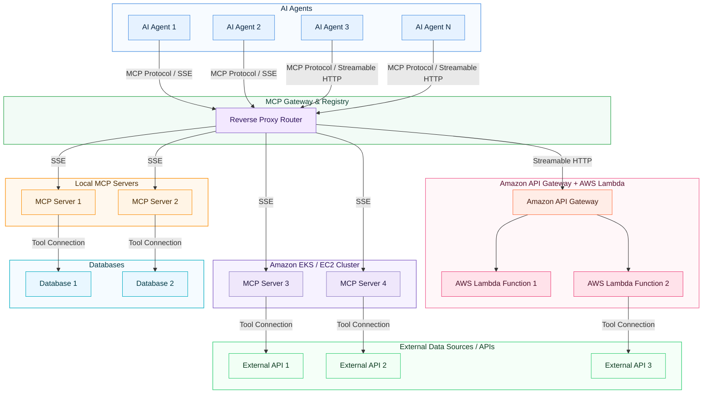
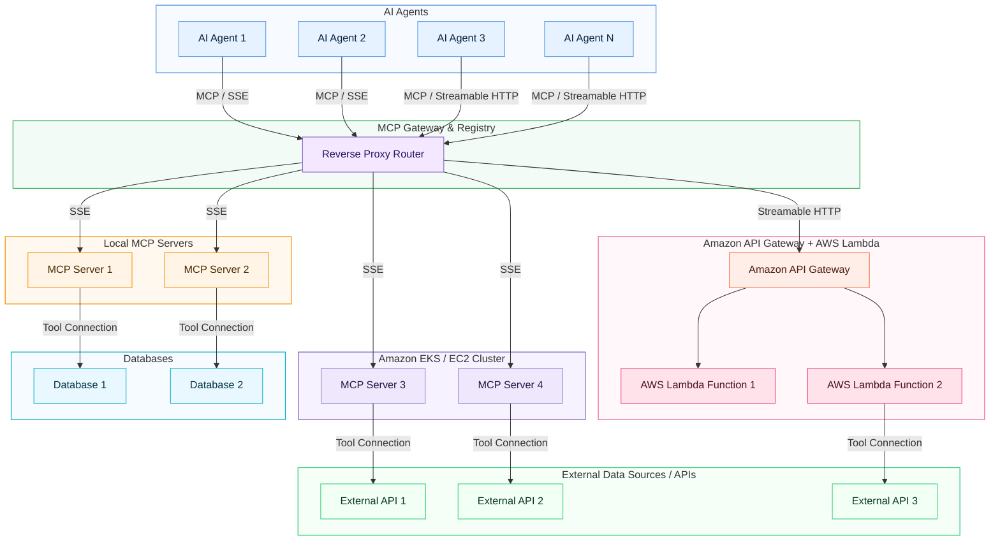

```mermaid

flowchart TB
    %% ============================================
    %% LAYERED LAYOUT (Top -> Bottom)
    %% ============================================

    %% ============ LAYER 1: AI Agents ============
    subgraph AIAgents[AI Agents]
        direction TB
        A1[AI Agent 1]
        A2[AI Agent 2]
        A3[AI Agent 3]
        AN[AI Agent N]
    end

    %% ============ LAYER 2: MCP Gateway ============
    subgraph MCPGateway[MCP Gateway & Registry]
        direction TB
        RP[Reverse Proxy Router]
    end

    %% Agent -> Gateway (Protocols)
    A1 -- "MCP Protocol / SSE" --> RP
    A2 -- "MCP Protocol / SSE" --> RP
    A3 -- "MCP Protocol / Streamable HTTP" --> RP
    AN -- "MCP Protocol / Streamable HTTP" --> RP

    %% ============ LAYER 3A: Local MCP Servers ============
    subgraph LocalMCP[Local MCP Servers]
        direction TB
        L1[MCP Server 1]
        L2[MCP Server 2]
    end

    %% ============ LAYER 3B: EKS/EC2 MCP Cluster ============
    subgraph EKSMCP[Amazon EKS / EC2 Cluster]
        direction TB
        S3[MCP Server 3]
        S4[MCP Server 4]
    end

    %% Gateway -> MCPs
    RP -- "SSE" --> L1
    RP -- "SSE" --> L2
    RP -- "SSE" --> S3
    RP -- "SSE" --> S4

    %% ============ LAYER 4: AWS API GW + Lambda ============
    subgraph AWSBlock[Amazon API Gateway + AWS Lambda]
        direction TB
        AGW[Amazon API Gateway]
        LMB1[AWS Lambda Function 1]
        LMB2[AWS Lambda Function 2]
    end

    RP -- "Streamable HTTP" --> AGW
    AGW --> LMB1
    AGW --> LMB2

    %% ============ LAYER 5A: Databases ============
    subgraph DBs[Databases]
        direction TB
        DB1[Database 1]
        DB2[Database 2]
    end

    %% ============ LAYER 5B: External APIs ============
    subgraph ExternalAPIs[External Data Sources / APIs]
        direction TB
        API1[External API 1]
        API2[External API 2]
        API3[External API 3]
    end

    %% Tool Connections (downward to data sources)
    L1 -- "Tool Connection" --> DB1
    L2 -- "Tool Connection" --> DB2

    S3 -- "Tool Connection" --> API1
    S4 -- "Tool Connection" --> API2
    LMB2 -- "Tool Connection" --> API3

    %% ============================================
    %% THEME (classDefs)
    %% ============================================
    classDef agentNode        fill:#E6F2FF,stroke:#4A90E2,color:#0A2540,stroke-width:1px;
    classDef gatewayBlock     fill:#EAF8F0,stroke:#34A853,color:#0B3D2E,stroke-width:1px;
    classDef routerNode       fill:#F3E8FF,stroke:#7E57C2,color:#2C115B,stroke-width:1px;
    classDef mcpLocal         fill:#FFF4E5,stroke:#FB8C00,color:#4A2A00,stroke-width:1px;
    classDef mcpCluster       fill:#EFE7FB,stroke:#8E7CC3,color:#231942,stroke-width:1px;
    classDef awsBlock         fill:#FFF3F3,stroke:#F06292,color:#5A1030,stroke-width:1px;
    classDef lambdaNode       fill:#FFE2EA,stroke:#EC407A,color:#4A0F27,stroke-width:1px;
    classDef apigwNode        fill:#FFEDE7,stroke:#FF7043,color:#4A1D12,stroke-width:1px;
    classDef dbNode           fill:#E9F7FF,stroke:#00ACC1,color:#003944,stroke-width:1px;
    classDef apiNode          fill:#F1FFF5,stroke:#2ECC71,color:#0B3A1F,stroke-width:1px;

    %% Assign classes
    class A1,A2,A3,AN agentNode
    class RP routerNode
    class L1,L2 mcpLocal
    class S3,S4 mcpCluster
    class AGW apigwNode
    class LMB1,LMB2 lambdaNode
    class DB1,DB2 dbNode
    class API1,API2,API3 apiNode

    %% Style subgraph containers
    style AIAgents     fill:#F7FBFF,stroke:#4A90E2,stroke-width:1.2px,color:#0A2540
    style MCPGateway   fill:#F2FBF6,stroke:#34A853,stroke-width:1.2px,color:#0B3D2E
    style LocalMCP     fill:#FFF8EE,stroke:#FB8C00,stroke-width:1.2px,color:#4A2A00
    style EKSMCP       fill:#F6F2FF,stroke:#7E57C2,stroke-width:1.2px,color:#2C115B
    style AWSBlock     fill:#FFF7F9,stroke:#F06292,stroke-width:1.2px,color:#5A1030
    style DBs          fill:#F5FBFF,stroke:#00ACC1,stroke-width:1.2px,color:#003944
    style ExternalAPIs fill:#F5FFF8,stroke:#2ECC71,stroke-width:1.2px,color:#0B3A1F

    %% (Optional) Link styling examples:
    %% linkStyle 0,1 stroke:#4A90E2,stroke-width:1.5px
    %% linkStyle 2,3 stroke:#7E57C2,stroke-width:1.5px
    %% linkStyle 4,5,6,7 stroke:#4A90E2,stroke-dasharray:3 2
    %% linkStyle 8,9 stroke:#7E57C2,stroke-dasharray:3 2
    %% linkStyle 10,11 stroke:#00ACC1,stroke-dasharray:2 2
    %% linkStyle 12,13,14 stroke:#2ECC71,stroke-dasharray:2 2

```

```mermaid

flowchart TB

%% ============================
%% LAYER 1 – AI Agents
%% ============================
subgraph AIAgents[AI Agents]
    direction TB
    A1[AI Agent 1]
    A2[AI Agent 2]
    A3[AI Agent 3]
    AN[AI Agent N]
end

%% ============================
%% LAYER 2 – MCP Gateway
%% ============================
subgraph MCPGateway[MCP Gateway & Registry]
    direction TB
    RP[Reverse Proxy Router]
end

A1 -->|MCP / SSE| RP
A2 -->|MCP / SSE| RP
A3 -->|MCP / Streamable HTTP| RP
AN -->|MCP / Streamable HTTP| RP

%% ============================
%% LAYER 3 – MCP Servers
%% ============================
subgraph LocalMCP[Local MCP Servers]
    direction TB
    L1[MCP Server 1]
    L2[MCP Server 2]
end

subgraph EKSMCP[Amazon EKS / EC2 Cluster]
    direction TB
    S3[MCP Server 3]
    S4[MCP Server 4]
end

RP -->|SSE| L1
RP -->|SSE| L2
RP -->|SSE| S3
RP -->|SSE| S4

%% ============================
%% LAYER 4 – AWS Gateway + Lambda
%% ============================
subgraph AWSBlock[Amazon API Gateway + AWS Lambda]
    direction TB
    AGW[Amazon API Gateway]
    LMB1[AWS Lambda Function 1]
    LMB2[AWS Lambda Function 2]
end

RP -->|Streamable HTTP| AGW
AGW --> LMB1
AGW --> LMB2

%% ============================
%% LAYER 5 – Data Sources
%% ============================
subgraph DBs[Databases]
    direction TB
    DB1[Database 1]
    DB2[Database 2]
end

subgraph ExternalAPIs[External Data Sources / APIs]
    direction TB
    API1[External API 1]
    API2[External API 2]
    API3[External API 3]
end

L1 -->|Tool Connection| DB1
L2 -->|Tool Connection| DB2

S3 -->|Tool Connection| API1
S4 -->|Tool Connection| API2
LMB2 -->|Tool Connection| API3

%% ===========================================
%% CLASS DEFINITIONS (colors)
%% ===========================================
classDef agentNode fill:#E6F2FF,stroke:#4A90E2,stroke-width:1px,color:#0A2540;
classDef routerNode fill:#F3E8FF,stroke:#7E57C2,stroke-width:1px,color:#2C115B;
classDef mcpLocal fill:#FFF4E5,stroke:#FB8C00,stroke-width:1px,color:#4A2A00;
classDef mcpCluster fill:#EFE7FB,stroke:#8E7CC3,stroke-width:1px,color:#231942;
classDef apigwNode fill:#FFEDE7,stroke:#FF7043,stroke-width:1px,color:#4A1D12;
classDef lambdaNode fill:#FFE2EA,stroke:#EC407A,stroke-width:1px,color:#4A0F27;
classDef dbNode fill:#E9F7FF,stroke:#00ACC1,stroke-width:1px,color:#003944;
classDef apiNode fill:#F1FFF5,stroke:#2ECC71,stroke-width:1px,color:#0B3A1F;

%% ===========================================
%% CLASS ASSIGNMENTS
%% ===========================================
class A1,A2,A3,AN agentNode
class RP routerNode
class L1,L2 mcpLocal
class S3,S4 mcpCluster
class AGW apigwNode
class LMB1,LMB2 lambdaNode
class DB1,DB2 dbNode
class API1,API2,API3 apiNode

%% ===========================================
%% SUBGRAPH AREA STYLES
%% ===========================================
style AIAgents fill:#F7FBFF,stroke:#4A90E2,stroke-width:1.2px;
style MCPGateway fill:#F2FBF6,stroke:#34A853,stroke-width:1.2px;
style LocalMCP fill:#FFF8EE,stroke:#FB8C00,stroke-width:1.2px;
style EKSMCP fill:#F6F2FF,stroke:#7E57C2,stroke-width:1.2px;
style AWSBlock fill:#FFF7F9,stroke:#F06292,stroke-width:1.2px;
style DBs fill:#F5FBFF,stroke:#00ACC1,stroke-width:1.2px;
style ExternalAPIs fill:#F5FFF8,stroke:#2ECC71,stroke-width:1.2px;

```
