## Introduction

MCP server have become a popular choice for hosting AI agents due to their ability to provide seamless integration with various tools and services. However, as the number of agents and tools increases, managing connections and ensuring efficient communication can become challenging. This is where the concept of an MCP Gateway comes into play.

> For a starter on MCP, refer my post [here](https://pravinchandankhede.github.io/posts/ModelContextProtocolSimple/).
{: .prompt-info }

### What is MCP Gateway?

An MCP Gateway is a centralized routing and management layer that sits between AI agents and multiple MCP servers. It acts as an intermediary that handles incoming requests from agents, routes them to the appropriate MCP server based on predefined rules, and manages the communication protocols used for interaction.
It helps you in streamlining the connections, improving scalability, and enhancing the overall performance of your AI agent ecosystem.

### Key Features of MCP Gateway

- **Centralized Routing**: The gateway routes requests from AI agents to the appropriate MCP server based on factors such as server load, agent requirements, and tool availability.
- **Protocol Management**: It supports multiple communication protocols (e.g., SSE, Streamable HTTP) to ensure compatibility with various agents and servers.
- **Scalability**: The gateway can handle a large number of agents and MCP servers, making it easier to scale your AI ecosystem as needed.
- **Load Balancing**: It can distribute requests evenly across multiple MCP servers to prevent overload and ensure optimal performance.

```mermaid

flowchart TB
    %% ============================================
    %% LAYERED LAYOUT (Top -> Bottom)
    %% ============================================

    %% ============ LAYER 1: AI Agents ============
    subgraph AIAgents[AI Agents]
        direction TB
        A1[AI Agent 1]
        A2[AI Agent 2]
        A3[AI Agent 3]
        AN[AI Agent N]
    end

    %% ============ LAYER 2: MCP Gateway ============
    subgraph MCPGateway[MCP Gateway & Registry]
        direction TB
        RP[Reverse Proxy Router]
    end

    %% Agent -> Gateway (Protocols)
    A1 -- "MCP Protocol / SSE" --> RP
    A2 -- "MCP Protocol / SSE" --> RP
    A3 -- "MCP Protocol / Streamable HTTP" --> RP
    AN -- "MCP Protocol / Streamable HTTP" --> RP

    %% ============ LAYER 3A: Local MCP Servers ============
    subgraph LocalMCP[Local MCP Servers]
        direction TB
        L1[MCP Server 1]
        L2[MCP Server 2]
    end

    %% ============ LAYER 3B: AKS/VMSS MCP Cluster ============
    subgraph AKSMCP[Azure AKS / VMSS Cluster]
        direction TB
        S3[MCP Server 3]
        S4[MCP Server 4]
    end

    %% Gateway -> MCPs
    RP -- "SSE" --> L1
    RP -- "SSE" --> L2
    RP -- "SSE" --> S3
    RP -- "SSE" --> S4

    %% ============ LAYER 4: Azure APIM + Azure Functions ============
    subgraph AzureBlock[Azure API Management + Azure Functions]
        direction TB
        APIM[Azure API Management]
        AF1[Azure Function 1]
        AF2[Azure Function 2]
    end

    RP -- "Streamable HTTP" --> APIM
    APIM --> AF1
    APIM --> AF2

    %% ============ LAYER 5A: Databases ============
    subgraph DBs[Databases]
        direction TB
        DB1[Database 1]
        DB2[Database 2]
    end

    %% ============ LAYER 5B: External APIs ============
    subgraph ExternalAPIs[External Data Sources / APIs]
        direction TB
        API1[External API 1]
        API2[External API 2]
        API3[External API 3]
    end

    %% Tool Connections (downward to data sources)
    L1 -- "Tool Connection" --> DB1
    L2 -- "Tool Connection" --> DB2

    S3 -- "Tool Connection" --> API1
    S4 -- "Tool Connection" --> API2
    LMB2 -- "Tool Connection" --> API3

    %% ============================================
    %% THEME (classDefs)
    %% ============================================
    classDef agentNode        fill:#E6F2FF,stroke:#4A90E2,color:#0A2540,stroke-width:1px;
    classDef gatewayBlock     fill:#EAF8F0,stroke:#34A853,color:#0B3D2E,stroke-width:1px;
    classDef routerNode       fill:#F3E8FF,stroke:#7E57C2,color:#2C115B,stroke-width:1px;
    classDef mcpLocal         fill:#FFF4E5,stroke:#FB8C00,color:#4A2A00,stroke-width:1px;
    classDef mcpCluster       fill:#EFE7FB,stroke:#8E7CC3,color:#231942,stroke-width:1px;
    classDef awsBlock         fill:#FFF3F3,stroke:#F06292,color:#5A1030,stroke-width:1px;
    classDef lambdaNode       fill:#FFE2EA,stroke:#EC407A,color:#4A0F27,stroke-width:1px;
    classDef apigwNode        fill:#FFEDE7,stroke:#FF7043,color:#4A1D12,stroke-width:1px;
    classDef dbNode           fill:#E9F7FF,stroke:#00ACC1,color:#003944,stroke-width:1px;
    classDef apiNode          fill:#F1FFF5,stroke:#2ECC71,color:#0B3A1F,stroke-width:1px;

    %% Assign classes
    class A1,A2,A3,AN agentNode
    class RP routerNode
    class L1,L2 mcpLocal
    class S3,S4 mcpCluster
    class AGW apigwNode
    class LMB1,LMB2 lambdaNode
    class DB1,DB2 dbNode
    class API1,API2,API3 apiNode

    %% Style subgraph containers
    style AIAgents     fill:#F7FBFF,stroke:#4A90E2,stroke-width:1.2px,color:#0A2540
    style MCPGateway   fill:#F2FBF6,stroke:#34A853,stroke-width:1.2px,color:#0B3D2E
    style LocalMCP     fill:#FFF8EE,stroke:#FB8C00,stroke-width:1.2px,color:#4A2A00
    style EKSMCP       fill:#F6F2FF,stroke:#7E57C2,stroke-width:1.2px,color:#2C115B
    style AWSBlock     fill:#FFF7F9,stroke:#F06292,stroke-width:1.2px,color:#5A1030
    style DBs          fill:#F5FBFF,stroke:#00ACC1,stroke-width:1.2px,color:#003944
    style ExternalAPIs fill:#F5FFF8,stroke:#2ECC71,stroke-width:1.2px,color:#0B3A1F

    %% (Optional) Link styling examples:
    %% linkStyle 0,1 stroke:#4A90E2,stroke-width:1.5px
    %% linkStyle 2,3 stroke:#7E57C2,stroke-width:1.5px
    %% linkStyle 4,5,6,7 stroke:#4A90E2,stroke-dasharray:3 2
    %% linkStyle 8,9 stroke:#7E57C2,stroke-dasharray:3 2
    %% linkStyle 10,11 stroke:#00ACC1,stroke-dasharray:2 2
    %% linkStyle 12,13,14 stroke:#2ECC71,stroke-dasharray:2 2

```

