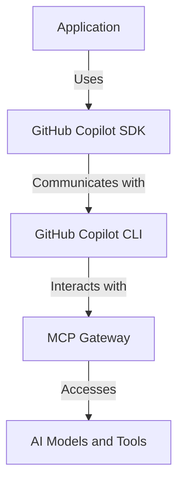

## Introduction

GitHub Copilot SDK is a recently launched SDK that helps you build AI Agents faster and in a more reliable way. It abstracts away most of the common boilerplate code required for building AI agents, allowing developers to focus on creating unique and innovative agent capabilities.

>The feature is still in preview and expected to change over time. For the latest updates, please refer to the [official documentation](https://github.com/github/copilot-sdk).
{: .prompt-info }

## Purpose

The GitHub Copilot SDK is a new framework that allows developers to embed Copilot‑like agentic capabilities directly into any application—not just IDEs. It represents a major evolution from traditional “autocomplete AI” toward full agentic coding workflows, where AI systems can plan, execute, and manage complex multi-step software development tasks.

## How its works

The SDK works on top of the GitHub Copilot CLI. The CLI works in server mode and integrates using JSON-RPC protocol.

- The SDK provides a higher-level abstraction over the CLI, allowing developers to define tools, actions, and workflows in a more intuitive way.
- The SDK also manages the lifecycle of the CLI automatically

The below figure shows a high-level architecture of how the GitHub Copilot SDK interacts with the Copilot CLI and MCP Gateway.



## Pre-requisites

To work with GitHub Copilot SDK, you would first need to install the GitHub Copilot CLI. You can follow the instructions in the [official documentation](https://github.com/github/copilot-cli)

You also need a vlaid GitHub account with access to GitHub Copilot Subscription. This you would use in the next for authentication.

Once you installed the CLI, you need to login using your GitHub account.

```bash
copilot login
```

## Demo Application

This is a simple application that demonstrates the fundamental capabilities of the GitHub Copilot SDK. The aplication creates an instance of `CopilotClient` class and confgiures it the relevant GPT model.

It then creates an session with the underlying CLI and start listening on it.

```csharp
        await using var client = new CopilotClient();
        await client.StartAsync();
        await using var session = await client.CreateSessionAsync(new SessionConfig { Model = "gpt-4.1" });
```

It also configures callbacks to handle the response and other necessary notifications from CLI.

```csharp
        session.On(evt =>
        {
            if (evt is AssistantMessageEvent msg)
            {
                Console.WriteLine(msg.Data.Content);
            }
            else if (evt is SessionIdleEvent)
            {
                done.SetResult();
            }
        });
```

Lastly, it calls the CLI with user given query and waits for the response.

```csharp
        var response = await session.SendAndWaitAsync(new MessageOptions { Prompt = "What is 2+2?" });
        Console.WriteLine("Response: " + response?.Data.Content);
```

This code also shows how to handle exceptions and errors that may occur during the interaction with the CLI.

You can find the complete code of the demo application in this [Simple Agent](https://github.com/pravinchandankhede/agenticai/blob/main/src/GitHubCopilot/SimpleAgent/Program.cs)

## Conclusion

In my view, the SDK is really a clean way of interacting with your CLI from your application. It lets you stay in your application context and leverage the power of GitHub Copilot without switching contexts - that too in your favorite programming language.
