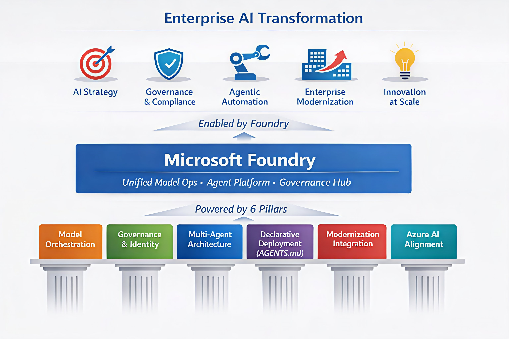

## 𝗥𝗲𝗱𝗲𝗳𝗶𝗻𝗶𝗻𝗴 𝗘𝗻𝘁𝗲𝗿𝗽𝗿𝗶𝘀𝗲 𝗔𝗜 𝗦𝘁𝗿𝗮𝘁𝗲𝗴𝘆: 𝗧𝗵𝗲 𝗙𝗼𝘂𝗻𝗱𝗿𝘆 𝗔𝗱𝘃𝗮𝗻𝘁𝗮𝗴𝗲

Over the last few months, Microsoft Foundry has evolved a lot. It is no longer just a place to experiment with models. It is becoming the strategic control plane for how AI gets built, governed, and scaled inside the Microsoft ecosystem. With every latest release I see more capabilities being added like agents, multi-agents or AI governance front. This reflects Microsoft’s AI direction on this product.

Microsoft Foundry started as a structured environment for trying out models and has now evolved into an enterprise platform. We can see the momentum clearly — from the model deployment into agent frameworks like OpenClaw & Agent Framework, to how identity governance and tool authorization are now baked directly into agentic workflows.

As an Enterprise Architect, I see Microsoft Foundry through six pillars that are shaping its role in the broader AI Strategy

#### 𝗠𝗼𝗱𝗲𝗹 𝗢𝗿𝗰𝗵𝗲𝘀𝘁𝗿𝗮𝘁𝗶𝗼𝗻 𝗟𝗮𝘆𝗲𝗿

Foundry can act as a centralized entry point for operationalizing models in a consistent, governed manner. This is reducing fragmented, team specific approaches.

#### 𝗚𝗼𝘃𝗲𝗿𝗻𝗮𝗻𝗰𝗲 & 𝗜𝗱𝗲𝗻𝘁𝗶𝘁𝘆 𝗕𝗮𝗰𝗸𝗯𝗼𝗻𝗲

With built in authorization and enterprise identity alignment, it provides the guardrails needed for responsible AI at scale.

#### 𝗠𝘂𝗹𝘁𝗶 𝗔𝗴𝗲𝗻𝘁 𝗔𝗿𝗰𝗵𝗶𝘁𝗲𝗰𝘁𝘂𝗿𝗲 𝗦𝘂𝗽𝗽𝗼𝗿𝘁

The improvements in agent communication and orchestration give enterprises the ability to design goal driven, multi-step workflows without reinventing the wheel.

#### 𝗗𝗲𝗰𝗹𝗮𝗿𝗮𝘁𝗶𝘃𝗲 𝗔𝗴𝗲𝗻𝘁 𝗗𝗲𝗽𝗹𝗼𝘆𝗺𝗲𝗻𝘁

To me this is one of the biggest game changers. It provides an ability to describe an agent in a simple Markdown file and deploy it directly on Azure Functions with a single command. It shortens the path from idea to production.

#### 𝗔𝗹𝗶𝗴𝗻𝗺𝗲𝗻𝘁 𝘄𝗶𝘁𝗵 𝗘𝗻𝘁𝗲𝗿𝗽𝗿𝗶𝘀𝗲 𝗠𝗼𝗱𝗲𝗿𝗻𝗶𝘇𝗮𝘁𝗶𝗼𝗻 P𝗿𝗼𝗴𝗿𝗮𝗺𝘀

Microsoft is increasingly working with its broader ecosystem of partners to strengthen enterprise modernization, positioning Foundry at the centre of agent‑driven transformation.

#### 𝗗𝗲𝗲𝗽 𝗜𝗻𝘁𝗲𝗴𝗿𝗮𝘁𝗶𝗼𝗻 𝘄𝗶𝘁𝗵 𝗔𝘇𝘂𝗿𝗲’𝘀 𝗔𝗜 𝗦𝘁𝗿𝗮𝘁𝗲𝗴𝘆

Foundry is aligned with Azure OpenAI Stateless APIs standard. This alignment makes it a central control plane that model orchestration, governance, and usage all consolidate naturally within Foundry.

Foundry is already showing up in reference architectures, governance frameworks, and AI operating models across enterprises. Teams are not just experimenting anymore; they’re building, governing, and running real workloads using it. Foundry has become important building blocks in Microsoft’ AI stack and many enterprises will rely on it to unlock the scalable value of agentic AI.

#### Are you considering Microsoft Foundry as part of your AI Strategy?
