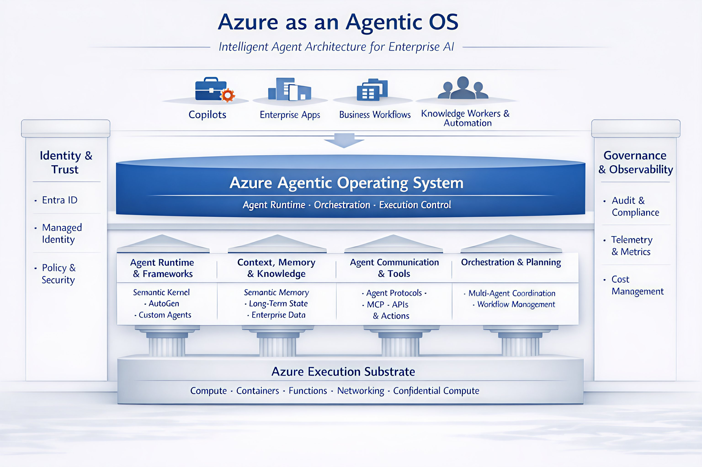

---
title: Azure Agentic OS
date: 2026-04-15 10:30:30 +/-TTTT
categories: [Architecture, Agentic AI, Azure, Microsoft Foundry, Model Context Protocol, Distributed Agents]
tags: [ai, ai agents, plugins, planner, llm, foundry, enterprise ai, strategy, agenticai,  microsoftfoundry, enterprisearchitecture, aigovernance, nextgenai, enterpriseai, aistrategy, workiq, foundryiq]     # TAG names should always be lowercase
description: We will explore how Azure is evolving into an agentic operating system, enabling intelligent agents across the enterprise.

mermaid: true
---

## 𝗔𝘇𝘂𝗿𝗲 𝗔𝗴𝗲𝗻𝘁𝗶𝗰 𝗢𝗦 — 𝗘𝗻𝘁𝗲𝗿𝗽𝗿𝗶𝘀𝗲 𝗖𝗹𝗼𝘂𝗱 𝗧𝗿𝗮𝗻𝘀𝗳𝗼𝗿𝗺𝗮𝘁𝗶𝗼𝗻

Cloud is undergoing a transformation — from being a hosting provider to a completely new paradigm. Over the last few years, Azure has evolved into something more foundational: an operating system for intelligent agents.

A traditional OS provides core services like runtime, memory, scheduling, identity, I/O, and security, that make complex systems possible at scale. Azure is now providing the same primitives, but for agent-based systems at enterprise scale.

As an architect, I see these agent ecosystems as collections of autonomous, semi-autonomous, and orchestrated agents that reason, collaborate, retain context, and act across enterprise systems — powered by an emerging Agentic OS.

### 𝗛𝗼𝘄 𝘁𝗵𝗲 𝗔𝗴𝗲𝗻𝘁𝗶𝗰 𝗢𝗦 𝗪𝗼𝗿𝗸𝘀

The Azure Agentic Operating System is the control fabric that governs agent execution. It brings together runtime management, orchestration, and execution control, ensuring that agents operate within defined boundaries and intent.

These capabilities are built on foundational architectural pillars — the primitives of the agentic OS:

• **Agent Runtime & Frameworks:** Frameworks like Semantic Kernel and AutoGen define how agents reason, plan, and act — making them first-class execution units.

• **Context, Memory & Knowledge:** Agents only become valuable when they retain semantic memory, long-term state, and governed enterprise knowledge.

• **Agent Communication & Tools:** Protocols such as A2A and MCP enable structured collaboration, delegation, and auditable tool invocation for agents.

• **Orchestration & Planning:** Agent systems rely on dynamic planning and coordination. Multi-agent orchestration allows work to be decomposed, delegated, and recomposed based on context.

These capabilities are built on top of the Azure execution substrate — compute, containers, serverless, networking, and confidential compute — enabling scale without defining behaviour.

• **Identity & Trust**, anchored in Microsoft Entra, ensures verifiable identity, least-privilege access, and enforces policy boundaries for every agent.
• **Governance & Observability** provide visibility into cost, compliance, and decision traceability.

### 𝗪𝗵𝘆 𝗧𝗵𝗶𝘀 𝗠𝗮𝘁𝘁𝗲𝗿𝘀 𝗳𝗼𝗿 𝗘𝗻𝘁𝗲𝗿𝗽𝗿𝗶𝘀𝗲𝘀

For enterprise architecture, it provides:

- A consistent execution model for agents across the organisation
- Built-in governance and control, not bolted on after experimentation
- Separation of experience and intelligence, allowing UX to evolve without re-architecting cognition
- Scalable, reusable agent ecosystems instead of siloed copilots

We are no longer designing applications or services. We are designing agent ecosystems, control fabrics, memory architectures, and trust models.

Azure's direction is clearly signalling: the future enterprise platform is not just cloud + AI. It is an operating system for intelligent, autonomous work.

#### Are you thinking about Azure as an operating system for your agents?
